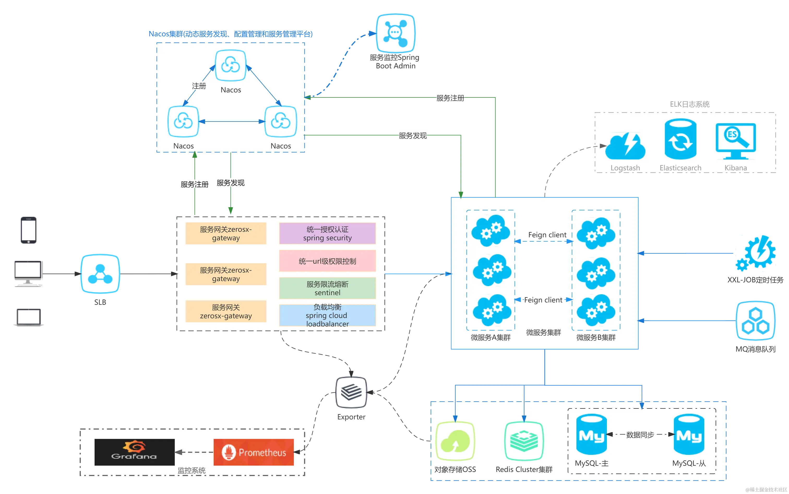
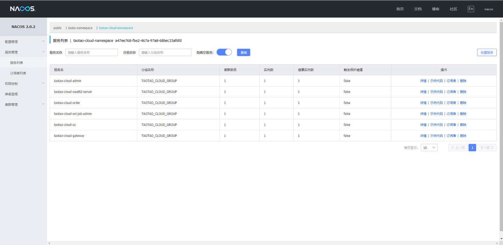
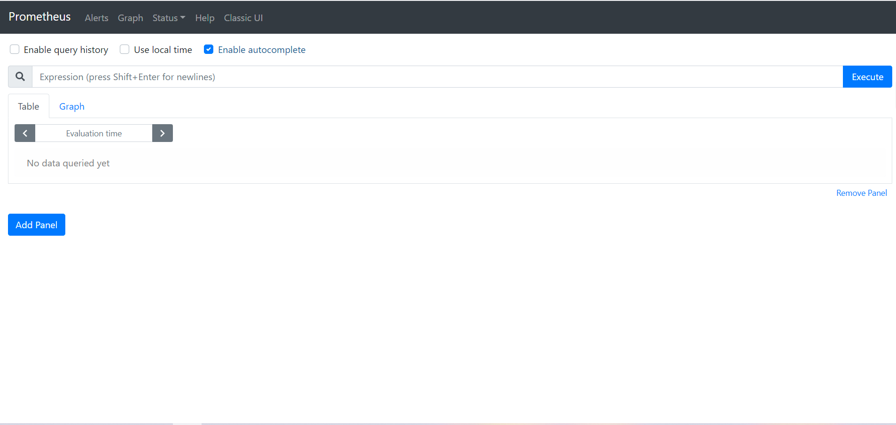
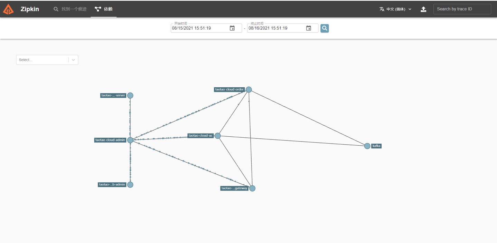
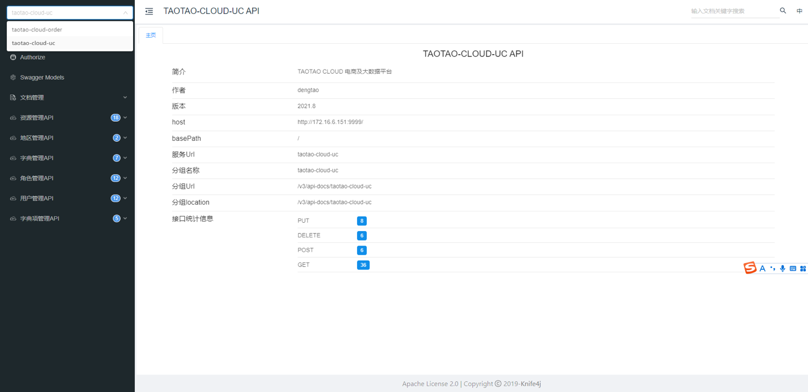

# <p align="center"><strong> taotao-cloud-project </strong></p>

[comment]: <> (# <center>**taotao-cloud-project**</center>)

<p align="center">
  
  
  
  
  
  
  
  
  
  
  
  
  
  
  
</p>

## 1. 如果您觉得有帮助，请点右上角 "Star" 支持一下谢谢

**taotao-cloud(taotao云平台)**  基于**gradle9.1.0** 、**jdk25**, 支持**graalvm25**, 采用最新的**spring 6.2.11**、**SpringBoot 3.5.6**、**SpringCloud 2025.0.0**、**SpringSecurity 6.5.5**、**Nacos 3.1.0**、**Mybatis-Plus 3.5.16**、**Redis 7.4.0**等框架，开发的一款企业级微服务架构的云服务平台， 

具有组件化、高性能、功能丰富的特点。代码简洁，架构清晰，组件可自由搭配，遵循**SpringBoot**编程思想，高度模块化和可配置化。

具备服务注册&发现、配置中心、服务限流、熔断降级、监控报警、多数据源、工作流、高亮搜索、定时任务、分布式缓存、分布式事务、分布式存储等功能，用于快速构建微服务项目。

目前支持**Shell**、**Docker**、**Docker-Compose**、**K8s**、**Github/Genkins CI/CD**等多种部署方式，实现**RBAC**权限。 

遵循阿里代码规范，采用**restful**设计风格及**DDD**(领域驱动设计)思想，代码简洁、架构清晰，非常适合作为基础框架使用。基于**DDD**（领域驱动设计）的轻量级快速开发框架，致力于企业技术架构的可沉淀和可传承，解决复杂业务场景的扩展问题

**仓库的目的**: 工作以来的技术总结和技术沉淀(业余时间进行开发) **仓库代码中不涉及公司任何业务代码**

主要包括如下几部分:

- **微服务模块** 基于**spring cloud alibaba**微服务基础脚手架框架,用于基础服务的集成和跟业务无关的基础技术集成,
  提供**大量的starters组件**作为技术底层支持,同时基础框架集中统一优化中间件相关服务及使用,
  提供高性能,更方便的基础服务接口及工具，完全可以在实际工作中使用


- **SASS商城模块** 基于**微服务模块**构建的前后端分离的**B2B2C**商城系统, 支持商家入驻支, 持分布式部署,
  使用**github action CI/CD**持续集成, 前后端均使用**kubernetes**部署，
  各个API独立, 管理前端使用**vue3 ant-design-vue**开发, 移动端使用**taro taro-ui**开发, **
  系统全端全部代码开源**


- **SASS商城多端前端模块** 主要使用**react antd**进行前后端分离开发, 集成以**taro, taro-ui, react native**
  为主的多端合一框架。


- **大数据模块** 集成基于**hadoop、hive、dolphinscheduler**的离线批量日志数据处理和分析, 用于用户行为分析、推荐系统,
  **flink、flink cdc、flink cep、spark streaming、presto、seatunnel**流式处理计算框架, **tidb、doris**离线数据仓库, **hudi、paimon**数据湖等大数据处理


- **数仓模块**  基于**Doris、Piamon、Hudi**的离线数仓和实时数仓(数据湖)

  > 数据源模块：业务数据写入 **MySQL** 数据库,生成的日志数据被写入 **Kafka**, **rocketmq** 消息队列

  > 数据采集模块：**Dinky**开发**FlinkSQL**，消费**Kafka**中的日志数据，并将其写入**Doris**、**Paimon** 、**Hudi**的在线数据存储（**ODS**）层。使用**DolphinScheduler**配置**SeaTunnel**任务，同步**MySQL**中的业务数据到**Doris**的**ODS**层。**FlinkSQL/CDC**从**Kafka**和**MySQL**采集数据，分别写入**Paimon** 、**Hudi**的**OD**S层。

  > 数仓模块：遵循标准的**ODS**(数据存储)->**DWD**(数据仓库明细层)/**DIM**(维度数据层)->**DWS**(数据服务层)->**ADS**(应用数据存储)的四级数据分层架构。数据在**Doris** 、**Paimon**、**Hudi**中通过批量和实时两种调度方式流转。  

  > 数据可视化：**ADS**层和**DWS**层的数据可以利用**SuperSet**和**DataRT**工具进行报表和数据大屏的制作、展示


- **python模块** 主要是集成了基于**django**的web开发, 基于**scrapy**爬虫开发, **homeassistant**
  家庭自动化框架原理的分析

总之基于**spring cloud alibaba**的微服务架构 **hadoop hive flink flink-cdc paimon doris hudi**
等大数据处理实践。旨在提供技术框架的基础能力的封装，减少开发工作，只关注业务

## 2. spring cloud 微服务架构图



## 3. spring cloud 微服务分层图


## 4. dependencies

Requires:

```
JAVA_VERSION >= 25 (推荐使用graalvm-jdk-25)
GRALE_VERSION >= 9.1.0
IDEA_VERSION >= 2025.2.2
```

Gradle:

```groovy
dependencyManagement{
  imports {
    mavenBom "io.github.shuigedeng:taotao-boot-dependencies:2025.10"
  }
}

dependencyManagement{
  imports {
    mavenBom "io.github.shuigedeng:taotao-cloud-dependencies:2025.10"
  }
}

api "io.github.shuigedeng:taotao-boot-starter-web"
```

Maven:

```xml
<dependencyManagement>
  <dependencies>
    <dependency>
      <groupId>io.github.shuigedeng</groupId>
      <artifactId>taotao-boot-dependencies</artifactId>
      <version>2025.10</version>
      <type>pom</type>
      <scope>import</scope>
    </dependency>
  </dependencies>
</dependencyManagement>

<dependencyManagement>
  <dependencies>
    <dependency>
      <groupId>io.github.shuigedeng</groupId>
      <artifactId>taotao-cloud-dependencies</artifactId>
      <version>2025.10</version>
      <type>pom</type>
      <scope>import</scope>
    </dependency>
  </dependencies>
</dependencyManagement>

<dependencies>
    <dependency>
      <groupId>io.github.shuigedeng</groupId>
      <artifactId>taotao-boot-starter-web</artifactId>
    </dependency>
</dependencies>
```

## 5. 基于taotao-cloud-starter构建的DDD单体项目


* **taotao-cloud-message**: [https://github.com/shuigedeng/taotao-cloud-message](https://github.com/shuigedeng/taotao-cloud-message)


* **taotao-cloud-goods**: [https://github.com/shuigedeng/taotao-cloud-goods](https://github.com/shuigedeng/taotao-cloud-goods)


* **taotao-cloud-order**: [https://github.com/shuigedeng/taotao-cloud-order](https://github.com/shuigedeng/taotao-cloud-order)


* **taotao-cloud-member**: [https://github.com/shuigedeng/taotao-cloud-member](https://github.com/shuigedeng/taotao-cloud-member)


* **taotao-cloud-auth**: [https://github.com/shuigedeng/taotao-cloud-auth](https://github.com/shuigedeng/taotao-cloud-auth)


* **taotao-cloud-sys**: [https://github.com/shuigedeng/taotao-cloud-sys](https://github.com/shuigedeng/taotao-cloud-sys)


## 6.基于taotao-cloud-project构建的插件

* **idea插件地址**: [TaoTaoToolKit](https://plugins.jetbrains.com/plugin/20538-taotaotoolkit)


* **gradle插件地址**: 

1. [https://plugins.gradle.org/plugin/io.github.shuigedeng.bom](https://plugins.gradle.org/plugin/io.github.shuigedeng.bom)
2. [https://plugins.gradle.org/plugin/io.github.shuigedeng.module](https://plugins.gradle.org/plugin/io.github.shuigedeng.module)
3. [https://plugins.gradle.org/plugin/io.github.shuigedeng.common](https://plugins.gradle.org/plugin/io.github.shuigedeng.common)
4. [https://plugins.gradle.org/plugin/io.github.shuigedeng.root](https://plugins.gradle.org/plugin/io.github.shuigedeng.root)
5. [https://plugins.gradle.org/plugin/io.github.shuigedeng.service](https://plugins.gradle.org/plugin/com.taotao.cloud.gradle.service)


* **maven插件地址**: 
```xml
<build>
	<plugins>
		<plugin>
			<groupId>io.github.shuigedeng</groupId>
			<artifactId>taotao-cloud-maven-plugin</artifactId>
			<version>2025.10</version>
		</plugin>
	</plugins>
</build>
```


## 7. 演示地址 (云服务器已到期)

* TaotaoCloud脚手架：[https://start.taotaocloud.top/](https://start.taotaocloud.top/)
* 文档地址：[https://docs.taotaocloud.top](https://docs.taotaocloud.top)
* 博客地址: [https://blog.taotaocloud.top](https://blog.taotaocloud.top)
* 代码质量检测结果地址: [https://qodana.taotaocloud.top](https://qodana.taotaocloud.top) (带宽有限, 需多刷新几次)
* 商城首页地址: [https://taotaocloud.top](https://taotaocloud.top)
  源码地址: [taotao-cloud-front](https://github.com/shuigedeng/taotao-cloud-ui/tree/main/taotao-cloud-vue3-front)
* 大屏展示地址: [https://datav.taotaocloud.top](https://datav.taotaocloud.top)
  源码地址: [taotao-cloud-datav](https://github.com/shuigedeng/taotao-cloud-ui/tree/main/taotao-cloud-vue3-datav)
* 平台管理地址(进度15%): [https://manager.taotaocloud.top](https://manager.taotaocloud.top) (
  admin/123456)
  源码地址: [taotao-cloud-manager](https://github.com/shuigedeng/taotao-cloud-ui/tree/main/taotao-cloud-vue3-manager)
* 商户管理地址(进度5%): [https://merchant.taotaocloud.top](https://merchant.taotaocloud.top) (
  taotao/123456)
  源码地址: [taotao-cloud-merchant](https://github.com/shuigedeng/taotao-cloud-ui/tree/main/taotao-cloud-vue3-merchant)
* 开放平台地址(进度15%): [https://open.taotaocloud.top](https://open.taotaocloud.top) (
  taotao/123456)
  源码地址: [taotao-cloud-open](https://github.com/shuigedeng/taotao-cloud-ui/tree/main/taotao-cloud-vue3-open)
* 移动端在线预览(进度5%)
  源码地址: [taotao-cloud-mall](https://github.com/shuigedeng/taotao-cloud-ui/tree/main/taotao-cloud-taro-mall)

| <center>移动端 ReactNative</center>                                                                                                                                                                                                                                                         | <center>小程序</center>     | <center>H5</center>                               |
|------------------------------------------------------------------------------------------------------------------------------------------------------------------------------------------------------------------------------------------------------------------------------------------|--------------------------|---------------------------------------------------|
| 安卓：[滔滔商城.apk](https://github.com/wuba/Taro-Mortgage-Calculator/raw/e0c432bdc6096a08d9020542e7ce401861026bfa/app-arm64-v8a-release.apk.1.zip) <br> IOS：[滔滔商城.app](https://github.com/wuba/Taro-Mortgage-Calculator/raw/a67459bc6667b0478978621482d33103d04e7538/taroDemo.app.zip)(目前暂不可用) |  | <br>https://m.taotaocloud.top |

## 8. 功能特点

* **微服务技术架构**: 前后端分离的企业级微服务架构、主要针对解决微服务和业务开发时常见的 **非功能性需求** 简化开发工作、提高生产率、解决通用问题
* **主体框架**：采用最新的`Spring Boot 3.5.6`、`Spring Cloud 2025.0.0`、`Spring Cloud Alibaba 2025.0.0.0-preview` 版本进行设计
* **统一注册**：支持`spring cloud alibaba Nacos`作为注册中心，实现多配置、分群组、分命名空间、多业务模块的注册和发现功能
* **统一认证**：统一Oauth2认证协议，采用jwt的方式，实现统一认证，完备的RBAC权限管理、数据权限处理、网关统一鉴权、灰度发布。 支持多种登录方式，如`账号密码`，`验证码登陆`、`支付宝`、`钉钉`、`码云`、`GitHub`、`GitLab`、`QQ`、`微信`、`企业微信`、`微博`等第三方登录，`微信小程序登录`，`指纹登录`，`手势登录`，`手机号码登录`，`人脸识别登录`等 优化Spring Security内部实现 ,实现API调用的统一出口和权限认证授权中心
* **业务监控**：利用`Spring Boot admin`监控各个独立服务的运行状态
* **日志分析**：集成`kafka、elk、prometheus、loki`等实时监控日志(请求日志、系统日志、数据变更日志、用户日志) 提供完善的企业微服务流量监控，日志监控能力
* **分布式事务**：集成`spring cloud alibaba seata`分布式事务处理
* **分布式任务**：集成`xxl-job、powerjob、quartz`分布式定时任务处理
* **mvc封装**：通用的 Controller、Service、Mapper、全局异常、全局序列化、反序列化规则，请求头传递、调用日志、灰度、统一配置编码解码规则等，AOP方式优雅记录操作日志、优雅缓存解决方案、防缓存击穿
* **业务熔断**：采用`spring cloud alibaba Sentinel`实现业务熔断处理，避免服务之间出现雪崩
* **链路追踪**：自定义traceId的方式，实现简单的链路追踪功能、集成`skywalking、sleuth、zipkin`链路监控
* **内部调用**：集成了`Feign`和`Dubbo`以及`grpc`等模式支持内部调用，并且可以实现无缝切换
* **身份注入**：通过注解的方式，实现用户登录信息的快速注入
* **网关支持**：支持流量控制、拉黑名单、过滤请求、灰度发布方案、防重复提交、命中缓存降级访问、网关统一鉴权等
* **在线文档**：通过接入`Knife4j`，实现在线API文档的查看与调试，对`swagger`、`knife4j`二次封装，实现配置即文档
* **业务监控**：利用`Spring Boot Admin`来监控各个独立Service的运行状态。
* **代码生成**：基于`Mybatis-plus-generator`自动生成代码，提升开发效率，使用代码生成器可以一键生成 `Java、Vue` 前后端代码、SQL 脚本、接口文档，支持单表、树表、主子表
* **消息中心**：集成消息中间件`RocketMQ、kafka、plusar`，对业务进行异步处理
* **实时通信**：实时通信，采用 `Spring WebSocket` 实现，内置 Token 身份校验，支持`WebSocket`集群
* **业务分离**：采用前后端分离的框架设计，前端采用`react antd、taro`脚手架快速开放
* **多租户功能**：集成`Mybatis Plus`、`jpa`,实现saas多租户功能 可自定义每个租户的权限，提供透明化的多租户底层封装
* **前端支持**：采用 `taro` 方案，一份代码多终端适配，同时支持 APP、小程序、H5！
* **前后端流水线支持**：包含基于`github、 GitLab Runner` 的 `kubernetes（k8s）、Docker、Shell` 等执行器执行 CI/CD 流水线进行自动构建、制作 Docker 镜像、发布
* **工作流功能**：工作流使用 `Flowable`，支持动态表单、在线设计流程、会签 / 或签、多种任务分配方式
* **短信和oss支持**：集成阿里云、腾讯云等短信渠道，集成 `MinIO`、阿里云、腾讯云、七牛云等云存储服务
* **容器化支持**: 提供对常见容器化支持 `Docker、docker-compose、Kubernetes、Rancher2`支持 完善的微服务部署方案
* **webflux支持**: `lambda、stream api、webflux` 的生产实践
* **开放平台**: 提供应用管理，方便第三方系统接入，**支持多租户(应用隔离)**
* **组件化**: 引入组件化的思想实现高内聚低耦合并且高度可配置化
* **代码规范**: 注重代码规范，严格控制包依赖

## 9. 核心依赖

| 依赖                   | 版本                 |
|----------------------|--------------------|
| Spring               | 6.2.11             |
| Spring Boot          | 3.5.6              |
| Spring Cloud         | 2025.0.0           |
| Spring Cloud Alibaba | 2025.0.0.0-preview |
| Seata                | 2.5.0              |
| Sentinel             | 1.8.9              |
| Spring-kafka         | 3.3.9              |
| Roketmq              | 5.2.4              |
| Spring Security      | 6.5.5              |
| Mybatis Plus         | 3.5.16             |
| Hutool               | 6.0.0-M22          |
| Mysql                | 9.4.0              |
| Querydsl             | 5.1.0              |
| Swagger              | 3.0.0              |
| Knife4j              | 4.5.0              |
| Redisson             | 3.51.0             |
| Lettuce              | 6.5.4.RELEASE      |
| Elasticsearch        | 9.0.4              |
| Xxl-job              | 3.2.0              |
| Guava                | 33.5.8-jre         |
| Grpc                 | 1.75.0             |
| Arthas               | 4.0.3              |
| Netty                | 4.2.6.Final        |


## 10. 模块说明

```
taotao-cloud-project -- 父项目
│  ├─taotao-cloud-bigdata -- 大数据模块
│  ├─taotao-cloud-cache -- 本地缓存中间件
│  ├─taotao-cloud-design-partterns  -- 设计模式
│  ├─taotao-cloud-jdbcpool  -- jdbcpool模块
│  ├─taotao-cloud-microservice -- 微服务模块
│  │  ├─taotao-cloud-ai  -- ai模块
│  │  ├─taotao-cloud-bff  -- bff模块
│  │  ├─taotao-cloud-business  -- 业务模块
│  │  ├─taotao-cloud-data-sync  -- 数据同步模块
│  │  ├─taotao-cloud-data-analysis  -- 数据分析模块
│  │  ├─taotao-cloud-gateway  -- 网关模块
│  │  ├─taotao-cloud-generator  -- 代码生成模块
│  │  ├─taotao-cloud-monitor  -- 监控模块
│  │  ├─taotao-cloud-open-platform  -- 开放平台模块
│  │  ├─taotao-cloud-recommend  -- 推荐模块
│  │  ├─taotao-cloud-shell  -- shell模块
│  │  ├─taotao-cloud-xxljob  -- job模块
│  ├─taotao-cloud-plugin -- 插件模块
│  ├─taotao-cloud-python -- python模块
│  ├─taotao-cloud-scala -- scala模块
│  ├─taotao-cloud-mq -- 分布式消息中间件
│  ├─taotao-cloud-job -- 分布式任务调度中间件
│  ├─taotao-cloud-rpc -- 分布式rpc中间件
│  ├─taotao-cloud-tx -- 分布式事务中间件
│  ├─taotao-cloud-ccsr -- 配置中心&服务注册中心 Configuration Center & Service Registry
│  ├─taotao-cloud-warehouse -- 数仓模块
│  │  ├─taotao-cloud-offline-warehouse  -- 离线仓库模块
│  │  ├─taotao-cloud-offline-weblog -- 离线日志分析模块
│  │  ├─taotao-cloud-realtime-datalake  -- 实时数据湖模块
│  │  ├─taotao-cloud-realtime-warehouse -- 实时数仓模块
```

## 11.开源共建

1. 欢迎提交 [pull request](https://github.com/shuigedeng/taotao-cloud-project)，注意对应提交对应 `dev` 分支


2. 欢迎提交 [issue](https://github.com/shuigedeng/taotao-cloud-project/issues)，请写清楚遇到问题的原因、开发环境、复显步骤。


3. 不接受`功能请求`的 [issue](https://github.com/shuigedeng/taotao-cloud-project/issues)，功能请求可能会被直接关闭。


4. mail: <a href="981376577@qq.com">981376577@qq.com</a>
   | <a target="_blank" href="http://wpa.qq.com/msgrd?v=3&uin=3130998334&site=qq&menu=yes"> QQ:
   981376577</a>

## 12.参与贡献

> 开发: 目前个人独立开放

> PS: 借鉴了其他开源项目


## 13.项目截图

<table>
    <tr>
        <td></td>
        <td></td>
    </tr>
	<tr>
        <td></td>
        <td></td>
    </tr>
	<tr>
        <td></td>
        <td></td>
    </tr>
    <tr>
        <td></td>
        <td></td>
    </tr>
    <tr>
        <td></td>
        <td></td>
    </tr>
    <tr>
        <td></td>
        <td></td>
    </tr>

[comment]: <> (    <tr>)

[comment]: <> (        <td></td>)

[comment]: <> (        <td></td>)

[comment]: <> (    </tr>)

[comment]: <> (    <tr>)

[comment]: <> (        <td></td>)

[comment]: <> (        <td></td>)

[comment]: <> (    </tr>)
</table>

## 14.基础组件taotao-cloud-starter项目模块 (暂未开源)

```
+--- Project ':taotao-boot-demo'
+--- Project ':taotao-boot-dependencies'
+--- Project ':taotao-boot-starter-actuator'
+--- Project ':taotao-boot-starter-agent'
+--- Project ':taotao-boot-starter-apollo'
+--- Project ':taotao-boot-starter-processor'
+--- Project ':taotao-boot-starter-cache'
+--- Project ':taotao-boot-starter-canal'
+--- Project ':taotao-boot-starter-common'
+--- Project ':taotao-boot-starter-core'
+--- Project ':taotao-boot-starter-data'
+--- Project ':taotao-boot-starter-ddd'
+--- Project ':taotao-boot-starter-dingtalk'
+--- Project ':taotao-boot-starter-dubbo'
+--- Project ':taotao-boot-starter-eventbus'
+--- Project ':taotao-boot-starter-flowengine'
+--- Project ':taotao-boot-starter-grpc'
+--- Project ':taotao-boot-starter-idempotent'
+--- Project ':taotao-boot-starter-idgenerator'
+--- Project ':taotao-boot-starter-job'
+--- Project ':taotao-boot-starter-lock'
+--- Project ':taotao-boot-starter-logger'
+--- Project ':taotao-boot-starter-metrics'
+--- Project ':taotao-boot-starter-tracer'
+--- Project ':taotao-boot-starter-monitor'
+--- Project ':taotao-boot-starter-mq'
+--- Project ':taotao-boot-starter-netty'
+--- Project ':taotao-boot-starter-office'
+--- Project ':taotao-boot-starter-oss'
+--- Project ':taotao-boot-starter-pay'
+--- Project ':taotao-boot-starter-plugin'
+--- Project ':taotao-boot-starter-security'
+--- Project ':taotao-boot-starter-sensitive'
+--- Project ':taotao-boot-starter-skywalking'
+--- Project ':taotao-boot-starter-springdoc'
+--- Project ':taotao-boot-starter-statemachine'
+--- Project ':taotao-boot-starter-test'
+--- Project ':taotao-boot-starter-translation'
+--- Project ':taotao-boot-starter-useragent'
+--- Project ':taotao-boot-starter-web'
+--- Project ':taotao-boot-starter-websocket'
+--- Project ':taotao-boot-starter-websocket-netty'
+--- Project ':taotao-boot-starter-xss'
+--- Project ':taotao-boot-starter-zookeeper'
+--- Project ':taotao-cloud-demo'
+--- Project ':taotao-cloud-dependencies'
+--- Project ':taotao-cloud-starter-bootstrap'
+--- Project ':taotao-cloud-starter-alibaba'
+--- Project ':taotao-cloud-starter-huawei'
+--- Project ':taotao-cloud-starter-tencent'
+--- Project ':taotao-cloud-starter-zookeeper'
+--- Project ':taotao-cloud-starter-openfeign'
+--- Project ':taotao-cloud-starter-seata'
+--- Project ':taotao-cloud-starter-sentinel'
+--- Project ':taotao-cloud-starter-stream'
\--- Project ':taotao-cloud-starter-ttc'

```
