# <p align="center"><strong> taotao-cloud-project </strong></p>

[comment]: <> (# <center>**taotao-cloud-project**</center>)

<p align="center">
  
  
  
  
  
  
  
  
  
  
  
  
  
  
</p>

## 1. 如果您觉得有帮助，请点右上角 "Star" 支持一下谢谢

**taotao cloud project** 仓库的目的: 工作以来的技术总结和技术沉淀(业余时间进行开发) **
仓库代码中不涉及公司任何业务代码**
主要包括如下几部分

- **大数据模块** 集成基于**hadoop、hive**的日志数据处理和分析, 用户行为分析、推荐系统, **flink、spark
  streaming**离线/流式计算,
  **tidb、doris**离线数据仓库, **apache hudi**数据湖, **presto**计算框架等大数据处理


- **微服务模块** 基于**spring cloud alibaba**微服务基础脚手架框架,用于基础服务的集成和跟业务无关的基础技术集成,
  提供**大量的starters组件**作为技术底层支持,同时基础框架集中统一优化中间件相关服务及使用,
  提供高性能,更方便的基础服务接口及工具，完全可以在实际工作中使用


- **商城模块** 基于**微服务模块**构建的前后端分离的B2B2C商城系统, 支持商家入驻支, 持分布式部署,
  使用**github action
  CI/CD**持续集成, 前后端均使用**kubernetes**部署，
  各个API独立, 管理前端使用**vue3 ant-design-vue**开发, 移动端使用**taro taro-ui**开发, **
  系统全端全部代码开源**


- **前端模块** 主要使用**react antd**进行前后端分离开发, 集成以**taro, taro-ui, react native**
  为主的多端合一框架。


- **python模块** 主要是集成了基于**django**的web开发, 基于**scrapy**爬虫开发, **homeassistant**
  家庭自动化框架原理的分析

总之基于**spring cloud alibaba**的微服务架构 **spark hive hudi flink**
等大数据处理实践。旨在提供技术框架的基础能力的封装，减少开发工作，只关注业务

## 2. spring cloud 微服务架构图


## 3. spring cloud 微服务分层图

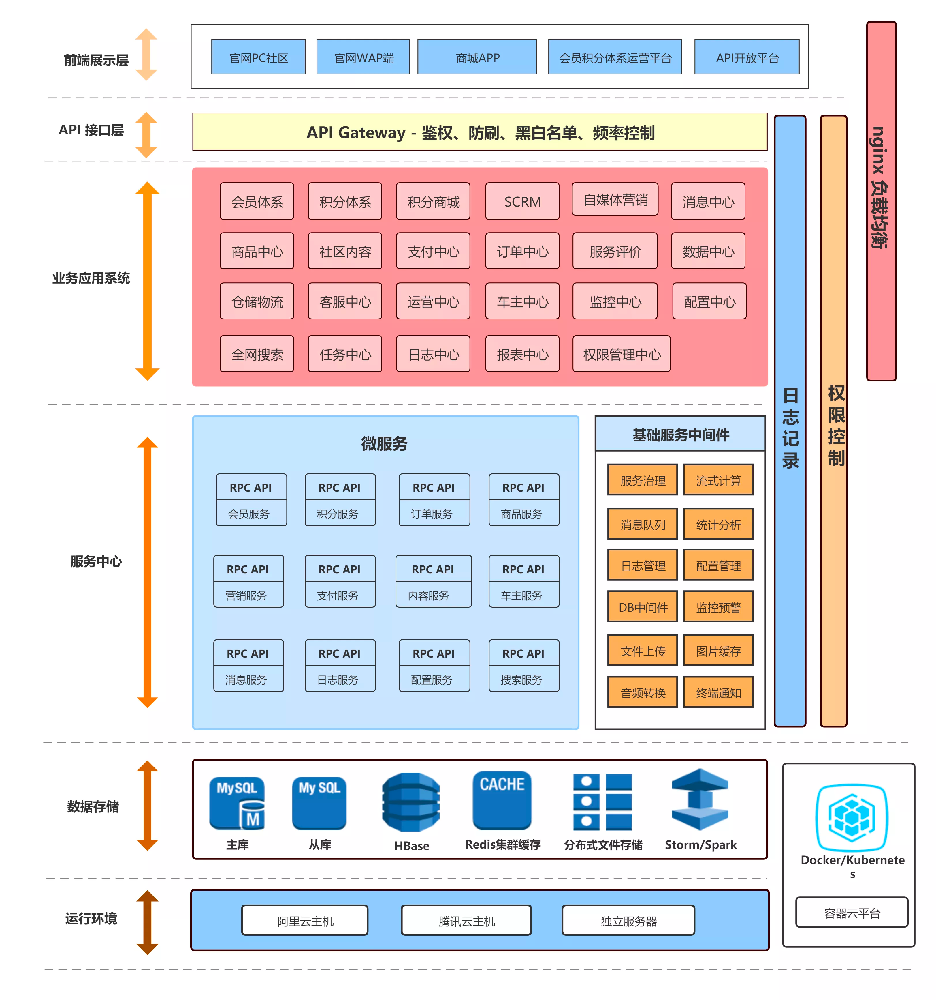

## 4. dependencies

Requires:

```
JAVA_VERSION >= 17 (推荐使用graalvm-22.3)
GRALE_VERSION >= 8.0.1
IDEA_VERSION >= 2023.1
```

Gradle:

```
dependencyManagement{
  imports {
    mavenBom "io.github.shuigedeng:taotao-cloud-dependencies:2023.04"
  }
}

api "io.github.shuigedeng:taotao-cloud-starter-web"
```

Maven:

```
<dependentyManagement>
  <dependencies>
    <dependency>
      <groupId>io.github.shuigedeng</groupId>
      <artifactId>taotao-cloud-dependencies</artifactId>
      <version>2023.04</version>
      <type>pom</type>
      <scope>import</scope>
    </dependency>
  </dependencies>
</dependentyManagement>


<dependencies>
    <dependency>
      <groupId>io.github.shuigedeng</groupId>
      <artifactId>taotao-cloud-starter-web</artifactId>
    </dependency>
</dependencies>
```

## 5. 核心依赖

 依赖                   | 版本              
----------------------|-----------------
 Spring               | 6.0.7           
 Spring Boot          | 3.0.5           
 Spring Cloud         | 2022.0.1        
 Spring Cloud Alibaba | 2022.0.0.0--RC1 
 Spring Cloud Tencent | 1.10.2-2022.0.1 
 Seata                | 1.6.1           
 Sentinel             | 1.8.6           
 Spring-kafka         | 6.0.5           
 Roketmq              | 5.0.0           
 Spring Security      | 6.0.3           
 Mybatis Plus         | 3.5.3.1         
 Hutool               | 5.8.16          
 Mysql                | 8.0.32          
 Querydsl             | 5.0.0           
 Swagger              | 3.0.0           
 Knife4j              | 4.1.0           
 Redisson             | 3.20.1          
 Lettuce              | 6.0.3.RELEASE   
 Elasticsearch        | 8.5.3           
 Xxl-job              | 2.4.0           
 EasyCaptcha          | 1.6.2           
 Guava                | 31.1-jre        
 Grpc                 | 1.54.0          
 Arthas               | 3.6.7           
 Dynamic-tp           | 1.1.2           
 Elasticjob           | 3.0.2           
 Forest               | 1.5.30          
 Netty                | 4.1.90.Final    
 Querydsl             | 5.0.0           

## 6. 演示地址

* 文档地址：[https://docs.taotaocloud.top](https://docs.taotaocloud.top)
* 博客地址: [https://blog.taotaocloud.top](https://blog.taotaocloud.top)
* 代码质量检测结果地址: [https://qodana.taotaocloud.top](https://qodana.taotaocloud.top) (带宽有限,
  需多刷新几次)
* 商城首页地址: [https://taotaocloud.top](https://taotaocloud.top)
  源码地址: [taotao-cloud-front](https://github.com/shuigedeng/taotao-cloud-ui/tree/main/taotao-cloud-vue3-front)
* 大屏展示地址: [https://datav.taotaocloud.top](https://datav.taotaocloud.top)
  源码地址: [taotao-cloud-datav](https://github.com/shuigedeng/taotao-cloud-ui/tree/main/taotao-cloud-vue3-datav)
* 平台管理地址(进度15%): [https://manager.taotaocloud.top](https://manager.taotaocloud.top) (
  admin/123456)
  源码地址: [taotao-cloud-manager](https://github.com/shuigedeng/taotao-cloud-ui/tree/main/taotao-cloud-vue3-manager)
* 商户管理地址(进度5%): [https://merchant.taotaocloud.top](https://merchant.taotaocloud.top) (
  taotao/123456)
  源码地址: [taotao-cloud-merchant](https://github.com/shuigedeng/taotao-cloud-ui/tree/main/taotao-cloud-vue3-merchant)
* 开放平台地址(进度15%): [https://open.taotaocloud.top](https://open.taotaocloud.top) (
  taotao/123456)
  源码地址: [taotao-cloud-open](https://github.com/shuigedeng/taotao-cloud-ui/tree/main/taotao-cloud-vue3-open)
* 移动端在线预览(进度5%)
  源码地址: [taotao-cloud-mall](https://github.com/shuigedeng/taotao-cloud-ui/tree/main/taotao-cloud-taro-mall)

| <center>移动端 ReactNative</center>                                                                                                                                                                                                                                                         | <center>小程序</center>     | <center>H5</center>                               |
|------------------------------------------------------------------------------------------------------------------------------------------------------------------------------------------------------------------------------------------------------------------------------------------|--------------------------|---------------------------------------------------|
| 安卓：[滔滔商城.apk](https://github.com/wuba/Taro-Mortgage-Calculator/raw/e0c432bdc6096a08d9020542e7ce401861026bfa/app-arm64-v8a-release.apk.1.zip) <br> IOS：[滔滔商城.app](https://github.com/wuba/Taro-Mortgage-Calculator/raw/a67459bc6667b0478978621482d33103d04e7538/taroDemo.app.zip)(目前暂不可用) |  | <br>https://m.taotaocloud.top |

## 7. 功能特点

* **微服务技术框架**: 前后端分离的企业级微服务架构、主要针对解决微服务和业务开发时常见的**
  非功能性需求**
* **主体框架**：采用最新的Spring Boot 3.0.5、Spring Cloud 2022.0.1、Spring Cloud Alibaba
  2022.0.0.0--RC1 版本进行设计
* **统一注册**：支持Nacos作为注册中心，实现多配置、分群组、分命名空间、多业务模块的注册和发现功能
* **统一认证**：统一Oauth2认证协议，采用jwt的方式，实现统一认证，完备的RBAC权限管理、数据权限处理、网关统一鉴权、灰度发布
* **业务监控**：利用Spring Boot admin 监控各个独立服务的运行状态
* **日志分析**：集成kafka、elk、prometheus、loki等实时监控日志(请求日志、系统日志、数据变更日志、用户日志)
* **分布式事务**：集成spring cloud alibaba seata分布式事务处理
* **业务熔断**：采用spring cloud alibaba Sentinel实现业务熔断处理，避免服务之间出现雪崩
* **链路追踪**：自定义traceId的方式，实现简单的链路追踪功能、集成skywalking、sleuth、zipkin链路监控
* **分布式任务**：集成xxl-job、powerjob、quartz等分布式定时任务处理
* **内部调用**：集成了Feign和Dubbo以及grpc等模式支持内部调用，并且可以实现无缝切换
* **身份注入**：通过注解的方式，实现用户登录信息的快速注入
* **在线文档**：通过接入Knife4j，实现在线API文档的查看与调试
* **消息中心**：集成消息中间件RocketMQ、kafka，对业务进行异步处理
* **业务分离**：采用前后端分离的框架设计，前端采用react antd、taro脚手架快速开放
* **多租户功能**：集成Mybatis Plus、jpa,实现saas多租户功能
* **容器化支持**: Docker、Kubernetes、Rancher2 支持
* **webflux**支持: lambda、stream api、webflux 的生产实践
* **开放平台**: 提供应用管理，方便第三方系统接入，**支持多租户(应用隔离)**
* **组件化**: 引入组件化的思想实现高内聚低耦合并且高度可配置化
* **代码规范**: 注重代码规范，严格控制包依赖

> PS: 借鉴了其他开源项目

## 8. 模块说明

```
taotao-cloud-project -- 父项目
│  ├─taotao-cloud-bigdata -- 大数据模块
│  ├─taotao-cloud-custom -- 自定义模块
│  │  ├─taotao-cloud-distributed-tx  -- 手写分布式事务
│  │  ├─taotao-cloud-rpc  -- 手写rpc框架
│  │  ├─taotao-cloud-storm  -- 手写storm
│  ├─taotao-cloud-demo -- demo模块
│  ├─taotao-cloud-go -- go模块
│  ├─taotao-cloud-microservice -- 微服务模块
│  │  ├─taotao-cloud-business  -- 所有的业务模块
│  │  ├─taotao-cloud-data-sync  -- 数据同步模块
│  │  ├─taotao-cloud-data-analysis  -- 数据分析模块
│  │  ├─taotao-cloud-front  -- 前端pc模块
│  │  ├─taotao-cloud-gateway  -- 网关模块
│  │  ├─taotao-cloud-gateway-shenyu  -- 基于shenyu网关模块
│  │  ├─taotao-cloud-graphql  -- graphql模块
│  │  ├─taotao-cloud-monitor  -- 监控模块
│  │  ├─taotao-cloud-open-platform  -- 开放模块
│  │  ├─taotao-cloud-recommend  -- 推荐模块
│  │  ├─taotao-cloud-xxljob  -- xxl-job模块
│  ├─taotao-cloud-netty -- netty模块
│  ├─taotao-cloud-node -- node模块
│  ├─taotao-cloud-plugin -- 插件模块
│  ├─taotao-cloud-python -- python模块
│  ├─taotao-cloud-scala -- scala模块
│  ├─taotao-cloud-standlone -- 单项目模块
│  ├─taotao-cloud-warehouse -- 数仓模块
│  │  ├─taotao-cloud-offline-warehouse  -- 离线仓库模块
│  │  ├─taotao-cloud-offline-weblog -- 离线日志分析模块
│  │  ├─taotao-cloud-realtime-datalake  -- 准实时数据湖模块
│  │  ├─taotao-cloud-realtime-mall -- 商城日志分析模块
│  │  ├─taotao-cloud-realtime-recommend -- 实时推荐模块
│  │  ├─taotao-cloud-realtime-travel -- 实时旅游模块
```

## 9.开源共建

1. 欢迎提交 [pull request](https://github.com/shuigedeng/taotao-cloud-project)
   ，注意对应提交对应 `dev` 分支

2. 欢迎提交 [issue](https://github.com/shuigedeng/taotao-cloud-project/issues)
   ，请写清楚遇到问题的原因、开发环境、复显步骤。

3. 不接受`功能请求`的 [issue](https://github.com/shuigedeng/taotao-cloud-project/issues)
   ，功能请求可能会被直接关闭。

4. mail: <a href="981376577@qq.com">981376577@qq.com</a>
   | <a target="_blank" href="http://wpa.qq.com/msgrd?v=3&uin=3130998334&site=qq&menu=yes"> QQ:
   981376577</a>

## 10.参与贡献

开发: 目前个人独立开放

## 11.项目截图

<table>
    <tr>
        <td>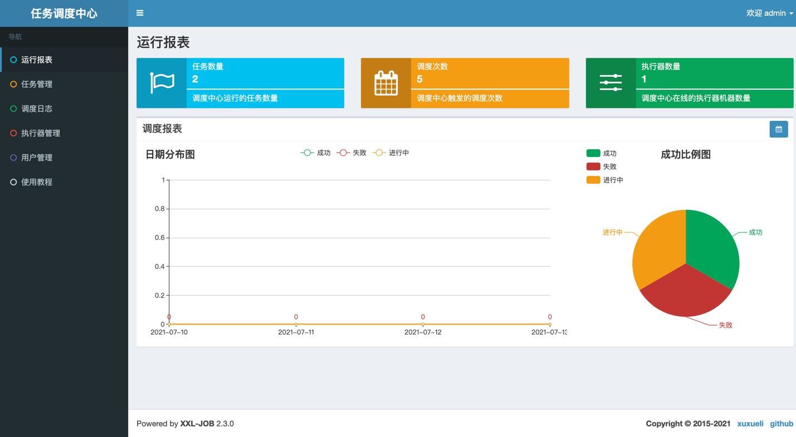</td>
        <td>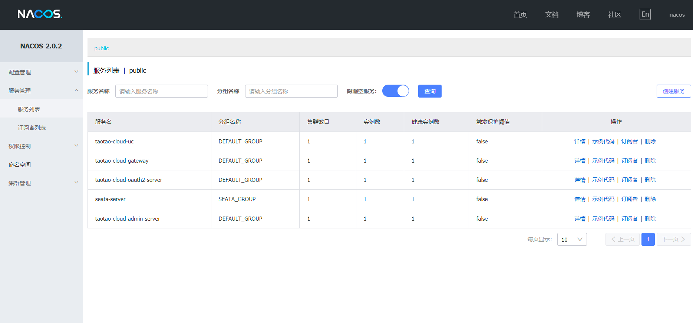</td>
    </tr>
	<tr>
        <td>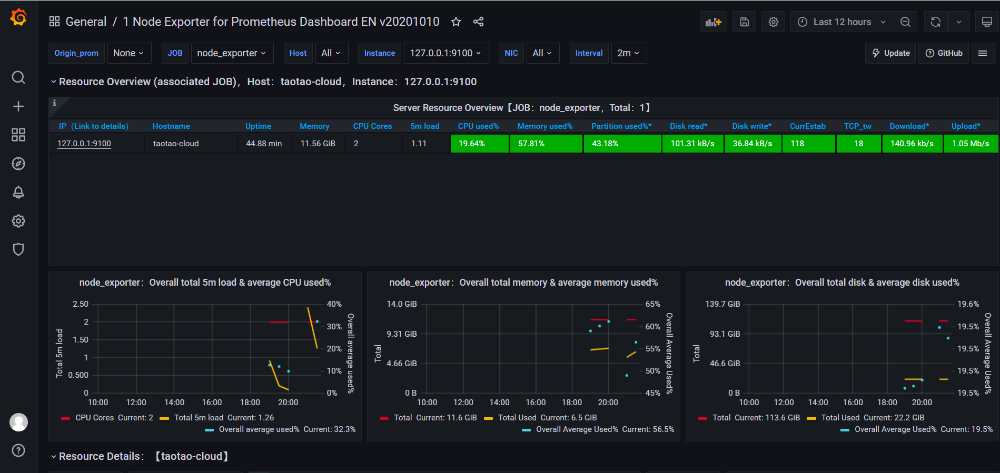</td>
        <td></td>
    </tr>
	<tr>
        <td>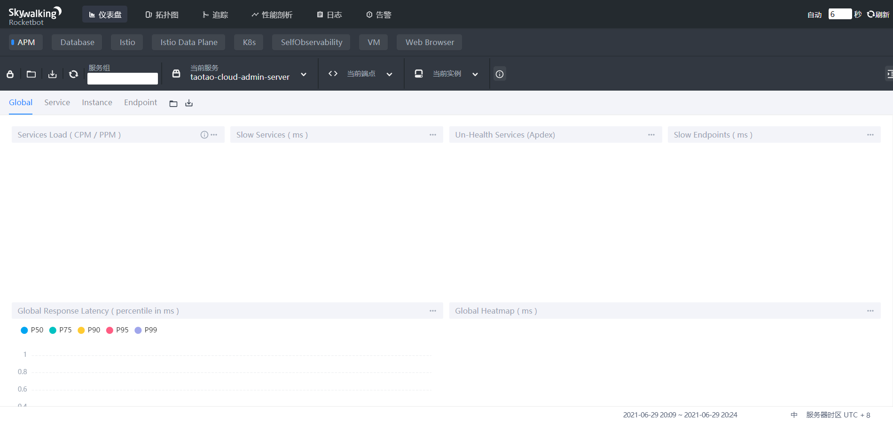</td>
        <td>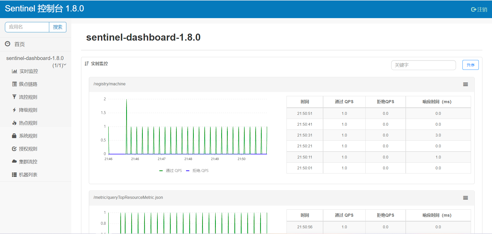</td>
    </tr>
    <tr>
        <td>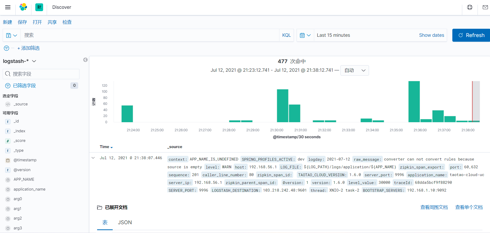</td>
        <td>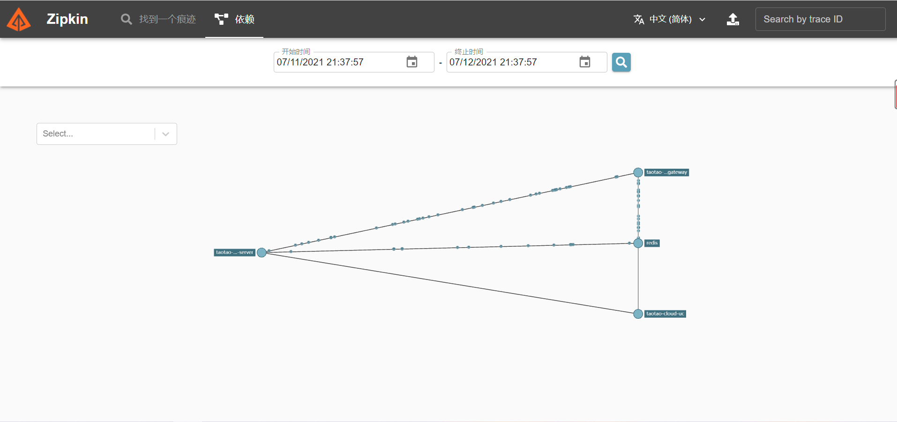</td>
    </tr>
    <tr>
        <td>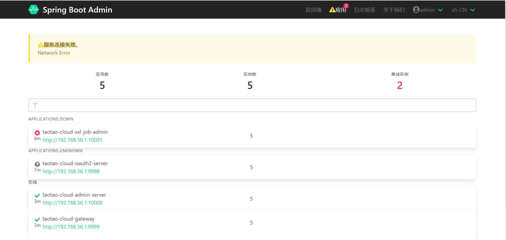</td>
        <td>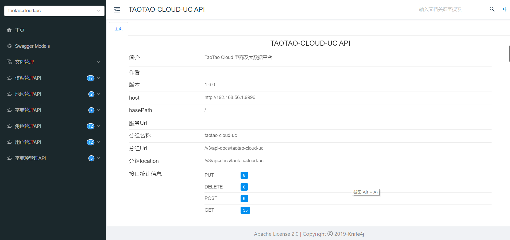</td>
    </tr>
    <tr>
        <td>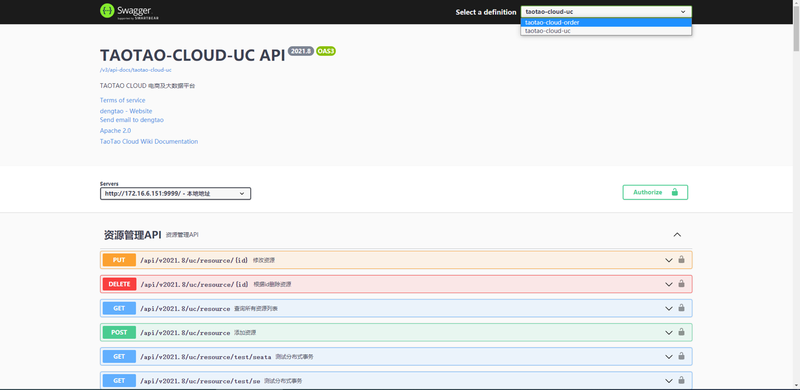</td>
        <td>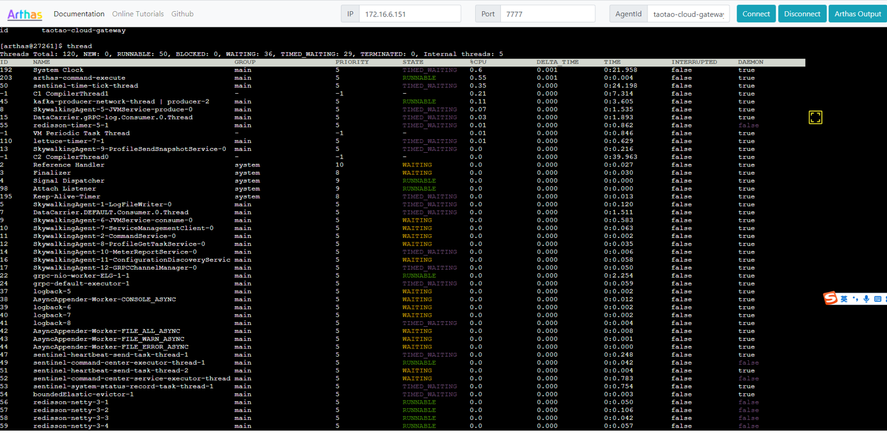</td>
    </tr>

[comment]: <> (    <tr>)

[comment]: <> (        <td></td>)

[comment]: <> (        <td></td>)

[comment]: <> (    </tr>)

[comment]: <> (    <tr>)

[comment]: <> (        <td></td>)

[comment]: <> (        <td></td>)

[comment]: <> (    </tr>)
</table>

## 12.基础组件starter项目模块 (暂未开源)

```
+--- Project ':taotao-cloud-dependencies'
+--- Project ':taotao-cloud-starter-agent'
+--- Project ':taotao-cloud-starter-alibaba'
|    +--- Project ':taotao-cloud-starter-alibaba:taotao-cloud-starter-alibaba-common'
|    +--- Project ':taotao-cloud-starter-alibaba:taotao-cloud-starter-alibaba-seata'
|    \--- Project ':taotao-cloud-starter-alibaba:taotao-cloud-starter-alibaba-sentinel'
+--- Project ':taotao-cloud-starter-apt'
+--- Project ':taotao-cloud-starter-cache'
|    +--- Project ':taotao-cloud-starter-cache:taotao-cloud-starter-cache-caffeine'
|    +--- Project ':taotao-cloud-starter-cache:taotao-cloud-starter-cache-common'
|    +--- Project ':taotao-cloud-starter-cache:taotao-cloud-starter-cache-hazelcast'
|    +--- Project ':taotao-cloud-starter-cache:taotao-cloud-starter-cache-jetcache'
|    \--- Project ':taotao-cloud-starter-cache:taotao-cloud-starter-cache-redis'
+--- Project ':taotao-cloud-starter-canal'
+--- Project ':taotao-cloud-starter-captcha'
+--- Project ':taotao-cloud-starter-common'
+--- Project ':taotao-cloud-starter-core'
+--- Project ':taotao-cloud-starter-crypto'
+--- Project ':taotao-cloud-starter-data'
|    +--- Project ':taotao-cloud-starter-data:taotao-cloud-starter-data-common'
|    +--- Project ':taotao-cloud-starter-data:taotao-cloud-starter-data-elasticsearch'
|    +--- Project ':taotao-cloud-starter-data:taotao-cloud-starter-data-jpa'
|    +--- Project ':taotao-cloud-starter-data:taotao-cloud-starter-data-mongodb'
|    +--- Project ':taotao-cloud-starter-data:taotao-cloud-starter-data-mybatis-plus'
|    +--- Project ':taotao-cloud-starter-data:taotao-cloud-starter-data-p6spy'
|    \--- Project ':taotao-cloud-starter-data:taotao-cloud-starter-data-shardingsphere'
+--- Project ':taotao-cloud-starter-dingtalk'
+--- Project ':taotao-cloud-starter-disruptor'
+--- Project ':taotao-cloud-starter-dubbo'
+--- Project ':taotao-cloud-starter-elk'
+--- Project ':taotao-cloud-starter-encrypt'
+--- Project ':taotao-cloud-starter-facility'
|    +--- Project ':taotao-cloud-starter-facility:taotao-cloud-starter-facility-alibaba'
|    +--- Project ':taotao-cloud-starter-facility:taotao-cloud-starter-facility-common'
|    +--- Project ':taotao-cloud-starter-facility:taotao-cloud-starter-facility-huawei'
|    +--- Project ':taotao-cloud-starter-facility:taotao-cloud-starter-facility-tencent'
|    \--- Project ':taotao-cloud-starter-facility:taotao-cloud-starter-facility-zookeeper'
+--- Project ':taotao-cloud-starter-grpc'
+--- Project ':taotao-cloud-starter-idempotent'
+--- Project ':taotao-cloud-starter-idgenerator'
+--- Project ':taotao-cloud-starter-ip2region'
+--- Project ':taotao-cloud-starter-job'
|    +--- Project ':taotao-cloud-starter-job:taotao-cloud-starter-job-common'
|    +--- Project ':taotao-cloud-starter-job:taotao-cloud-starter-job-elastic'
|    +--- Project ':taotao-cloud-starter-job:taotao-cloud-starter-job-powerjob'
|    +--- Project ':taotao-cloud-starter-job:taotao-cloud-starter-job-quartz'
|    +--- Project ':taotao-cloud-starter-job:taotao-cloud-starter-job-schedule'
|    \--- Project ':taotao-cloud-starter-job:taotao-cloud-starter-job-xxl'
+--- Project ':taotao-cloud-starter-laytpl'
+--- Project ':taotao-cloud-starter-limit'
+--- Project ':taotao-cloud-starter-lock'
+--- Project ':taotao-cloud-starter-logger'
+--- Project ':taotao-cloud-starter-mail'
+--- Project ':taotao-cloud-starter-metrics'
+--- Project ':taotao-cloud-starter-monitor'
+--- Project ':taotao-cloud-starter-mq'
|    +--- Project ':taotao-cloud-starter-mq:taotao-cloud-starter-mq-common'
|    +--- Project ':taotao-cloud-starter-mq:taotao-cloud-starter-mq-kafka'
|    +--- Project ':taotao-cloud-starter-mq:taotao-cloud-starter-mq-pulsar'
|    +--- Project ':taotao-cloud-starter-mq:taotao-cloud-starter-mq-rabbitmq'
|    +--- Project ':taotao-cloud-starter-mq:taotao-cloud-starter-mq-rocketmq'
|    \--- Project ':taotao-cloud-starter-mq:taotao-cloud-starter-mq-stream'
+--- Project ':taotao-cloud-starter-office'
+--- Project ':taotao-cloud-starter-openai'
+--- Project ':taotao-cloud-starter-openapi'
+--- Project ':taotao-cloud-starter-openfeign'
+--- Project ':taotao-cloud-starter-oss'
|    +--- Project ':taotao-cloud-starter-oss:taotao-cloud-starter-oss-aliyun'
|    +--- Project ':taotao-cloud-starter-oss:taotao-cloud-starter-oss-aws'
|    +--- Project ':taotao-cloud-starter-oss:taotao-cloud-starter-oss-baidu'
|    +--- Project ':taotao-cloud-starter-oss:taotao-cloud-starter-oss-common'
|    +--- Project ':taotao-cloud-starter-oss:taotao-cloud-starter-oss-fastdfs'
|    +--- Project ':taotao-cloud-starter-oss:taotao-cloud-starter-oss-ftp'
|    +--- Project ':taotao-cloud-starter-oss:taotao-cloud-starter-oss-huawei'
|    +--- Project ':taotao-cloud-starter-oss:taotao-cloud-starter-oss-jd'
|    +--- Project ':taotao-cloud-starter-oss:taotao-cloud-starter-oss-jdbc'
|    +--- Project ':taotao-cloud-starter-oss:taotao-cloud-starter-oss-jinshan'
|    +--- Project ':taotao-cloud-starter-oss:taotao-cloud-starter-oss-local'
|    +--- Project ':taotao-cloud-starter-oss:taotao-cloud-starter-oss-minio'
|    +--- Project ':taotao-cloud-starter-oss:taotao-cloud-starter-oss-nginx'
|    +--- Project ':taotao-cloud-starter-oss:taotao-cloud-starter-oss-pingan'
|    +--- Project ':taotao-cloud-starter-oss:taotao-cloud-starter-oss-qingyun'
|    +--- Project ':taotao-cloud-starter-oss:taotao-cloud-starter-oss-qiniu'
|    +--- Project ':taotao-cloud-starter-oss:taotao-cloud-starter-oss-sftp'
|    +--- Project ':taotao-cloud-starter-oss:taotao-cloud-starter-oss-tencent'
|    +--- Project ':taotao-cloud-starter-oss:taotao-cloud-starter-oss-ucloud'
|    +--- Project ':taotao-cloud-starter-oss:taotao-cloud-starter-oss-up'
|    \--- Project ':taotao-cloud-starter-oss:taotao-cloud-starter-oss-wangyi'
+--- Project ':taotao-cloud-starter-pay'
|    +--- Project ':taotao-cloud-starter-pay:taotao-cloud-starter-pay-alipay'
|    +--- Project ':taotao-cloud-starter-pay:taotao-cloud-starter-pay-common'
|    \--- Project ':taotao-cloud-starter-pay:taotao-cloud-starter-pay-wxpay'
+--- Project ':taotao-cloud-starter-pinyin'
+--- Project ':taotao-cloud-starter-prometheus'
+--- Project ':taotao-cloud-starter-retry'
+--- Project ':taotao-cloud-starter-rxjava'
+--- Project ':taotao-cloud-starter-security'
|    +--- Project ':taotao-cloud-starter-security:taotao-cloud-starter-security-common'
|    +--- Project ':taotao-cloud-starter-security:taotao-cloud-starter-security-justauth'
|    +--- Project ':taotao-cloud-starter-security:taotao-cloud-starter-security-satoken'
|    \--- Project ':taotao-cloud-starter-security:taotao-cloud-starter-security-springsecurity'
+--- Project ':taotao-cloud-starter-sensitive'
+--- Project ':taotao-cloud-starter-sign'
+--- Project ':taotao-cloud-starter-sms'
|    +--- Project ':taotao-cloud-starter-sms:taotao-cloud-starter-sms-aliyun'
|    +--- Project ':taotao-cloud-starter-sms:taotao-cloud-starter-sms-baiducloud'
|    +--- Project ':taotao-cloud-starter-sms:taotao-cloud-starter-sms-chinamobile'
|    +--- Project ':taotao-cloud-starter-sms:taotao-cloud-starter-sms-common'
|    +--- Project ':taotao-cloud-starter-sms:taotao-cloud-starter-sms-huaweicloud'
|    +--- Project ':taotao-cloud-starter-sms:taotao-cloud-starter-sms-jdcloud'
|    +--- Project ':taotao-cloud-starter-sms:taotao-cloud-starter-sms-jpush'
|    +--- Project ':taotao-cloud-starter-sms:taotao-cloud-starter-sms-netease'
|    +--- Project ':taotao-cloud-starter-sms:taotao-cloud-starter-sms-qiniu'
|    +--- Project ':taotao-cloud-starter-sms:taotao-cloud-starter-sms-tencent'
|    +--- Project ':taotao-cloud-starter-sms:taotao-cloud-starter-sms-tencentv3'
|    +--- Project ':taotao-cloud-starter-sms:taotao-cloud-starter-sms-upyun'
|    \--- Project ':taotao-cloud-starter-sms:taotao-cloud-starter-sms-yunpian'
+--- Project ':taotao-cloud-starter-spi'
+--- Project ':taotao-cloud-starter-springdoc'
+--- Project ':taotao-cloud-starter-third-client'
+--- Project ':taotao-cloud-starter-threadpool'
+--- Project ':taotao-cloud-starter-tracing'
|    +--- Project ':taotao-cloud-starter-tracing:taotao-cloud-starter-tracing-common'
|    +--- Project ':taotao-cloud-starter-tracing:taotao-cloud-starter-tracing-jaeger'
|    +--- Project ':taotao-cloud-starter-tracing:taotao-cloud-starter-tracing-micrometer'
|    \--- Project ':taotao-cloud-starter-tracing:taotao-cloud-starter-tracing-skywalking'
+--- Project ':taotao-cloud-starter-translation'
+--- Project ':taotao-cloud-starter-web'
+--- Project ':taotao-cloud-starter-websocket'
+--- Project ':taotao-cloud-starter-websocket-netty'
+--- Project ':taotao-cloud-starter-xss'
\--- Project ':taotao-cloud-starter-zookeeper'

```
