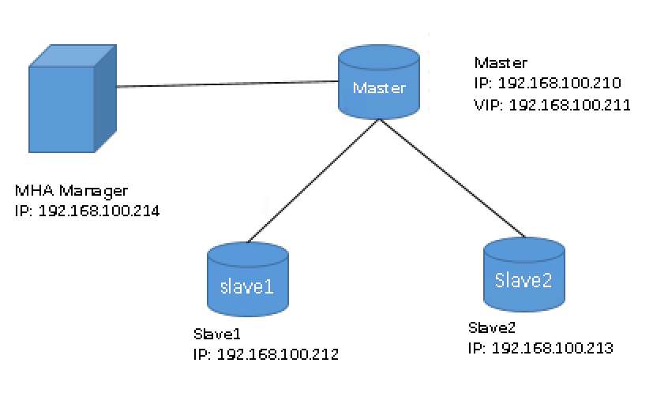

# MySQL MHA 搭建示例

### 一、环境信息

操作系统：CentOS Linux release 7.6.1810 (Core) 

MySQL 版本：mysql-5.7.28-linux-glibc2.12-x86_64.tar.gz

MHA 版本：mha4mysql-manager-0.58-0.el7.centos.noarch.rpm，mha4mysql-node-0.58-0.el7.centos.noarch.rpm

yum 源：base，epel

服务器节点：

| IP | 主机名 | 角色
| -- | -- | -- |
| 192.168.100.210 | master1 | 主库 | 
| 192.168.100.212 | slave1 | 从库 |
| 192.168.100.213 | slave2 | 从库 |
| 192.168.100.214 | slave3 | MHA 管理节点|

一主二从，管理节点单独安装在 slave4 节点上。



### 二、 搭建复制环境

数据库安装、初始化及配置复制略，以下记录主要步骤。

1、在主库创建复制及 MHA 使用账号：

```
复制账号
mysql 192.168.100.210:3306 [(none)]> create user rpl@'192.168.100.%' identified by 'rpl123;
mysql 192.168.100.210:3306 [(none)]> grant replication slave, replication client on *.* to 'rpl'@'192.168.100.%'

MHA 账号
mysql 192.168.100.210:3306 [(none)]> create user mhauser@'192.168.100.%' identified by 'mhauserpass';
mysql 192.168.100.210:3306 [(none)]> grant all privileges on *.* to  mhauser@'192.168.100.%';
```

2、各主机之间 ssh 免密互信

```
在 master1 服务器上操作
# ssh-keygen -t rsa -P''
# cat ~/.ssh/id_rsa.pub > ~/.ssh/authorized_keys
# chmod 600 ~/.ssh/authorized_keys
# scp ~/.ssh/id_rsa ~/.ssh/authorized_keys   slave1
# scp ~/.ssh/id_rsa ~/.ssh/authorized_keys   slave2
# scp ~/.ssh/id_rsa ~/.ssh/authorized_keys   slave3
# scp ~/.ssh/id_rsa ~/.ssh/authorized_keys   slave4
```

3、需要特别设定的两个参数：

```
各从节点必须显示启用 
read_only=1   //通过此参数判断从节点
relay_log_purge=0  //不自动清除中继日志，MHA 通过 relay_log 合并各从节点未完成的 bin_log，MHA node 通过 purge_relay_logs 来清理过期的中继日志
```


### 搭建 MHA 

1、下载 mha-manager, mha-node 后，yum 安装即可。

mha-manager： <https://github.com/yoshinorim/mha4mysql-manager/releases>

mha-node：<https://github.com/yoshinorim/mha4mysql-node/releases>

```
slave3 上 manager 和 node 都安装：
[root@slave3 ~]# ll
total 120
-rw-------. 1 root root  1261 Feb 14 09:10 anaconda-ks.cfg
-rw-r--r--. 1 root root 81024 Mar 22  2018 mha4mysql-manager-0.58-0.el7.centos.noarch.rpm
-rw-r--r--. 1 root root 36328 Mar 22  2018 mha4mysql-node-0.58-0.el7.centos.noarch.rpm
[root@slave3 ~]# yum install mha4mysql-*

m1, slave1, slave2 上只安装 node 即可
# yum install mha4mysql-node-0.58-0.el7.centos.noarch.rpm -y
```

2、初始化 MHA

在 MHA 管理节点自定义监控的集群配置文件：

```
[root@slave3 ~]# mkdir /etc/masterha/  //配置文件目录
[root@slave3 ~]# mkdir /data/masterha/app1 -pv  //MHA工作目录
[root@slave3 ~]# cat /etc/masterha/app1.cnf 
[server default]
user=mhauser
password=mhauserpass
manager_workdir=/data/masterha/app1
manager_log=/data/masterha/app1/manager.log
remote_workdir=/data/masterha/app1
ssh_user=root
repl_user=rpl
repl_password=rpl123
log_level=debug
ping_interval=3
ping_type=INSERT
master_binlog_dir=/mysqldata/
report_script=/usr/local/bin/send_report
master_ip_failover_script=/usr/local/bin/master_ip_failover
master_ip_online_change_script=/usr/local/bin/master_ip_online_change
secondary_check_script=/usr/bin/masterha_secondary_check -s 192.168.100.212 -s 192.168.100.213 --user=root --master_host=192.168.100.210 --master_port=3306 
#shutdown_script="/usr/local/bin/power_manager --command=stopssh2 --host=192.168.100.210 --ssh_user=root"

[server1]
hostname=192.168.100.210
#ssh_port=22
candidate_master=1

[server2]
hostname=192.168.100.212
candidate_master=1
check_repl_delay=0

[server3]
hostname=192.168.100.213
no_master=1
```

3、准备`master_ip_failover` , `master_ip_online_change` , `send_report` perl 脚本

`master_ip_failover` 和 `master_ip_online_change` 脚本如下，需要修改`VIP`相关配置。

`send_report` 脚本需要修改相关邮箱配置。

`master_ip_failover`：

```
#!/usr/bin/env perl

use strict;
use warnings FATAL => 'all';

use Getopt::Long;

my (
    $command,          $ssh_user,        $orig_master_host, $orig_master_ip,
    $orig_master_port, $new_master_host, $new_master_ip,    $new_master_port
);

my $vip = '192.168.100.211/24';
my $key = '88';
my $ssh_start_vip = "/sbin/ifconfig ens192:$key $vip";
my $ssh_stop_vip = "/sbin/ifconfig ens192:$key down";

GetOptions(
    'command=s'          => \$command,
    'ssh_user=s'         => \$ssh_user,
    'orig_master_host=s' => \$orig_master_host,
    'orig_master_ip=s'   => \$orig_master_ip,
    'orig_master_port=i' => \$orig_master_port,
    'new_master_host=s'  => \$new_master_host,
    'new_master_ip=s'    => \$new_master_ip,
    'new_master_port=i'  => \$new_master_port,
);

exit &main();

sub main {

    print "\n\nIN SCRIPT TEST====$ssh_stop_vip==$ssh_start_vip===\n\n";

    if ( $command eq "stop" || $command eq "stopssh" ) {

        my $exit_code = 1;
        eval {
            print "Disabling the VIP on old master: $orig_master_host \n";
            &stop_vip();
            $exit_code = 0;
        };
        if ($@) {
            warn "Got Error: $@\n";
            exit $exit_code;
        }
        exit $exit_code;
    }
    elsif ( $command eq "start" ) {

        my $exit_code = 10;
        eval {
            print "Enabling the VIP - $vip on the new master - $new_master_host \n";
            &start_vip();
            $exit_code = 0;
        };
        if ($@) {
            warn $@;
            exit $exit_code;
        }
        exit $exit_code;
    }
    elsif ( $command eq "status" ) {
        print "Checking the Status of the script.. OK \n";
        exit 0;
    }
    else {
        &usage();
        exit 1;
    }
}

sub start_vip() {
    `ssh $ssh_user\@$new_master_host \" $ssh_start_vip \"`;
}
sub stop_vip() {
     return 0  unless  ($ssh_user);
    `ssh $ssh_user\@$orig_master_host \" $ssh_stop_vip \"`;
}

sub usage {
    print
    "Usage: master_ip_failover --command=start|stop|stopssh|status --orig_master_host=host --orig_master_ip=ip --orig_master_port=port --new_master_host=host --new_master_ip=ip --new_master_port=port\n";
}
```

`master_ip_online_change`：

```
#!/usr/bin/env perl

use strict;
use warnings FATAL => 'all';

use Getopt::Long;

#my (
#    $command,          $ssh_user,        $orig_master_host, $orig_master_ip,
#    $orig_master_port, $new_master_host, $new_master_ip,    $new_master_port
#);

my (
  $command,              $orig_master_is_new_slave, $orig_master_host,
  $orig_master_ip,       $orig_master_port,         $orig_master_user,
  $orig_master_password, $orig_master_ssh_user,     $new_master_host,
  $new_master_ip,        $new_master_port,          $new_master_user,
  $new_master_password,  $new_master_ssh_user,
);


my $vip = '192.168.100.211/24';
my $key = '88';
my $ssh_start_vip = "/sbin/ifconfig ens192:$key $vip";
my $ssh_stop_vip = "/sbin/ifconfig ens192:$key down";
my $ssh_user = "root";

GetOptions(
    'command=s'          => \$command,
    #'ssh_user=s'         => \$ssh_user,
    #'orig_master_host=s' => \$orig_master_host,
    #'orig_master_ip=s'   => \$orig_master_ip,
    #'orig_master_port=i' => \$orig_master_port,
    #'new_master_host=s'  => \$new_master_host,
    #'new_master_ip=s'    => \$new_master_ip,
    #'new_master_port=i'  => \$new_master_port,
    'orig_master_is_new_slave' => \$orig_master_is_new_slave,
    'orig_master_host=s'       => \$orig_master_host,
    'orig_master_ip=s'         => \$orig_master_ip,
    'orig_master_port=i'       => \$orig_master_port,
    'orig_master_user=s'       => \$orig_master_user,
    'orig_master_password=s'   => \$orig_master_password,
    'orig_master_ssh_user=s'   => \$orig_master_ssh_user,
    'new_master_host=s'        => \$new_master_host,
    'new_master_ip=s'          => \$new_master_ip,
    'new_master_port=i'        => \$new_master_port,
    'new_master_user=s'        => \$new_master_user,
    'new_master_password=s'    => \$new_master_password,
    'new_master_ssh_user=s'    => \$new_master_ssh_user,
);

exit &main();

sub main {

    print "\n\nIN SCRIPT TEST====$ssh_stop_vip==$ssh_start_vip===\n\n";

    if ( $command eq "stop" || $command eq "stopssh" ) {

        my $exit_code = 1;
        eval {
            print "Disabling the VIP on old master: $orig_master_host \n";
            &stop_vip();
            $exit_code = 0;
        };
        if ($@) {
            warn "Got Error: $@\n";
            exit $exit_code;
        }
        exit $exit_code;
    }
    elsif ( $command eq "start" ) {

        my $exit_code = 10;
        eval {
            print "Enabling the VIP - $vip on the new master - $new_master_host \n";
            &start_vip();
            $exit_code = 0;
        };
        if ($@) {
            warn $@;
            exit $exit_code;
        }
        exit $exit_code;
    }
    elsif ( $command eq "status" ) {
        print "Checking the Status of the script.. OK \n";
        exit 0;
    }
    else {
        &usage();
        exit 1;
    }
}

sub start_vip() {
    `ssh $ssh_user\@$new_master_host \" $ssh_start_vip \"`;
}
sub stop_vip() {
     return 0  unless  ($ssh_user);
    `ssh $ssh_user\@$orig_master_host \" $ssh_stop_vip \"`;
}

sub usage {
    print
    "Usage: master_ip_failover --command=start|stop|stopssh|status --ssh-user=user --orig_master_host=host --orig_master_ip=ip --orig_master_port=port --new_master_host=host --new_master_ip=ip --new_master_port=port\n";
}
```

`send_report`：

```
[root@slave3 ~]# cat /usr/local/bin/send_report 
#!/usr/bin/perl

#  Copyright (C) 2011 DeNA Co.,Ltd.
#
#  This program is free software; you can redistribute it and/or modify
#  it under the terms of the GNU General Public License as published by
#  the Free Software Foundation; either version 2 of the License, or
#  (at your option) any later version.
#
#  This program is distributed in the hope that it will be useful,
#  but WITHOUT ANY WARRANTY; without even the implied warranty of
#  MERCHANTABILITY or FITNESS FOR A PARTICULAR PURPOSE.  See the
#  GNU General Public License for more details.
#
#  You should have received a copy of the GNU General Public License
#   along with this program; if not, write to the Free Software
#  Foundation, Inc.,
#  51 Franklin Street, Fifth Floor, Boston, MA  02110-1301  USA

## Note: This is a sample script and is not complete. Modify the script based on your environment.

use strict;
use warnings FATAL => 'all';
use Mail::Sender;
use Getopt::Long;

#new_master_host and new_slave_hosts are set only when recovering master succeeded
my ( $dead_master_host, $new_master_host, $new_slave_hosts, $subject, $body );
my $smtp='smtp.ym.163.com';
my $mail_from='wangjian@bizvane.cn';
my $mail_user='wangjian@bizvane.cn';
my $mail_pass='Pqms#9vd';
my $mail_to=['wangjian@bizvane.cn','929000201@qq.com'];
GetOptions(
  'orig_master_host=s' => \$dead_master_host,
  'new_master_host=s'  => \$new_master_host,
  'new_slave_hosts=s'  => \$new_slave_hosts,
  'subject=s'          => \$subject,
  'body=s'             => \$body,
);

mailToContacts($smtp,$mail_from,$mail_user,$mail_pass,$mail_to,$subject,$body);

sub mailToContacts {
    my ( $smtp, $mail_from, $user, $passwd, $mail_to, $subject, $msg ) = @_;
    open my $DEBUG, "> /tmp/monitormail.log"
        or die "Can't open the debug      file:$!\n";
    my $sender = new Mail::Sender {
        ctype       => 'text/plain; charset=utf-8',
        encoding    => 'utf-8',
        smtp        => $smtp,
        from        => $mail_from,
        auth        => 'LOGIN',
        TLS_allowed => '0',
        authid      => $user,
        authpwd     => $passwd,
        to          => $mail_to,
        subject     => $subject,
        debug       => $DEBUG
    };

    $sender->MailMsg(
        {   msg   => $msg,
            debug => $DEBUG
        }
    ) or print $Mail::Sender::Error;
    return 1;
}


# Do whatever you want here

exit 0;
```

4、检查各节点 ssh 通信配置是否 OK

```
[root@slave3 ~]# masterha_check_ssh --conf=/etc/mastermha/app1.cnf 
Sun Feb 16 02:52:53 2020 - [warning] Global configuration file /etc/masterha_default.cnf not found. Skipping.
Sun Feb 16 02:52:53 2020 - [info] Reading application default configuration from /etc/mastermha/app1.cnf..
Sun Feb 16 02:52:53 2020 - [info] Reading server configuration from /etc/mastermha/app1.cnf..
Sun Feb 16 02:52:53 2020 - [info] Starting SSH connection tests..
Sun Feb 16 02:52:54 2020 - [debug] 
Sun Feb 16 02:52:53 2020 - [debug]  Connecting via SSH from root@192.168.100.210(192.168.100.210:22) to root@192.168.100.212(192.168.100.212:22)..
Sun Feb 16 02:52:54 2020 - [debug]   ok.
Sun Feb 16 02:52:54 2020 - [debug]  Connecting via SSH from root@192.168.100.210(192.168.100.210:22) to root@192.168.100.213(192.168.100.213:22)..
Sun Feb 16 02:52:54 2020 - [debug]   ok.
Sun Feb 16 02:52:55 2020 - [debug] 
Sun Feb 16 02:52:54 2020 - [debug]  Connecting via SSH from root@192.168.100.213(192.168.100.213:22) to root@192.168.100.210(192.168.100.210:22)..
Sun Feb 16 02:52:55 2020 - [debug]   ok.
Sun Feb 16 02:52:55 2020 - [debug]  Connecting via SSH from root@192.168.100.213(192.168.100.213:22) to root@192.168.100.212(192.168.100.212:22)..
Sun Feb 16 02:52:55 2020 - [debug]   ok.
Sun Feb 16 02:52:55 2020 - [debug] 
Sun Feb 16 02:52:54 2020 - [debug]  Connecting via SSH from root@192.168.100.212(192.168.100.212:22) to root@192.168.100.210(192.168.100.210:22)..
Sun Feb 16 02:52:54 2020 - [debug]   ok.
Sun Feb 16 02:52:54 2020 - [debug]  Connecting via SSH from root@192.168.100.212(192.168.100.212:22) to root@192.168.100.213(192.168.100.213:22)..
Sun Feb 16 02:52:54 2020 - [debug]   ok.
Sun Feb 16 02:52:55 2020 - [info] All SSH connection tests passed successfully.
```


5、检查复制环境是否 OK

```
[root@slave3 ~]# masterha_check_repl --conf=/etc/mastermha/app1.cnf 
Sun Feb 16 02:59:13 2020 - [warning] Global configuration file /etc/masterha_default.cnf not found. Skipping.
Sun Feb 16 02:59:13 2020 - [info] Reading application default configuration from /etc/mastermha/app1.cnf..
Sun Feb 16 02:59:13 2020 - [info] Reading server configuration from /etc/mastermha/app1.cnf..
Sun Feb 16 02:59:13 2020 - [info] MHA::MasterMonitor version 0.58.
Sun Feb 16 02:59:14 2020 - [info] GTID failover mode = 0
Sun Feb 16 02:59:14 2020 - [info] Dead Servers:
Sun Feb 16 02:59:14 2020 - [info] Alive Servers:
Sun Feb 16 02:59:14 2020 - [info]   192.168.100.210(192.168.100.210:3306)
Sun Feb 16 02:59:14 2020 - [info]   192.168.100.212(192.168.100.212:3306)
Sun Feb 16 02:59:14 2020 - [info]   192.168.100.213(192.168.100.213:3306)
Sun Feb 16 02:59:14 2020 - [info] Alive Slaves:
Sun Feb 16 02:59:14 2020 - [info]   192.168.100.212(192.168.100.212:3306)  Version=5.7.28-log (oldest major version between slaves) log-bin:enabled
Sun Feb 16 02:59:14 2020 - [info]     Replicating from 192.168.100.210(192.168.100.210:3306)
Sun Feb 16 02:59:14 2020 - [info]     Primary candidate for the new Master (candidate_master is set)
Sun Feb 16 02:59:14 2020 - [info]   192.168.100.213(192.168.100.213:3306)  Version=5.7.28-log (oldest major version between slaves) log-bin:enabled
Sun Feb 16 02:59:14 2020 - [info]     Replicating from 192.168.100.210(192.168.100.210:3306)
Sun Feb 16 02:59:14 2020 - [info] Current Alive Master: 192.168.100.210(192.168.100.210:3306)
Sun Feb 16 02:59:14 2020 - [info] Checking slave configurations..
Sun Feb 16 02:59:14 2020 - [info]  read_only=1 is not set on slave 192.168.100.212(192.168.100.212:3306).
Sun Feb 16 02:59:14 2020 - [warning]  relay_log_purge=0 is not set on slave 192.168.100.212(192.168.100.212:3306).
Sun Feb 16 02:59:14 2020 - [info]  read_only=1 is not set on slave 192.168.100.213(192.168.100.213:3306).
Sun Feb 16 02:59:14 2020 - [warning]  relay_log_purge=0 is not set on slave 192.168.100.213(192.168.100.213:3306).
Sun Feb 16 02:59:14 2020 - [info] Checking replication filtering settings..
Sun Feb 16 02:59:14 2020 - [info]  binlog_do_db= , binlog_ignore_db= 
Sun Feb 16 02:59:14 2020 - [info]  Replication filtering check ok.
Sun Feb 16 02:59:14 2020 - [info] GTID (with auto-pos) is not supported
Sun Feb 16 02:59:14 2020 - [info] Starting SSH connection tests..
Sun Feb 16 02:59:15 2020 - [info] All SSH connection tests passed successfully.
Sun Feb 16 02:59:15 2020 - [info] Checking MHA Node version..
Sun Feb 16 02:59:16 2020 - [info]  Version check ok.
Sun Feb 16 02:59:16 2020 - [info] Checking SSH publickey authentication settings on the current master..
Sun Feb 16 02:59:16 2020 - [info] HealthCheck: SSH to 192.168.100.210 is reachable.
Sun Feb 16 02:59:16 2020 - [info] Master MHA Node version is 0.58.
Sun Feb 16 02:59:16 2020 - [info] Checking recovery script configurations on 192.168.100.210(192.168.100.210:3306)..
Sun Feb 16 02:59:16 2020 - [info]   Executing command: save_binary_logs --command=test --start_pos=4 --binlog_dir=/mysqldata/ --output_file=/data/mastermha/app1/save_binary_logs_test --manager_version=0.58 --start_file=mysql-bin.000025 
Sun Feb 16 02:59:16 2020 - [info]   Connecting to root@192.168.100.210(192.168.100.210:22).. 
  Creating /data/mastermha/app1 if not exists.. Creating directory /data/mastermha/app1.. done.
   ok.
  Checking output directory is accessible or not..
   ok.
  Binlog found at /mysqldata/, up to mysql-bin.000025
Sun Feb 16 02:59:16 2020 - [info] Binlog setting check done.
Sun Feb 16 02:59:16 2020 - [info] Checking SSH publickey authentication and checking recovery script configurations on all alive slave servers..
Sun Feb 16 02:59:16 2020 - [info]   Executing command : apply_diff_relay_logs --command=test --slave_user='mhauser' --slave_host=192.168.100.212 --slave_ip=192.168.100.212 --slave_port=3306 --workdir=/data/mastermha/app1 --target_version=5.7.28-log --manager_version=0.58 --relay_log_info=/mysqldata/relay-log.info  --relay_dir=/mysqldata/  --slave_pass=xxx
Sun Feb 16 02:59:16 2020 - [info]   Connecting to root@192.168.100.212(192.168.100.212:22).. 
Creating directory /data/mastermha/app1.. done.
  Checking slave recovery environment settings..
    Opening /mysqldata/relay-log.info ... ok.
    Relay log found at /mysqldata, up to slave1-relay-bin.000008
    Temporary relay log file is /mysqldata/slave1-relay-bin.000008
    Checking if super_read_only is defined and turned on.. not present or turned off, ignoring.
    Testing mysql connection and privileges..
mysql: [Warning] Using a password on the command line interface can be insecure.
 done.
    Testing mysqlbinlog output.. done.
    Cleaning up test file(s).. done.
Sun Feb 16 02:59:17 2020 - [info]   Executing command : apply_diff_relay_logs --command=test --slave_user='mhauser' --slave_host=192.168.100.213 --slave_ip=192.168.100.213 --slave_port=3306 --workdir=/data/mastermha/app1 --target_version=5.7.28-log --manager_version=0.58 --relay_dir=/mysqldata --current_relay_log=slave2-relay-bin.000009  --slave_pass=xxx
Sun Feb 16 02:59:17 2020 - [info]   Connecting to root@192.168.100.213(192.168.100.213:22).. 
Creating directory /data/mastermha/app1.. done.
  Checking slave recovery environment settings..
    Relay log found at /mysqldata, up to slave2-relay-bin.000009
    Temporary relay log file is /mysqldata/slave2-relay-bin.000009
    Checking if super_read_only is defined and turned on.. not present or turned off, ignoring.
    Testing mysql connection and privileges..
mysql: [Warning] Using a password on the command line interface can be insecure.
 done.
    Testing mysqlbinlog output.. done.
    Cleaning up test file(s).. done.
Sun Feb 16 02:59:17 2020 - [info] Slaves settings check done.
Sun Feb 16 02:59:17 2020 - [info] 
192.168.100.210(192.168.100.210:3306) (current master)
 +--192.168.100.212(192.168.100.212:3306)
 +--192.168.100.213(192.168.100.213:3306)

Sun Feb 16 02:59:17 2020 - [info] Checking replication health on 192.168.100.212..
Sun Feb 16 02:59:17 2020 - [info]  ok.
Sun Feb 16 02:59:17 2020 - [info] Checking replication health on 192.168.100.213..
Sun Feb 16 02:59:17 2020 - [info]  ok.
Sun Feb 16 02:59:17 2020 - [warning] master_ip_failover_script is not defined.
Sun Feb 16 02:59:17 2020 - [warning] shutdown_script is not defined.
Sun Feb 16 02:59:17 2020 - [info] Got exit code 0 (Not master dead).

MySQL Replication Health is OK.
```

6、在主节点（192.168.100.210）启动 VIP：

```
[root@master ~]# ifconfig ens192:88 192.168.100.211/24
[root@master ~]# ip addr
2: ens192: <BROADCAST,MULTICAST,UP,LOWER_UP> mtu 1500 qdisc mq state UP group default qlen 1000
    link/ether 00:50:56:b7:9c:c5 brd ff:ff:ff:ff:ff:ff
    inet 192.168.100.210/24 brd 192.168.100.255 scope global noprefixroute ens192
       valid_lft forever preferred_lft forever
    inet 192.168.100.211/24 brd 192.168.100.255 scope global secondary ens192:88
       valid_lft forever preferred_lft forever
    inet6 fe80::250:56ff:feb7:9cc5/64 scope link 
       valid_lft forever preferred_lft forever
```

7、在线切换测试

```
[root@slave3 ~]#  masterha_master_switch --conf=/etc/masterha/app1.cnf --master_state=alive --running_updates_limit=10000 --orig_master_is_new_slave --new_master_host=192.168.100.212
Wed Feb 19 07:39:39 2020 - [info] MHA::MasterRotate version 0.58.
Wed Feb 19 07:39:39 2020 - [info] Starting online master switch..
Wed Feb 19 07:39:39 2020 - [info] 
Wed Feb 19 07:39:39 2020 - [info] * Phase 1: Configuration Check Phase..
Wed Feb 19 07:39:39 2020 - [info] 
Wed Feb 19 07:39:39 2020 - [warning] Global configuration file /etc/masterha_default.cnf not found. Skipping.
Wed Feb 19 07:39:39 2020 - [info] Reading application default configuration from /etc/masterha/app1.cnf..
Wed Feb 19 07:39:39 2020 - [info] Reading server configuration from /etc/masterha/app1.cnf..
Wed Feb 19 07:39:39 2020 - [debug] Connecting to servers..
Wed Feb 19 07:39:40 2020 - [debug]  Connected to: 192.168.100.210(192.168.100.210:3306), user=mhauser
Wed Feb 19 07:39:40 2020 - [debug]  Number of slave worker threads on host 192.168.100.210(192.168.100.210:3306): 0
Wed Feb 19 07:39:40 2020 - [debug]  Connected to: 192.168.100.212(192.168.100.212:3306), user=mhauser
Wed Feb 19 07:39:40 2020 - [debug]  Number of slave worker threads on host 192.168.100.212(192.168.100.212:3306): 0
Wed Feb 19 07:39:40 2020 - [debug]  Connected to: 192.168.100.213(192.168.100.213:3306), user=mhauser
Wed Feb 19 07:39:40 2020 - [debug]  Number of slave worker threads on host 192.168.100.213(192.168.100.213:3306): 4
Wed Feb 19 07:39:40 2020 - [debug]  Comparing MySQL versions..
Wed Feb 19 07:39:40 2020 - [debug]   Comparing MySQL versions done.
Wed Feb 19 07:39:40 2020 - [debug] Connecting to servers done.
Wed Feb 19 07:39:40 2020 - [info] GTID failover mode = 0
Wed Feb 19 07:39:40 2020 - [info] Current Alive Master: 192.168.100.210(192.168.100.210:3306)
Wed Feb 19 07:39:40 2020 - [info] Alive Slaves:
Wed Feb 19 07:39:40 2020 - [info]   192.168.100.212(192.168.100.212:3306)  Version=5.7.28-log (oldest major version between slaves) log-bin:enabled
Wed Feb 19 07:39:40 2020 - [debug]    Relay log info repository: FILE
Wed Feb 19 07:39:40 2020 - [info]     Replicating from 192.168.100.210(192.168.100.210:3306)
Wed Feb 19 07:39:40 2020 - [info]     Primary candidate for the new Master (candidate_master is set)
Wed Feb 19 07:39:40 2020 - [info]   192.168.100.213(192.168.100.213:3306)  Version=5.7.28-log (oldest major version between slaves) log-bin:enabled
Wed Feb 19 07:39:40 2020 - [debug]    Relay log info repository: TABLE
Wed Feb 19 07:39:40 2020 - [info]     Replicating from 192.168.100.210(192.168.100.210:3306)
Wed Feb 19 07:39:40 2020 - [info]     Not candidate for the new Master (no_master is set)

It is better to execute FLUSH NO_WRITE_TO_BINLOG TABLES on the master before switching. Is it ok to execute on 192.168.100.210(192.168.100.210:3306)? (YES/no): yes
Wed Feb 19 07:39:43 2020 - [info] Executing FLUSH NO_WRITE_TO_BINLOG TABLES. This may take long time..
Wed Feb 19 07:39:43 2020 - [info]  ok.
Wed Feb 19 07:39:43 2020 - [info] Checking MHA is not monitoring or doing failover..
Wed Feb 19 07:39:43 2020 - [info] Checking replication health on 192.168.100.212..
Wed Feb 19 07:39:43 2020 - [info]  ok.
Wed Feb 19 07:39:43 2020 - [info] Checking replication health on 192.168.100.213..
Wed Feb 19 07:39:43 2020 - [info]  ok.
Wed Feb 19 07:39:43 2020 - [info] 192.168.100.212 can be new master.
Wed Feb 19 07:39:43 2020 - [info] 
From:
192.168.100.210(192.168.100.210:3306) (current master)
 +--192.168.100.212(192.168.100.212:3306)
 +--192.168.100.213(192.168.100.213:3306)

To:
192.168.100.212(192.168.100.212:3306) (new master)
 +--192.168.100.213(192.168.100.213:3306)
 +--192.168.100.210(192.168.100.210:3306)

Starting master switch from 192.168.100.210(192.168.100.210:3306) to 192.168.100.212(192.168.100.212:3306)? (yes/NO): yes
Wed Feb 19 07:39:45 2020 - [info] Checking whether 192.168.100.212(192.168.100.212:3306) is ok for the new master..
Wed Feb 19 07:39:45 2020 - [info]  ok.
Wed Feb 19 07:39:45 2020 - [info] 192.168.100.210(192.168.100.210:3306): SHOW SLAVE STATUS returned empty result. To check replication filtering rules, temporarily executing CHANGE MASTER to a dummy host.
Wed Feb 19 07:39:45 2020 - [info] 192.168.100.210(192.168.100.210:3306): Resetting slave pointing to the dummy host.
Wed Feb 19 07:39:45 2020 - [info] ** Phase 1: Configuration Check Phase completed.
Wed Feb 19 07:39:45 2020 - [info] 
Wed Feb 19 07:39:45 2020 - [debug]  Disconnected from 192.168.100.210(192.168.100.210:3306)
Wed Feb 19 07:39:45 2020 - [info] * Phase 2: Rejecting updates Phase..
Wed Feb 19 07:39:45 2020 - [info] 
Wed Feb 19 07:39:45 2020 - [info] Executing master ip online change script to disable write on the current master:
Wed Feb 19 07:39:45 2020 - [info]   /usr/local/bin/master_ip_online_change --command=stop --orig_master_host=192.168.100.210 --orig_master_ip=192.168.100.210 --orig_master_port=3306 --orig_master_user='mhauser' --new_master_host=192.168.100.212 --new_master_ip=192.168.100.212 --new_master_port=3306 --new_master_user='mhauser' --orig_master_ssh_user=root --new_master_ssh_user=root   --orig_master_is_new_slave --orig_master_password=xxx --new_master_password=xxx


IN SCRIPT TEST====/sbin/ifconfig ens192:88 down==/sbin/ifconfig ens192:88 192.168.100.211/24===

Disabling the VIP on old master: 192.168.100.210 
Wed Feb 19 07:39:45 2020 - [info]  ok.
Wed Feb 19 07:39:45 2020 - [info] Locking all tables on the orig master to reject updates from everybody (including root):
Wed Feb 19 07:39:45 2020 - [info] Executing FLUSH TABLES WITH READ LOCK..
Wed Feb 19 07:39:45 2020 - [info]  ok.
Wed Feb 19 07:39:45 2020 - [info] Orig master binlog:pos is mysql-bin.000027:105531056.
Wed Feb 19 07:39:45 2020 - [debug] Fetching current slave status..
Wed Feb 19 07:39:45 2020 - [debug]  Fetching current slave status done.
Wed Feb 19 07:39:45 2020 - [info]  Waiting to execute all relay logs on 192.168.100.212(192.168.100.212:3306)..
Wed Feb 19 07:39:45 2020 - [info]  master_pos_wait(mysql-bin.000027:105531056) completed on 192.168.100.212(192.168.100.212:3306). Executed 0 events.
Wed Feb 19 07:39:45 2020 - [info]   done.
Wed Feb 19 07:39:45 2020 - [debug]  Stopping SQL thread on 192.168.100.212(192.168.100.212:3306)..
Wed Feb 19 07:39:45 2020 - [debug]   done.
Wed Feb 19 07:39:45 2020 - [info] Getting new master's binlog name and position..
Wed Feb 19 07:39:45 2020 - [info]  mysql-bin.000002:382741086
Wed Feb 19 07:39:45 2020 - [info]  All other slaves should start replication from here. Statement should be: CHANGE MASTER TO MASTER_HOST='192.168.100.212', MASTER_PORT=3306, MASTER_LOG_FILE='mysql-bin.000002', MASTER_LOG_POS=382741086, MASTER_USER='rpl', MASTER_PASSWORD='xxx';
Wed Feb 19 07:39:45 2020 - [info] Executing master ip online change script to allow write on the new master:
Wed Feb 19 07:39:45 2020 - [info]   /usr/local/bin/master_ip_online_change --command=start --orig_master_host=192.168.100.210 --orig_master_ip=192.168.100.210 --orig_master_port=3306 --orig_master_user='mhauser' --new_master_host=192.168.100.212 --new_master_ip=192.168.100.212 --new_master_port=3306 --new_master_user='mhauser' --orig_master_ssh_user=root --new_master_ssh_user=root   --orig_master_is_new_slave --orig_master_password=xxx --new_master_password=xxx


IN SCRIPT TEST====/sbin/ifconfig ens192:88 down==/sbin/ifconfig ens192:88 192.168.100.211/24===

Enabling the VIP - 192.168.100.211/24 on the new master - 192.168.100.212 
Wed Feb 19 07:39:45 2020 - [info]  ok.
Wed Feb 19 07:39:45 2020 - [info] Setting read_only=0 on 192.168.100.212(192.168.100.212:3306)..
Wed Feb 19 07:39:45 2020 - [info]  ok.
Wed Feb 19 07:39:45 2020 - [info] 
Wed Feb 19 07:39:45 2020 - [info] * Switching slaves in parallel..
Wed Feb 19 07:39:45 2020 - [info] 
Wed Feb 19 07:39:45 2020 - [info] -- Slave switch on host 192.168.100.213(192.168.100.213:3306) started, pid: 29925
Wed Feb 19 07:39:45 2020 - [info] 
Wed Feb 19 07:39:46 2020 - [info] Log messages from 192.168.100.213 ...
Wed Feb 19 07:39:46 2020 - [info] 
Wed Feb 19 07:39:45 2020 - [info]  Waiting to execute all relay logs on 192.168.100.213(192.168.100.213:3306)..
Wed Feb 19 07:39:45 2020 - [info]  master_pos_wait(mysql-bin.000027:105531056) completed on 192.168.100.213(192.168.100.213:3306). Executed 0 events.
Wed Feb 19 07:39:45 2020 - [info]   done.
Wed Feb 19 07:39:45 2020 - [debug]  Stopping SQL thread on 192.168.100.213(192.168.100.213:3306)..
Wed Feb 19 07:39:45 2020 - [debug]   done.
Wed Feb 19 07:39:45 2020 - [info]  Resetting slave 192.168.100.213(192.168.100.213:3306) and starting replication from the new master 192.168.100.212(192.168.100.212:3306)..
Wed Feb 19 07:39:45 2020 - [debug]  Stopping slave IO/SQL thread on 192.168.100.213(192.168.100.213:3306)..
Wed Feb 19 07:39:45 2020 - [debug]   done.
Wed Feb 19 07:39:45 2020 - [info]  Executed CHANGE MASTER.
Wed Feb 19 07:39:45 2020 - [debug]  Starting slave IO/SQL thread on 192.168.100.213(192.168.100.213:3306)..
Wed Feb 19 07:39:45 2020 - [debug]   done.
Wed Feb 19 07:39:45 2020 - [info]  Slave started.
Wed Feb 19 07:39:46 2020 - [info] End of log messages from 192.168.100.213 ...
Wed Feb 19 07:39:46 2020 - [info] 
Wed Feb 19 07:39:46 2020 - [info] -- Slave switch on host 192.168.100.213(192.168.100.213:3306) succeeded.
Wed Feb 19 07:39:46 2020 - [info] Unlocking all tables on the orig master:
Wed Feb 19 07:39:46 2020 - [info] Executing UNLOCK TABLES..
Wed Feb 19 07:39:46 2020 - [info]  ok.
Wed Feb 19 07:39:46 2020 - [info] Starting orig master as a new slave..
Wed Feb 19 07:39:46 2020 - [info]  Resetting slave 192.168.100.210(192.168.100.210:3306) and starting replication from the new master 192.168.100.212(192.168.100.212:3306)..
Wed Feb 19 07:39:46 2020 - [info]  Executed CHANGE MASTER.
Wed Feb 19 07:39:46 2020 - [debug] Explicitly disabled relay_log_purge.
Wed Feb 19 07:39:46 2020 - [debug]  Starting slave IO/SQL thread on 192.168.100.210(192.168.100.210:3306)..
Wed Feb 19 07:39:46 2020 - [debug]   done.
Wed Feb 19 07:39:46 2020 - [info]  Slave started.
Wed Feb 19 07:39:46 2020 - [debug]  ok.
Wed Feb 19 07:39:46 2020 - [info] All new slave servers switched successfully.
Wed Feb 19 07:39:46 2020 - [info] 
Wed Feb 19 07:39:46 2020 - [info] * Phase 5: New master cleanup phase..
Wed Feb 19 07:39:46 2020 - [info] 
Wed Feb 19 07:39:46 2020 - [debug]  Clearing slave info..
Wed Feb 19 07:39:46 2020 - [debug]  Stopping slave IO/SQL thread on 192.168.100.212(192.168.100.212:3306)..
Wed Feb 19 07:39:46 2020 - [debug]   done.
Wed Feb 19 07:39:46 2020 - [debug]  SHOW SLAVE STATUS shows new master does not replicate from anywhere. OK.
Wed Feb 19 07:39:46 2020 - [info]  192.168.100.212: Resetting slave info succeeded.
Wed Feb 19 07:39:46 2020 - [info] Switching master to 192.168.100.212(192.168.100.212:3306) completed successfully.
Wed Feb 19 07:39:46 2020 - [debug]  Disconnected from 192.168.100.210(192.168.100.210:3306)
Wed Feb 19 07:39:46 2020 - [debug]  Disconnected from 192.168.100.212(192.168.100.212:3306)
Wed Feb 19 07:39:46 2020 - [debug]  Disconnected from 192.168.100.213(192.168.100.213:3306)
```

8、启动 MHA Manager 

```
nohup masterha_manager --conf=/etc/masterha/app1.cnf --ignor-last-failover > /data/masterha/app1/manager.log 2>&1 &

--ignor-last-failover: 如果最近failover 失败，MHA 将不会再次开始failover机制，因为这个问题可能再次发生。常规步骤:手动清理failover 错误文件，此文件一般在manager_workdir/app_name.failover.error文件，然后在启动failover机制。如果设置此参数，MHA 将会继续failover 不管上次的failover状态
```

当 master 节点切换后，`masterha_manager` 服务需要重启。

参考：
<https://www.cnblogs.com/gomysql/p/3675429.html>
<https://yq.aliyun.com/articles/203831>

（完） 