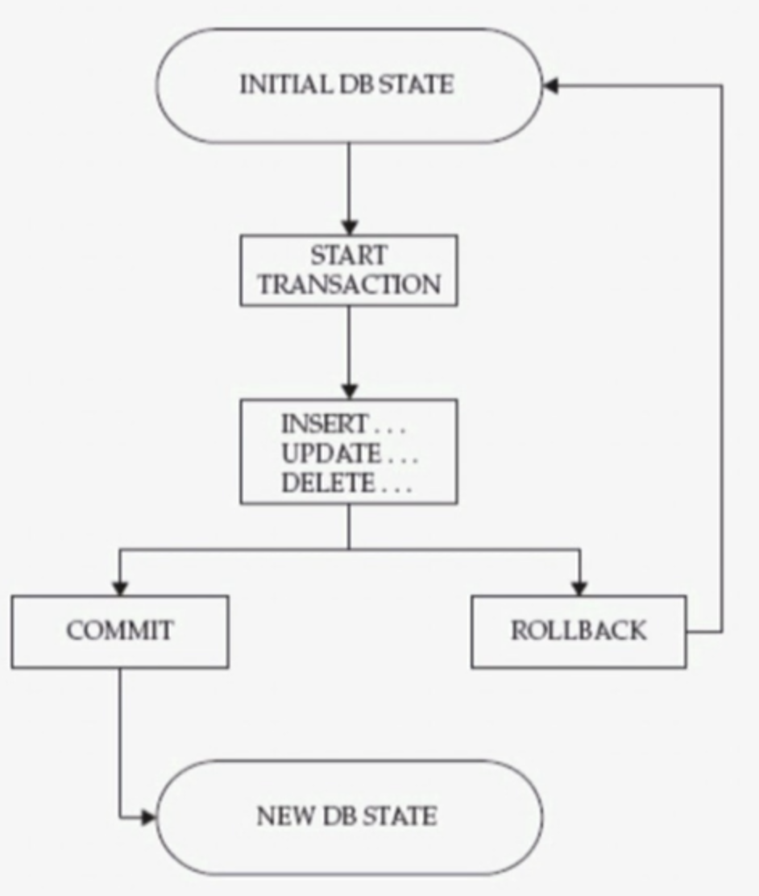

    第 40 天 【MySQL中的事务(04)】

## MySQL 事务

事务是一组原子性的SQL查询，或者说是一个独立工作单元。

- 锁分类：
    + 隐式锁：由存储引擎自动施加锁；
    + 显式锁：手动显示指定对相关数据施加锁；

- ACID测试：
    + A：atomicity，原子性：整个事务中的所有操作要么全部成功执行，要么全部失败后回滚；
    + C：consistency，一致性：数据库总是从一个一致性状态转换为另一个一致性状态；
    + I：Isolation，隔离性：一个事务所做出的操作在提交之前，是不能为其它所见；隔离有多种隔离级别；
    + D：durability，持久性：一旦事务提交，其所做的修改会永久保存于数据库中；

**Transaction life cycle:**



启动事务：START TRANSACTION；<br>
结束事务：（1）COMMIT：提交，（2）ROLLBACK：回滚；<br>
注意：只有事务型存储引擎方能支持此类操作；

**autocommit:**

MySQL默认操作模式就是autocommit自动提交模式。这就表示除非显式地开始一个事务，否则每个查询都被当做一个单独的事务自动执行。我们可以通过设置autocommit的值改变是否是自动提交autocommit模式。
```
MariaDB [hellodb]> SHOW GLOBAL VARIABLES LIKE 'autocommit';
+---------------+-------+
| Variable_name | Value |
+---------------+-------+
| autocommit    | ON    |
+---------------+-------+
1 row in set (0.00 sec)
```
从查询结果中，我们发现Value的值是ON，表示autocommit开启。我们可以通过以下SQL语句改变这个模式
```
MariaDB [hellodb]> set autocommit = 0;
```
值0和OFF都是一样的，当然，1也就表示ON。通过以上设置autocommit=0，则用户将一直处于某个事务中，直到执行一条commit提交或rollback语句才会结束当前事务重新开始一个新的事务。

建议显示请求和提交事务，而不是要使用“自动提交”的功能；

**事务支持savepoint**

```
Syntax:
SAVEPOINT identifier
ROLLBACK [WORK] TO [SAVEPOINT] identifier
RELEASE SAVEPOINT identifier

InnoDB supports the SQL statements SAVEPOINT, ROLLBACK TO SAVEPOINT,
RELEASE SAVEPOINT and the optional WORK keyword for ROLLBACK.
```


#### 事务隔离级别：
```
MariaDB [hellodb]> SHOW GLOBAL VARIABLES LIKE 'tx_isolation';
+---------------+-----------------+
| Variable_name | Value           |
+---------------+-----------------+
| tx_isolation  | REPEATABLE-READ |
+---------------+-----------------+
1 row in set (0.00 sec)
```

`tx_isolation`：服务器变量，默认为`REPEATABLE-READ`；可以设置如下值，可在`SESSION`级进行修改；
```
SET tx_isolation=''
    READ-UNCOMMITTED
    READ-COMMITTED
    REPEATABLE-READ
    SERIALIZABLE
```

READ UNCOMMITTED（读未提交）：脏读、不可重复读、幻读；

READ COMMITED（读提交）：不可重复读、幻读；

REPEATEABLE READ（可重读）：幻读；

SERIALIZABILE（可串行化）：锁数据；

可能存在的问题：

- 脏读：能够读到其它事务修改尚未提交的数据；
- 不可重复读：由于受其它事务的影响导致两次读取的数据不一致；
- 幻读：数据已经被另一事务修改并提交，但当前事务读到的数据显示并没有修改；
- 加锁读：对读取的数据加排他锁，影响并发操作；

[什么是脏读、不可重复读、幻读](http://www.cnblogs.com/phoebus0501/archive/2011/02/28/1966709.html)

MVCC：多版本并发控制

**死锁**

两个或多个事务在一组资源相互占用，并请求锁定对方占用的资源的状态；

**事务日志** 

事务日志的写入类型为“追加”，因此其操作为“顺序IO”；此日志通常也被称为“预写式日志（write ahead logging）”；
```
MariaDB [hellodb]> SHOW VARIABLES LIKE 'innodb_log%';
+---------------------------+---------+
| Variable_name             | Value   |
+---------------------------+---------+
| innodb_log_block_size     | 512     |
| innodb_log_buffer_size    | 8388608 |
| innodb_log_file_size      | 5242880 |
| innodb_log_files_in_group | 2       |
| innodb_log_group_home_dir | ./      |
+---------------------------+---------+
5 rows in set (0.00 sec)
```

（完）
