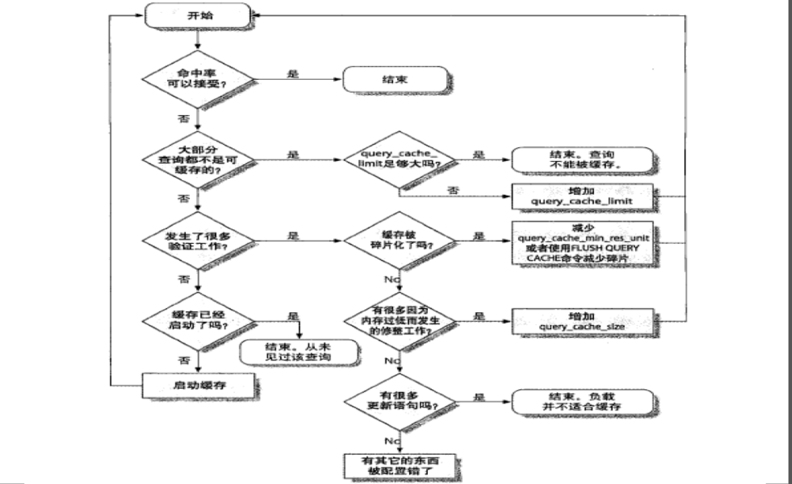

## MySQL 查询缓存

    第 40 天 【用户、权限管理及查询缓存(01)】

#### 如何判断缓存是否命中：<br>
通过查询语句的哈希值判断，哈希值考虑的因素包括：查询本身、要查询的数据库、客户端使用协议版本，等等；在查询时，查询语句任何字符上的不同，都会导致缓存不能命中；

#### 哪些查询可能不会被缓存？
- 查询中包含UDF(User Defin Function)
- 存储函数
- 用户自定义变量
- 临时表
- MySQL库中系统表
- 包含列级别权限的表
- 有着不确定值的函数(Now())

#### 查询缓存相关的服务器变量：<br>
```
MariaDB [(none)]> SHOW GLOBAL VARIABLES LIKE 'query%';
+------------------------------+----------+
| Variable_name                | Value    |
+------------------------------+----------+
| query_alloc_block_size       | 8192     |
| query_cache_limit            | 1048576  |
| query_cache_min_res_unit     | 4096     |
| query_cache_size             | 16777216 |
| query_cache_strip_comments   | OFF      |
| query_cache_type             | ON       |
| query_cache_wlock_invalidate | OFF      |
| query_prealloc_size          | 8192     |
+------------------------------+----------+
8 rows in set (0.00 sec)
```
query_cache_min_res_unit：查询缓存中内存块的最小分配单位；较小值会减少浪费，但会导致频繁的内存分配操作；较大的值会带来浪费，较大的值会导致内存碎片；<br>
query_cache_limit：能够缓存的最大查询结果；对于有着较大结果的查询语句，建议在SELECT中使用SQL_NO_CACHE；<br>
query_cache_size：查询缓存总共可用的内存空间；单位是字节，必须是1024的整数倍；<br>
query_cache_type：ON, OFF, DEMAND(查询时显示指定SQL_CACHE才会缓存，否则不予缓存)；<br>
query_cache_wlock_invalidate：如果某表被其它的连接锁定，是否仍然可以从查询缓存中返回结果；默认值为OFF，表示可以在表被其它连接锁定的场景中继续从缓存返回数据；ON则表示不允许；<br>

#### 优化缓存



#### 查询相关的状态变量

```
MariaDB [(none)]> SHOW GLOBAL STATUS LIKE 'Qcache%';
+-------------------------+----------+
| Variable_name           | Value    |
+-------------------------+----------+
| Qcache_free_blocks      | 1        |
| Qcache_free_memory      | 16750360 |
| Qcache_hits             | 2        |
| Qcache_inserts          | 8        |
| Qcache_lowmem_prunes    | 0        |
| Qcache_not_cached       | 80       |
| Qcache_queries_in_cache | 8        |
| Qcache_total_blocks     | 19       |
+-------------------------+----------+
8 rows in set (0.00 sec)
```

- 缓存命中率的评估：Qcache_hits/(Qcache_hits + Com_select)
    + Com_select：记录由 MySQL 执行的查询次数，如果结果从查询缓存里得来，就增加Qcache_hits，而不增加Com_select；


（完）


