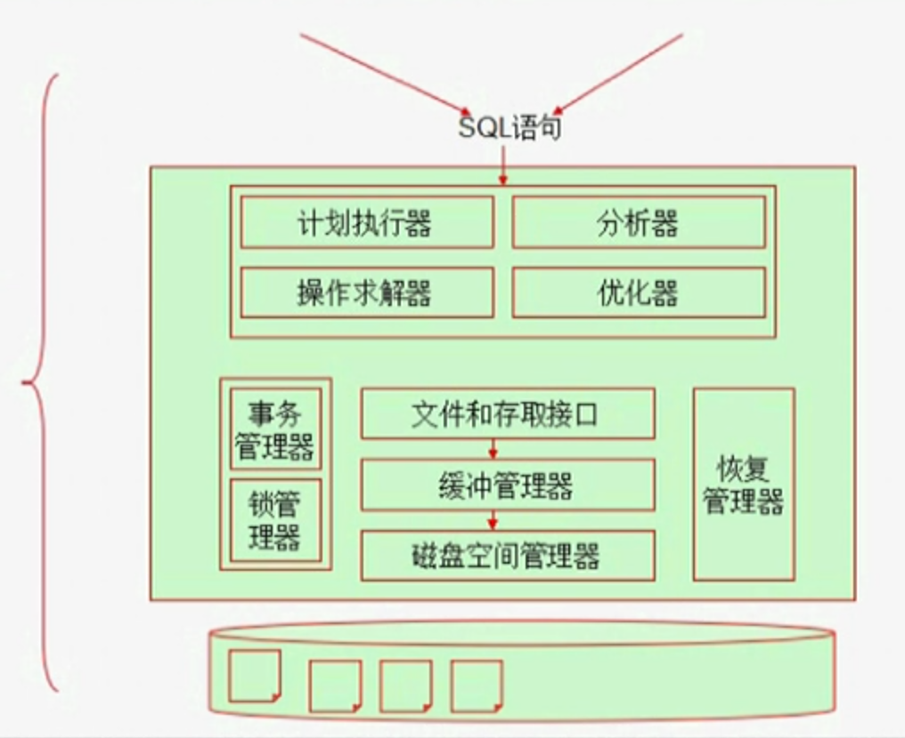
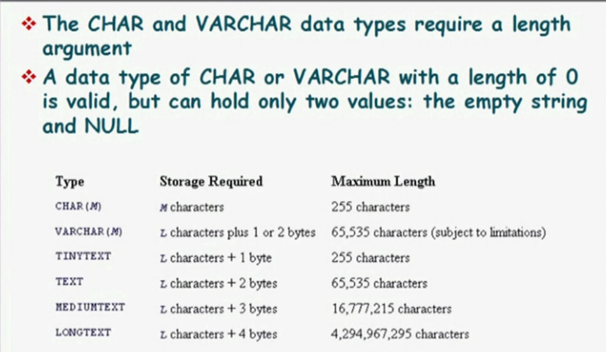
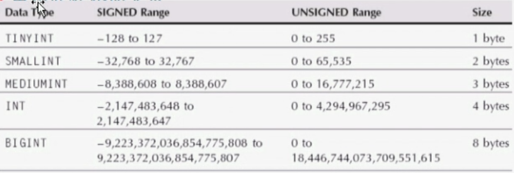
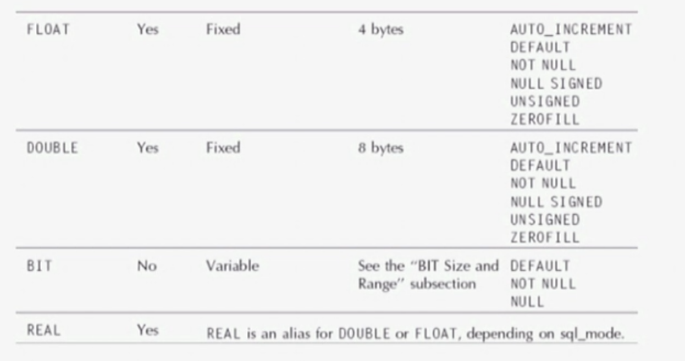
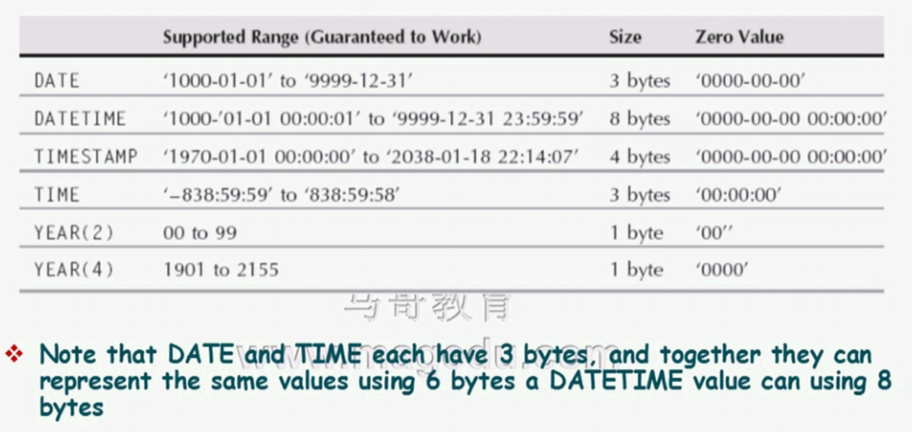
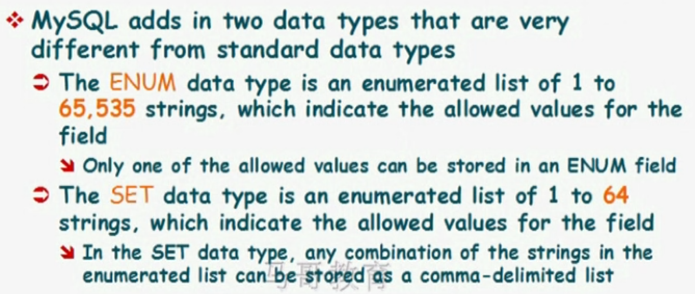
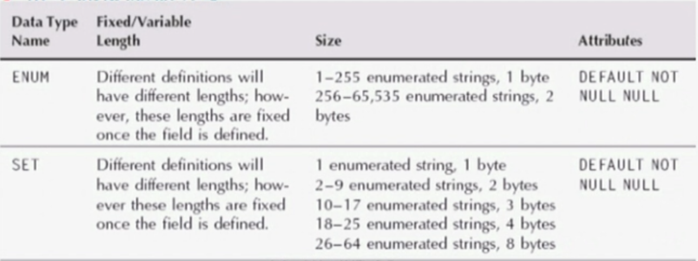
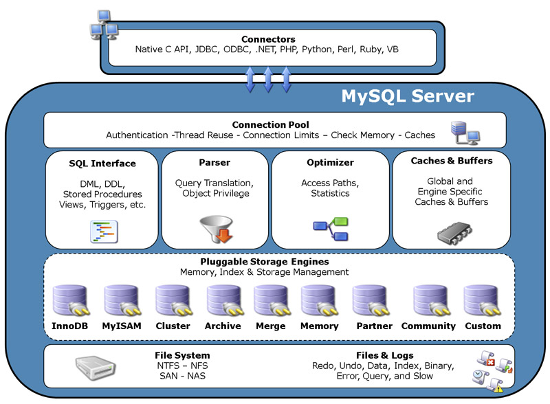
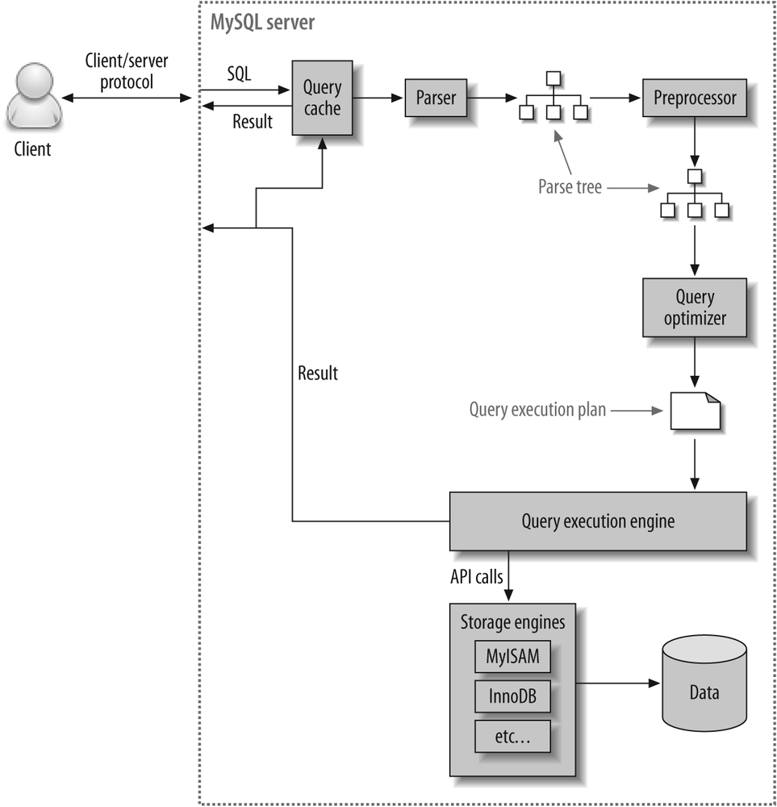

## MySQL基础

    第 22 天 【 php及mysql使用基础（03）】

###  mariadb(mysql)

- 数据结构模型：
    + 层次模型
    + 网状模型
    + 关系模型
        * 二维关系
            - row
            - column

- MariaDB：关系型数据库的一种开源实现；
- 数据库管理系统：DBMS
    + 关系：Relational, RDBMS

##### 补充材料：RDBMS设计范式基础概念：

设计关系型数据库时，遵从不同的规范要求，设计出合理的关系型数据库，这些不同的规范要求被称为不同的范式，各种范式呈递次规范，越高的范式数据库冗余越小。

###### 目前关系数据库有六种范式：  
第一范式（1NF）、第二范式（2NF）、第三范式（3NF）、巴德斯科范式（BCNF）、第四范式（4NF）和第五范式（5NF，又称完美范式）。满足最低要求的范式是第一范式（1NF）。在第一范式的基础上进一步满足更多规范要求的称为第二范式（2NF），其余范式一次类推。一般说来，数据库只需满足第三范式（3NF）就行了。

###### 第一范式（1NF）  
所谓第一范式（1NF）是指在关系模型中，对域添加的一个规范要求，所有的域都应该是原子性的，即数据库表的每一列都是不可分割的原子数据项，而不是集合，数组，记录等非原子性数据项。即实体中的某个属性有多个值时，必须拆分为不同的属性。在符合第一范式（1NF）表中的每个域值只能是实体的一个属性或一个属性的一部分。简而言之，第一范式就是无重复的域。

说明：在任何一个关系型数据库中，第一范式（1NF）是对关系模式的设计基本要求，一般设计中都必须满足第一范式（1NF）。不过有些关系型模型中突破了1NF的限制，这种称为非1NF的关系模型。换句话说，是否必须满足1NF的最低要求，主要依赖于所使用的关系模型。

###### 第二范式（2NF）  
第二范式（2NF）是在第一范式（1NF）的基础上建立起来的，即满足第二范式（2NF）必须先满足第一范式（1NF）。第二范式（2NF）要求数据库表中的每个实例或纪录必须可以被唯一地区分。选取一个能区分每个实体的属性或属性组，作为实体的唯一标识。

第二范式（2NF）要求实体的属性完全依赖于主关键字。所谓完全依赖是指不能存在仅依赖主关键字一部分的属性，如果存在，那么这个属性和主关键字的这一部分分离出来形成一个新的实体，新实体与原实体之间是一对多的关系。为实现分区通常需要为表加上一个列，一存储各个实例的唯一标识，简而言之，第二范式就是在第一范式的基础上完全依赖于主键。

###### 第三范式（3NF）
第三范式（3NF）是第二范式（2NF）的一个子集，即满足第三范式（3NF）必须先满足第二范式（2NF）。简而言之，第三范式（3NF）要求一个关系中不包含已在其它关系中已包含的非主关键字信息。简而言之，第三范式就是属性不依赖于其它非主属性，也就是在满足2NF的基础上，任何非主属性不得传递依赖于主属性。

- RDBMS：
    + MySQL：
        * MySQL
        * MariaDB
        * Percona-Server
    + PostgreSQL：简称为pgsql
        * EnterpriseDB
    + Oracle：甲骨文
    + MSSQL：微软的SQL Server
    + 体系结构：  
        

- 事物：多个操作被当作一个整体对待；
    + ACID：
        * A：atomicity,原子性；整个事务中的多有操作要么全部成功执行，要么全部失败后回滚；
        * C：consistency，一致性；数据库总是从一个一致性状态转换为另一个一致性状态；
        * I：Isolation，隔离性；一个事物所所做出的操作在提交之前，是不能为其它所见；隔离有多种隔离级别；
        * D：durability，持久性，一旦事务提交，其所做的修改会永久保存于数据库中；

- SQL：Structure Query Language，结构化查询语言；

- 数据库存储协议：
    + 应用层协议，C/S
        * S：server，监听于套接字，接受并处理客户端的应用请求；
        * C：Client
            - 程序接口
                + CLI
                + GUI
            - 应用编程接口
                + ODBC：Open DataBase Connection

- 基础概念：
    + 约束：constriaint，向数据表提供的数据要遵守的限制；
        * 主键：一个或多个字段的组合，填入的数据必须能在本表中唯一标示本行；
            - 必须提供数据，即 `NOT NULL`；
            - 一个表只能存在一个
        * 惟一建：一个或多个字段的组合，填入的数据必须能在本表中唯一表示本行；
            - 允许为 `NULL`；
            - 一个表可以存在多个；
        * 外键：一个表中的某字段可填入数据取决于另一个表的主键已有的数据；
        * 检查性：限制某一字段的属性值；
    + 索引：将表中的一个或多个字段中的数据复制一份另存，并且此些需要按特定次序排序的存储；
    + 关系运算：
        * 选择：挑选出符合条件的行（部分）；
        * 投影：挑选出需要的字段；
        * 链接：将多张表根据条件合并成一张临时的大表；

- 数据的抽象：
    + 物理层：决定数据的存储格式，即RDBMS在次盘上如何组织文件；
    + 逻辑层：描述DB存储什么数据，以及数据间存在什么样的关系；
    + 视图层：描述DB中的部分数据；

- 关系模型的分类：
    + 基本关系模型
    + 实体-关系模型
    + 基于对象的关系模型
    + 半结构化的关系模型

- MariaDB：
    + 早期叫 Unireg
    + MySQL AB --> MySQL
        * 第一个版本：Solaris 上的二进制版本；

- 安装MySQL：
    + 源代码：编译安装；
    + 二进制格式的程序包；
        * 展开至特定路径，并经过简单配置后即可使用；
    + 程序包管理器管理的程序包：
        * rpm, deb：
            - OS Vendor
            - 项目官方
---

    第 22 天 【 mysql基础应用（04）】

- MariaDB的特性：
    + 插件式存储引擎：存储管理器有多种实现版本，功能和特性可能均略有差别；用户可根据需要灵活选择；
        * 存储引擎也称之为“表类型”；
    + [mariadb vs mysql]：
        * 更多的存储的存储引擎：
            - MyISAM(mysql) --> Aria(mariadb)
            - InnoDB(mysql) --> XtraDB(mariadb)
        * 诸多扩展和新特性；
        * 提供了较多的测试组件；
        * Truly open source；

- 安装和使用MariaDB
    + CentOS 7 直接提供；
    + CentOS 6：
        * [通用二进制格式安装]：
            - 准备数据目录：
                + 以 `/mydata/data` 为例；
            - 配置mariadb：
            ```
                # groupadd -r -g 306 mysql
                # useradd -r -g 306 -u 306 mysql
                # tar xf mariadb-VERSION-OS.tar.gz -C /usr/local
                # cd /usr/local/
                # ln -sv mariadb-VERSION-OS mysql
                # cd /usr/local/mysql
                # chown -R root:mysql ./*
                # scripts/mysql_install_db --datadir=/mydata/data --user=mysql
                # cp supper-files/mysql.server /etc/rc.d/init.d/mysqld
                # chkconfig --add mysqld
            ```
            - 准备配置文件：
                + 配置格式：类ini格式，为各程序通过单个配置文件提供配置信息；
                ```
                    [prog_name]
                    ...
                    ...
                ```
                + 配置文件查找次序：
                    * `/etc/my.cnf --> /etc/mysql/my.cnf --> default-extra-file=/PATH/TO/CONF_FILE --> ~/.my.cnf`
                + 配置配置文件：
                ```
                    # mkdir /etc/mysql
                    # cp support-files/my-large.cnf /etc/mysql/my.cnf

                    添加三个选项：
                    datadir = /mydata/data
                    innodb_file_per_table = on
                    skip_name_resolve = on
                ```
            - 启动mariadb：
                + `service mysqld start`
            - 安全初始化：
                + mysql_secure_installation：/usr/local/mysql/bin/mysql_secure_installation
                ```
                    [root@node1 ~]# /usr/local/mysql/bin/mysql_secure_installation
                    /usr/local/mysql/bin/mysql_secure_installation: line 393: find_mysql_client: command not found

                    NOTE: RUNNING ALL PARTS OF THIS SCRIPT IS RECOMMENDED FOR ALL MariaDB
                          SERVERS IN PRODUCTION USE!  PLEASE READ EACH STEP CAREFULLY!

                    In order to log into MariaDB to secure it, we'll need the current
                    password for the root user.  If you've just installed MariaDB, and
                    you haven't set the root password yet, the password will be blank,
                    so you should just press enter here.

                    Enter current password for root (enter for none): 
                    OK, successfully used password, moving on...

                    Setting the root password ensures that nobody can log into the MariaDB
                    root user without the proper authorisation.

                    Set root password? [Y/n] y
                    New password: 
                    Re-enter new password: 
                    Password updated successfully!
                    Reloading privilege tables..
                     ... Success!


                    By default, a MariaDB installation has an anonymous user, allowing anyone
                    to log into MariaDB without having to have a user account created for
                    them.  This is intended only for testing, and to make the installation
                    go a bit smoother.  You should remove them before moving into a
                    production environment.

                    Remove anonymous users? [Y/n] y
                     ... Success!

                    Normally, root should only be allowed to connect from 'localhost'.  This
                    ensures that someone cannot guess at the root password from the network.

                    Disallow root login remotely? [Y/n] y
                     ... Success!

                    By default, MariaDB comes with a database named 'test' that anyone can
                    access.  This is also intended only for testing, and should be removed
                    before moving into a production environment.

                    Remove test database and access to it? [Y/n] n
                     ... skipping.

                    Reloading the privilege tables will ensure that all changes made so far
                    will take effect immediately.

                    Reload privilege tables now? [Y/n] y
                     ... Success!

                    Cleaning up...

                    All done!  If you've completed all of the above steps, your MariaDB
                    installation should now be secure.

                    Thanks for using MariaDB!
                ```

- MariaDB的程序组成：
    + C：
        * mysql：CLI交互式客户端程序；
        * mysqldump，mysqladmin...
    + S：
        * mysqld_safe：线程安全的服务器端程序；
        * mysqld：服务器端程序；
        * mysqld_multi：同一主机运行多mysqld实例；

- 服务器监听的两种socket地址：
    + ip socket：监听在tcp的3306端口，支持远程通信；
    + unix sock：监听在sock文件上（/tmp/mysql.sock, /var/lib/mysql/mysql.sock），仅支持本地通信；
        * server 地址：localhost, 127.0.0.1

- 命令行交互式客户端程序：mysql
    + `mysql`
        * `-u USERNAME`：用户名，默认为root；
        * `-h HOST`：服务器主机，默认为localhost；
        * `-p PASSWORD`：用户的密码，默认为空密码；
        * 注意：mysql用户账号由两部分组成：`'USERNAME'@'HOST'`：
            - 其中 HOST 用于限制此用户可以通过哪些主机远程连接mysql服务；
                + 支持使用通配符：
                    * `%`：匹配任意长度的任意字符：
                        - 172.16.0.0/16， 172.16.%.%
                    * `_`：匹配任意单个字符；
        * 命令：
            - 客户端命令：本地执行；
                + `mysql> help`：
                    * 每个命令都有完整形式和简写格式；
                    * status, \s Get status information from the server.
                    ```
                        mysql> \s
                        --------------
                        mysql  Ver 14.14 Distrib 5.1.73, for redhat-linux-gnu (x86_64) using readline 5.1

                        Connection id:          11
                        Current database:       mysql
                        Current user:           root@localhost
                        SSL:                    Not in use
                        Current pager:          stdout
                        Using outfile:          ''
                        Using delimiter:        ;
                        Server version:         5.5.59-MariaDB MariaDB Server
                        Protocol version:       10
                        Connection:             Localhost via UNIX socket
                        Server characterset:    latin1
                        Db     characterset:    latin1
                        Client characterset:    latin1
                        Conn.  characterset:    latin1
                        UNIX socket:            /tmp/mysql.sock
                        Uptime:                 37 min 36 sec

                        Threads: 1  Questions: 38  Slow queries: 0  Opens: 0  Flush tables: 2  Open tables: 26  Queries per second avg: 0.016
                        --------------

                    ```
            - 服务端命令：通过mysql协议访问服务器执行并取回结果；
                + 每个命令都必须有命令结束符：默认为分号；
                ```
                    mysql> SELECT VERSION();
                    +----------------+
                    | VERSION()      |
                    +----------------+
                    | 5.5.59-MariaDB |
                    +----------------+
                    1 row in set (0.00 sec)
                ```

- 关系型数据库的常见组件：
    + 数据库：database
    + 表：table
        * 行：row
        * 列：column
    + 索引：index
    + 试图：view
    + 用户：user
    + 权限：privilege
    + 存储过程：procedure
    + 存储函数：function
    + 触发器：trigger
    + 事件调度器：event scheduler

- SQL语句：
    + DDL：Data Defination Language
        * CREATE, DROP, ALTER
    + DML：Data Manipulation Language
        * INSERT, DELETE, UPDATE, SELECT
    + DCL：Data Control Language
        * GRANT, REVOKE, COMMIT, ROLLBACK

    + 数据库：
        * 创建：
        ```
            mysql> help create database
            Name: 'CREATE DATABASE'
            Description:
            Syntax:
            CREATE {DATABASE | SCHEMA} [IF NOT EXISTS] db_name
                [create_specification] ...

            create_specification:
                [DEFAULT] CHARACTER SET [=] charset_name
              | [DEFAULT] COLLATE [=] collation_name

            CREATE DATABASE creates a database with the given name. To use this
            statement, you need the CREATE privilege for the database. CREATE
            SCHEMA is a synonym for CREATE DATABASE.

            URL: http://dev.mysql.com/doc/refman/5.5/en/create-database.html

            mysql> CREATE DATABASE IF NOT EXISTS testdb;
            Query OK, 1 row affected (0.00 sec)
            mysql> SHOW DATABASES;
            +--------------------+
            | Database           |
            +--------------------+
            | information_schema |
            | mysql              |
            | performance_schema |
            | test               |
            | testdb             |
            +--------------------+
            5 rows in set (0.00 sec)
        ```
        * 查看：`SHOW DATABASES;`
        * 删除：
        ```
            mysql> help drop database
            Name: 'DROP DATABASE'
            Description:
            Syntax:
            DROP {DATABASE | SCHEMA} [IF EXISTS] db_name

            DROP DATABASE drops all tables in the database and deletes the
            database. Be very careful with this statement! To use DROP DATABASE,
            you need the DROP privilege on the database. DROP SCHEMA is a synonym
            for DROP DATABASE.

            *Important*: When a database is dropped, user privileges on the
            database are not automatically dropped. See [HELP GRANT].

            IF EXISTS is used to prevent an error from occurring if the database
            does not exist.

            URL: http://dev.mysql.com/doc/refman/5.5/en/drop-database.html
        ```
        * 查看支持的所有字符集：`SHOW CHARACTER SET;`
        * 查看支持所有排序规则：`SHOW COLLATION;`
    + 表：
        * 创建：
        ```
            CREATE TABLE [ IF NOT EXISTS] tb_name (col1 datatype 修饰符, col2 datatype 修饰符) ENGINE=''

            mysql> USE testdb;
            Database changed
            mysql> CREATE TABLE tbl1 (id int NOT NULL, name VARCHAR(100) NOT NULL, age tinyint); 
            Query OK, 0 rows affected (0.17 sec)

            mysql> SHOW TABLES;
            +------------------+
            | Tables_in_testdb |
            +------------------+
            | tbl1             |
            +------------------+
            1 row in set (0.00 sec)
        ```
        * 查看表：`SHOW TABLES [FROM db_name];`
        * 查看表结构：`DESC [db_name.]tb_name;`
        * 查看所有的引擎：`show engines;`
        ```
            mysql> show engines;
            +--------------------+---------+----------------------------------------------------------------------------+--------------+------+------------+
            | Engine             | Support | Comment                                                                    | Transactions | XA   | Savepoints |
            +--------------------+---------+----------------------------------------------------------------------------+--------------+------+------------+
            | MEMORY             | YES     | Hash based, stored in memory, useful for temporary tables                  | NO           | NO   | NO         |
            | CSV                | YES     | CSV storage engine                                                         | NO           | NO   | NO         |
            | PERFORMANCE_SCHEMA | YES     | Performance Schema                                                         | NO           | NO   | NO         |
            | BLACKHOLE          | YES     | /dev/null storage engine (anything you write to it disappears)             | NO           | NO   | NO         |
            | MyISAM             | YES     | MyISAM storage engine                                                      | NO           | NO   | NO         |
            | MRG_MYISAM         | YES     | Collection of identical MyISAM tables                                      | NO           | NO   | NO         |
            | ARCHIVE            | YES     | Archive storage engine                                                     | NO           | NO   | NO         |
            | FEDERATED          | YES     | FederatedX pluggable storage engine                                        | YES          | NO   | YES        |
            | InnoDB             | DEFAULT | Percona-XtraDB, Supports transactions, row-level locking, and foreign keys | YES          | YES  | YES        |
            | Aria               | YES     | Crash-safe tables with MyISAM heritage                                     | NO           | NO   | NO         |
            +--------------------+---------+----------------------------------------------------------------------------+--------------+------+------------+
            10 rows in set (0.00 sec)
        ```
        * 删除表：
        ```
            DROP TABLE [IF EXISTS] tb_name;
        ```
        * 数据类型：
            - 字符型
                + 定长字符型：
                    * CHAR(#)：不区分字符大小写；
                    * BINARY(#)：区分字符大小写；
                + 变长字符型：
                    * VARCHAR(#)：不区分字符大小写；
                    * VARBINARY(#)：区分字符大小写；
                + 对象存储：
                    * TEXT：不区分大小写；
                    * BLOB：区分字符大小写；
                + 内置类型：
                    * ENUM：枚举
                    * SET：集合
            - 数值型：
                + 精确数值型：
                    * 整型：
                        - int：4bytes
                        - tinyint：1byte
                        - smallint：2bytes
                        - mediumint：3bytes
                        - bigint：8bytes
                    * 十进制
                + 近似数值型：
                    * 单精度浮点型：float
                    * 双精度浮点型：double
        * 修饰符：
            - NOT NULL：非空约束；
            - DEFAULT VALUE：设定默认值；

博客作业：CentOS 7 lamp实现

1、vhost1：pma.stuX.com, phpMyAdmin, 同时提供https服务；<br>
2、vhost2：wp.stuX.com, wordpress； <br>
3、vhost3：dz.stuX.com, Discuz；

---
    第 23 天 【MariaDB SQL语句基础(01)】

### 回顾：MariaDB的基础
- 关系：二维关系，表（行，列）
- 设计范式：
    + 第一范式：字段是原子性的；
    + 第二范式：存在可用主键；
    + 第三范式：任何表都不应该有依赖于其它表非主键的字段；
- 约束：主键、唯一键、外键、（检查性约束）；
- MariaDB安装方式：
    + 源码编译安装；
    + 通用二进制格式；
    + 包管理器(rpm, deb)；
        * OS vendor提供；
        * 程序官方提供；

- SQL：
    + 数据库组件：
        * 数据库
        * 表
        * 索引
        * 视图
        * 用户
        * 权限
        * 存储过程
        * 存储函数
        * 触发器
        * 事件调度器
    + 创建数据库、设计数据库
        * 字段：字段名、数据类型、数据类型修饰符、约束
    + DDL：CREATE、DROP、ALTER
    + DML：INSERT(REPLACE)、DELETE、UPDATE、SELECT
    + DCL：GRANT、REVOKE
    + 数据类型：
        * 字符：
            - 变长字符：VARCHAR(#), VARBINARY(#)
            - 定长字符：CHAR(#), BINARY(#)
            - 内建字符：ENUM, SET
            - 对象：TEXT, BLOB
        * 数值：
            - 精确数值：
                + 整型：INT
                    * TINYINT, SMALLINT, INT, MEDIUMINT, BIGINT
                + 十进制：DECIMAL
            - 近似数值：
                + 单精度：FLOAT
                + 双精度：DOUBLE
        * 日期时间型：
            - DATE：日期
            - TIME：时间
            - DATETIME：日期时间
            - TIMESTAMP：时间戳
            - 年份：YEAR(2), YEAR(4)
        * 修饰符：
            - 所有类型使用：
                + NOT NULL
                + DEFAULT
                + PRIMARY KEY
                + UNIQUE KEY
            - 数值型使用：
                + UNSIGNED
                + AUTO_INCREMENT


    + 数据库：
    ```
        CREATE DATABASE [IF NOT EXISTS] 'db_name';
            CHARACTER SET [=] charset
            COLLATE [=] collate

        SHOW CHARACTER SET;
        SHOW COLLATION;

        DROP DATABASE [IF EXISTS] 'db_name';
    ```

- 数据基础应用：
    + 表：
    ```
    创建表：CREATE 
        CREATE TABLE [IF NOT EXISTS] 'tbl_name' (col1 type1, col2 type2, ...)
            col type1
            PRIMARY KEY(col1, ...)
            INDEX(col1, ...)
            UNIQUE KEY(col1, ...)
        表选项：
             ENGINE [=] engine_name
             ROW_FORMAT [=] {DEFAULT|DYNAMIC|FIXED|COMPRESSED|REDUNDANT|COMPACT}

        获取帮助：
            mysql> HELP CREATE TABLE;

        MariaDB [testdb]> CREATE TABLE students (id int UNSIGNED NOT NULL PRIMARY KEY, name VARCHAR(20) NOT NULL, age tinyint UNSIGNED);
        Query OK, 0 rows affected (0.15 sec)

        MariaDB [testdb]> DESC students;
        +-------+---------------------+------+-----+---------+-------+
        | Field | Type                | Null | Key | Default | Extra |
        +-------+---------------------+------+-----+---------+-------+
        | id    | int(10) unsigned    | NO   | PRI | NULL    |       |
        | name  | varchar(20)         | NO   |     | NULL    |       |
        | age   | tinyint(3) unsigned | YES  |     | NULL    |       |
        +-------+---------------------+------+-----+---------+-------+
        3 rows in set (0.00 sec)

        MariaDB [testdb]> CREATE TABLE tbl2 (id int UNSIGNED NOT NULL, name VARCHAR(20) NOT NULL, age tinyint UNSIGNED, PRIMARY KEY(id,name));    
        Query OK, 0 rows affected (0.15 sec)

        MariaDB [testdb]> DESC tbl2;
        +-------+---------------------+------+-----+---------+-------+
        | Field | Type                | Null | Key | Default | Extra |
        +-------+---------------------+------+-----+---------+-------+
        | id    | int(10) unsigned    | NO   | PRI | NULL    |       |
        | name  | varchar(20)         | NO   | PRI | NULL    |       |
        | age   | tinyint(3) unsigned | YES  |     | NULL    |       |
        +-------+---------------------+------+-----+---------+-------+
        3 rows in set (0.00 sec)

        查看创建的表使用的命令：
            SHOW CREATE TABLE tbl_name;
            MariaDB [testdb]> SHOW CREATE TABLE students;

        查看表状态：
            SHOW TABLE STATUS LIKE 'tbl_name'\G

    修改表：ALTER
        ALTER TABLE 'tbl_name'
            字段：
                添加字段：add
                    ADD clo1 data_type [FIRST|AFTER clo_name]
                        MariaDB [testdb]> ALTER TABLE students ADD gender ENUM('m','f');  
                删除字段：drop
                修改字段：alter, change, modify
                    MariaDB [testdb]> ALTER TABLE students CHANGE id sid int UNSIGNED NOT NULL;
            索引：
                添加索引：add
                    MariaDB [testdb]> ALTER TABLE students ADD INDEX index_name (name);
                删除索引：drop
                    MariaDB [testdb]> ALTER TABLE students DROP INDEX index_name;
            表选项：
                修改：表选项修改不常用，改engine会有一些副作用；

        查看表上的索引：
            SHOW INDEXES FROM [db_name.]tbl_name;

    索引：
        索引是特殊数据结构：定义在查找时作为查找条件的字段；
        索引要有索引名称；

        创建索引：
            CREATE INDEX index_name ON tbl_name (index_col_name,...);

        删除索引：
            DROP [ONLINE|OFFLINE] INDEX index_name ON tbl_name;
    ```
    
- DML：INSERT, DELETE, SELECT, UPDATE
    + INSERT INTO：
    ```
        INSERT [INTO] tbl_name [(col_name,...)]
        {VALUES | VALUE} ({expr | DEFAULT},...),(...),...

        MariaDB [testdb]> INSERT INTO students VALUES(1,'Yang Guo','m',28),(2,'Guo Xiang','f',18);
        MariaDB [testdb]> INSERT INTO students (sid,name,gender) VALUES(3,'Zhang wuji','m'),(4,'Zhao Mi','f');

        MariaDB [testdb]> SELECT * FROM students;
        +-----+-----------+--------+------+
        | sid | name      | gender | age  |
        +-----+-----------+--------+------+
        |   1 | Yang Guo  | m      |   28 |
        |   2 | Guo Xiang | f      |   18 |
        +-----+-----------+--------+------+
    ```
    + SELECT：
    ```
        SELECT col1,col2,... FROM tbl_name [WHERE clause] [ORDER BY 'col_name' [DESC]] [LIMIT [m,]n];
            字段表示法：
                *：所有字段；
                as：字段别名，col1 AS alias1

            WHERE clase：
                操作符：
                    >, <, >=, <=, ==, !=
                    BETWEEN ... AND ...

                    MariaDB [testdb]> SELECT * FROM students WHERE sid >= 2 AND sid <=4;
                    +-----+------------+--------+------+
                    | sid | name       | gender | age  |
                    +-----+------------+--------+------+
                    |   2 | Guo Xiang  | f      |   18 |
                    |   3 | Zhang wuji | m      | NULL |
                    |   4 | Zhao Mi    | f      | NULL |
                    +-----+------------+--------+------+

                    MariaDB [testdb]> SELECT * FROM students WHERE sid BETWEEN 2 AND 4;
                    +-----+------------+--------+------+
                    | sid | name       | gender | age  |
                    +-----+------------+--------+------+
                    |   2 | Guo Xiang  | f      |   18 |
                    |   3 | Zhang wuji | m      | NULL |
                    |   4 | Zhao Mi    | f      | NULL |
                    +-----+------------+--------+------+

                    LIKE：
                        %：任意长度的任意字符；
                        _：任意单个字符；

                        MariaDB [testdb]> SELECT * FROM students WHERE name LIKE 'Z%';
                        +-----+------------+--------+------+
                        | sid | name       | gender | age  |
                        +-----+------------+--------+------+
                        |   3 | Zhang wuji | m      | NULL |
                        |   4 | Zhao Mi    | f      | NULL |
                        +-----+------------+--------+------+

                    RLIKE：基于正则表达式模式匹配；
                        MariaDB [testdb]> SELECT * FROM students WHERE name RLIKE '.*u.*';
                        +-----+------------+--------+------+
                        | sid | name       | gender | age  |
                        +-----+------------+--------+------+
                        |   1 | Yang Guo   | m      |   28 |
                        |   2 | Guo Xiang  | f      |   18 |
                        |   3 | Zhang wuji | m      | NULL |
                        +-----+------------+--------+------+

                    IS NULL
                    IS NOT NULL

            条件逻辑操作：
                and
                or
                not
    ```
    + DELETE：
    ```
        DELETE FROM tbl_anem [WHERE clause] [ORDER BY 'col_name' [DESC]] [LIMIT [m,]n]

        MariaDB [testdb]> DELETE FROM students WHERE sid=3;
        Query OK, 1 row affected (0.01 sec)

        MariaDB [testdb]> SELECT * FROM students;          
        +-----+-----------+--------+------+
        | sid | name      | gender | age  |
        +-----+-----------+--------+------+
        |   1 | Yang Guo  | m      |   28 |
        |   2 | Guo Xiang | f      |   18 |
        |   4 | Zhao Mi   | f      | NULL |
        +-----+-----------+--------+------+
        3 rows in set (0.00 sec)
    ```
    + UPDATE：
    ```
        UPDATE tbl_name SET col1-new_val1, col2=new_val2, ... [WHERE clause] [ORDER BY 'col_name' [DESC]] [LIMIT [m,]n]

        MariaDB [testdb]> UPDATE students SET age=18 WHERE sid=4;
    ```


---
	第 39 天 【MySQL基础（01）】
 
### MariaDB or MySQL：
- DBMS
- RDBMS：关系型数据库管理系统
    + C/S：通过专有协议
    + 关系模型：表(行，列)，二维关系
    + 范式：第一范式、第二范式、第三范式；
    + 关系运算：
        * 选择
        * 投影
    + 数据库：表，索引，试图（虚表）
        * SQL：Structure Query Language
            - DDL, DML
            - 编程接口：
                + 存储过程：不返回数据；
                + 存储函数：返回数据；
                + 触发器
                + 事件调度器
                + 过程式编程：选择、循环
    + 三层模型：
        * 物理层
        * 逻辑层
        * 视图层
    + 解决方案：
        * Oracle, Sybase, Infomix, DB2
        * MySQL, MariaDB, PostgreSQL, SQLite

```
    MySQL --> 5.1 --> 5.5 --> 5.6 --> 5.7
    MariaDB:
        插件式存储引擎
        单进程多线程：
            链接线程：维护用户链接；
            守护线程：维护一个数据库的运行；

    配置文件：集中式的配置，能够为mysql的各应用程序提供配置信息；
        [mysqld]：mysql服务器端程序专用配置信息；
        [mysqld_safe]：线程安全的mysql专用配置信息；
        [mysqld_multi]：多实例模型共享的配置信息；
        [server]：服务器端程序运行都有效；
        [mysql]：专用于mysql客户端程序配置信息；
        [mysqldump]：专用于mysqldump备份导入导出配置信息；
        [client]：对客户端程序有效的配置信息；

            parameter = value

        两种方式都生效：
            skip-name-resolve
            skip_name_resolve

        配置文件查找路径：
            /etc/my.cnf --> /etc/mysql/my.cnf --> $MYSQL_HOME/my.cnf --> --default-extra-file=/PATH/TO/SOMEDIR/my.cnf --> ~/.my.cnf

            按顺序依次查找，如果前后两个文件中配置的参数相同，以后找到的配置参数为准。

    安装方式：
        os vendor：rpm
        MySQL：
            rpm：安装方便；
            Binary：展开可用；
            源码：可定制；

        安装后的设定：
            （1）为所有root用户设定密码；
                mysql> SET PASSWORD

                    MariaDB [(none)]> SET PASSWORD FOR 'root'@'localhost' = PASSWORD('mageedu');

                mysql> update musql.user SET password=PASSWORD('your_password') WHERE cluase;

                # mysqladmin -uUSERNAME -p password('your_password')

            (2) 删除所有匿名用户；
                mysql> DROP USER 'username'@'host';

                上述两步骤可运行命令：mysql_secure_installation

            (3) 建议关闭主机名反解功能；
                skip_name_resolve = on

        元数据数据库：mysql
            user, host表等；
```

- Mysql 的客户端程序：
    + `mysql`：交互式的CLI工具；
    + `mysqldump`：备份工具，基于mysql协议向mysqld发起查询请求，并将查得的所有数据转换成 insert 等写操作语句保存在文本文件中；
    + `mysqladmin`：基于mysql协议管理mysqld；
    + `mysqlimport`：数据导入工具；
- 非客户端类的管理工具：
    + `myisamchk`：检查、整理、修复 MYISAM 表；
    + `myisapack`：将 MYISAM 表打包压缩后存放；

- 如何获取程序默认使用的配置：
    + mysql：
    ```
        # /usr/local/mysql/bin/mysql --print-defaults
        /usr/local/mysql/bin/mysql would have been started with the following arguments:
        --port=3306 --socket=/tmp/mysql.sock --no-auto-rehash 
    ```
    + mysqld --print-defaults
    ```
        # /usr/local/mysql/bin/mysqld --print-defaults;
        /usr/local/mysql/bin/mysqld would have been started with the following arguments:
        --datadir=/var/lib/mysql --socket=/var/lib/mysql/mysql.sock --user=mysql --symbolic-links=0 --port=3306 --socket=/tmp/mysql.sock --skip-external-locking --key_buffer_size=256M --max_allowed_packet=1M --table_open_cache=256 --sort_buffer_size=1M --read_buffer_size=1M --read_rnd_buffer_size=4M --myisam_sort_buffer_size=64M --thread_cache_size=8 --query_cache_size=16M --thread_concurrency=8 --datadir=/mydata/data --innodb_file_per_table=on --skip_name_resolve=on --log-bin=mysql-bin --binlog_format=mixed --server-id=1 
    ```
- 客户端类应用家程序的可用选项：
    + `-u, --user=`：指明连接用户，默认为root用户；
    + `-h, --hosts=`：指明连接的主机，默认为localhost；
    + `-p, --password=`：指定密码，默认无密码；
    + `-P, --port=`：指定连接服务器的端口；
    + `--protocol={TCP|SOCKET|PIPE|MEMORY}`：指定连接时使用的协议，一般为 tcp；
    + `-S, --socket=`：指定连接时使用的套接字文件路径，`--host` 为 localhost 或 127.0.0.1 时使用；
    + `-D, --database=`：指定连接后使用的数据库名称；
    + `-C, --compress`：传输数据时是否压缩；
    + `mysql -e "SQL"`：不进入交互模式执行SQL语句；

- mysql的使用模式：
    + 交互式模式：
        * 可运行命令有两类：
            - 客户端命令：
                + `\h, help`
            - 服务器端命令：
                + SQL，需要语句结束符；
    + 脚本模式：
        * `# mysql -uUSERNAME -hHOST -pPASSWORD < /path/from/somefile.sql`
        * `mysql> source /path/from/somefile.sql`

- 服务器端(mysqld)工作特性有多种定义方式：
    + 命令行选项；
    + 配置文件参数：
        * 获取可用参数列表：
        ```
            # /usr/local/mysql/bin/mysqld --verbose --help 
        ```
        * 获取运行中的mysql进程使用各服务器参数及其值：
        ```
            MariaDB [(none)]> SHOW GLOBAL VARIABLES;
            MariaDB [(none)]> SHOW [SESSION] VARIABLES;

            注意：其中有些参数支持运行时修改，会立即生效；有些参数不支持，则只能修改配置文件，并重启服务程序生效；
                 有些参数作用域是全局的，且不可改变；有些可以为每个用户提供单独的设置；
        ```
        * 需改服务器变量的值：
        ```
            mysql> help SET;

            全局：
                mysql> SET GLOBAL system_var_name=value;
                mysql> SET @@global.syste_var_name=value;
            会话：
                mysql> SET [SESSION] system_var_name=value;
                mysql> SET @@[session.]system_var_name=value;
        ```
        * 状态变量：用于保存mysqld运行中的统计数据的变量：
        ```
            mysql> SHOW GLOBAL STATUS;
            mysql> SHOW [SESSION] STATUS;
        ```

>   第 39 天 【MySQL基础（02）】

- SQL：ANSI SQL 标准
    + SQL-86, SQL-89, SQL-92, SQL-99, SQL-03

- MySQL 数据类型：
    + 字符型：
        * CHAR, BINARY：定长数据类型；BINARY 区分字符大小写；
        * VARCHAR, VARBINARY：变长数据类型；需要结束符；VARBINARY 区分字符大小写；
        * TEXT：TINYTEXT, TEXT, MEDIUMTEXT, LONGTEXT
        * BLOB：TINYBLOB, BLOB, MEDIUMBLOB, LONGBLOB
        * ENUM, SET
        
        

        * 字符型修饰符：
            - NOT NULL：非空约束；
            - NULL：运行为空，默认；
            - DEFAULT 'STRING'：指明默认值；
            - CHARACTER SET ''：使用的字符集；
            - COLLATION：使用的排序规则；
            ```
                MariaDB [testdb]> SHOW CHARACTER SET;
                MariaDB [testdb]> SHOW COLLATION;
            ```

    + 数值型：
        * 精确数值型：
            - 整型：TINYINT, SMALLINT, MEDIUMINT, INT, BIGINT
            - 十进制型：DECIMAL
            
        

        * 整型数据修饰符：
            - NOT NULL
            - NULL
            - DEFAULT NUMBER
            - AUTO_INCREMENT：自动增长，需满足以下约束；
                + UNSIGNED
                + PRIMARY KEY|UNIQUE KEY
                + NOT NULL
                ```
                    查看上一次插入的自增长ID号：
                    MariaDB [testdb]> select last_insert_ID();
                    +------------------+
                    | last_insert_ID() |
                    +------------------+
                    |                0 |
                    +------------------+
                    1 row in set (0.00 sec)
                ```

        * 近似数值型：
            - 浮点型：
                + FLOAT
                + DOUBLE
            - BIT：位数据类型；

        


    + 日期时间型：
        * DATE(3 bytes)
        * TIME(3 bytes)
        * DATETIME(8 bytes)
        * TIMESTAMP
        * YEAR(2), YEAR(4)
        
        

        * 日期时间型修饰符：
            - NOT NULL
            - NULL
            - DEFAULT 
    + 内建类型
        * ENUM：枚举，存储时从枚举列表中选择一个枚举字段；
        * SET：集合，存储时可从集合中选择多个字段进行组合存储；

        
        
        * An example：
        ```
            MariaDB [testdb]> CREATE TABLE enum_set ( en ENUM('a','','1'), se SET('a','1'));
            Query OK, 0 rows affected (0.15 sec)

            MariaDB [testdb]> INSERT INTO enum_set (en,se) values ('a', 'a');
            Query OK, 1 row affected (0.02 sec)

            MariaDB [testdb]> INSERT INTO enum_set (en,se) values ('a', 'b');
            Query OK, 1 row affected, 1 warning (0.04 sec)

            MariaDB [testdb]> INSERT INTO enum_set (en,se) values ('b', 'a'); 
            Query OK, 1 row affected, 1 warning (0.01 sec)

            MariaDB [testdb]> SELECT * FROM enum_set;
            +------+------+
            | en   | se   |
            +------+------+
            | a    | a    |
            | a    |      |
            |      | a    |
            +------+------+
            3 rows in set (0.00 sec)

            MariaDB [testdb]> INSERT INTO enum_set (en,se) values ('a,1', 'a,1');
            Query OK, 1 row affected, 1 warning (0.01 sec)

            MariaDB [testdb]> SELECT * FROM enum_set;                            
            +------+------+
            | en   | se   |
            +------+------+
            | a    | a    |
            | a    |      |
            |      | a    |
            |      | a,1  |
            +------+------+
            4 rows in set (0.00 sec)
        ```
        

        * 内建类型修饰符：
            - NOT NULL
            - NULL
            - DEFAULT 

## SQL MODE

可以参考下：[MySQL sql_mode 说明](http://seanlook.com/2016/04/22/mysql-sql-mode-troubleshooting/)

sql_mode：定义mysqld对约束等的响应行为；

修改方式：  

```
    MariaDB [testdb]> show variables like "sql_mode";
    +---------------+-------+
    | Variable_name | Value |
    +---------------+-------+
    | sql_mode      |       |
    +---------------+-------+
    1 row in set (0.00 sec)

    mysql> SET GLOBAL sql_mod='MODE';
    mysql> SET @@global.sql_mode='MODE';

    具有super权限才可修改；
    仅对修改后新创建的会话有效，对已经建立的会话无效；

    mysql> SET [SESSION] sql_mode='MODE';
    mysql> SET @@[session].sql_mode='MODE';
```

- 常用MODE：
    + TRADITIONAL
    + STRICT_TRANS_TABLES
    + STRICT_ALL_TABLES


## SQL：DDL, DML

DDL：数据定义语言，定义数据库组件，比如：数据库，表，索引，用户，试图，存储过程，存储函数等等；

```    
    CREATE, ALTER, DROP 

    DB组件：数据库、表、索引、试图、用户、存储过程、存储函数、触发器、事件调度器等；

    CREATE 相关的常用命令：
       CREATE DATABASE
       CREATE EVENT
       CREATE FUNCTION
       CREATE FUNCTION UDF
       CREATE INDEX
       CREATE PROCEDURE
       CREATE SERVER
       CREATE TABLE
       CREATE TABLESPACE
       CREATE TRIGGER
       CREATE USER
       CREATE VIEW     
```

DML：数据操作语言；
```
    INSERT, DELETE, UPDATE, SELECT
```

数据库：
```
    CREATE, ALTER, DROP
        {DATABASE|SCHEMA}
        [IF EXISTS]
        [IF NOT EXISTS]
```

表：二维关系

```
    设计表：遵循规范；

    定义：字段，索引
        字段：字段名，字段数据类型，修改符
        约束，索引：应该创建在经常用作查询条件的字段上；
            索引：实现级别在存储引擎；
                分类：
                    稠密索引、稀疏索引
                    B+索引、hash索引、R树索引、FULLTEXT索引
                    聚焦索引、非聚焦索引
                    简单索引、组合索引

    创建表：CREATE TABLE
        (1) 直接创建；
        (2) 通过查询现存的表创建；新表会被插入查询而来的数据；
            CREATE [TEMPORARY] TABLE [IF NOT EXISTS] tbl_name
                [(create_definition,...)]
                [table_options]
                [partition_options]
                select_statement
        (3) 通过复制现存的表的表结构创建；不复制数据；
            CREATE [TEMPORARY] TABLE [IF NOT EXISTS] tbl_name
            { LIKE old_tbl_name | (LIKE old_tbl_name) }

        注意：Storage Engine时指表类型，也即在表创建时指明其使用的存储引擎；
             同一个库中表要使用同一个存储引擎类型；

             MariaDB [testdb]> show global variables like '%default%engine%';
            +------------------------+--------+
            | Variable_name          | Value  |
            +------------------------+--------+
            | default_storage_engine | InnoDB |
            +------------------------+--------+
            1 row in set (0.00 sec)

    创建表结构：
        DESCRIBE tbl_name;

    查看表状态信息：
        SHOW [FULL] TABLES [{FROM | IN} db_name] [LIKE 'pattern' | WHERE expr]

        MariaDB [testdb]> show table status like 'tbl1'\G
        *************************** 1. row ***************************
                   Name: tbl1
                 Engine: InnoDB
                Version: 10
             Row_format: Compact
                   Rows: 0
         Avg_row_length: 0
            Data_length: 16384
        Max_data_length: 0
           Index_length: 0
              Data_free: 0
         Auto_increment: NULL
            Create_time: 2018-04-22 16:54:01
            Update_time: NULL
             Check_time: NULL
              Collation: latin1_swedish_ci
               Checksum: NULL
         Create_options: 
                Comment: 
        1 row in set (0.00 sec)

    修改表：ALTER TABLE
    删除表：DROP TABLE
```

    第 39 天 【MySQL架构及SQL语句(03)】

## MySQL Architecture



- 单进程多线程：
    + 用户连接：建立连接线程

- MySQL 数据文件类型：
    + 数据文件、索引文件
    + 重做日志、撤销日志、二进制日志、错误日志、查询日志、慢查询日志、中继日志

### 索引管理：

索引是按特定数据结构存储的数据；

- 索引类型：
    + 聚集索引、非聚集索引：数据是否与索引存储在一起；
    + 主键索引、辅助索引；
    + 稠密索引、稀疏索引：是否索引了每一个数据项；
    + B+ TREE、HASH、R TREE；
    + 简单索引、组合索引；
    + 左前缀索引；
    + 覆盖索引：索引即是数据；

- 管理索引的途径：
    + 创建索引：创建表时指定；
    ```
        CREATE TABLE [IF NOT EXISTS] 'tbl_name' (col1 type1, col2 type2, ...)
            {INDEX|KEY} [index_name] [index_type] (index_col_name,...)
            [index_option] ...
            
        index_col_name:
            col_name [(length)] [ASC | DESC]

        index_type:
            USING {BTREE | HASH}

        index_option:
            KEY_BLOCK_SIZE [=] value
          | index_type
          | WITH PARSER parser_name
          | COMMENT 'string'
    ```
    + 创建或删除索引：修改表的命令；
    ```
        CREATE [ONLINE|OFFLINE] [UNIQUE|FULLTEXT|SPATIAL] INDEX index_name
            [index_type]
            ON tbl_name (index_col_name,...)
            [index_option] ...

        index_col_name:
            col_name [(length)] [ASC | DESC]

        index_type:
            USING {BTREE | HASH}

        index_option:
            KEY_BLOCK_SIZE [=] value
          | index_type
          | WITH PARSER parser_name
          | COMMENT 'string'

        MariaDB [hellodb]> CREATE INDEX name ON students(Name);

        MariaDB [hellodb]> ALTER TABLE students ADD INDEX(Age);
    ```
    + 删除索引：
    ```
        DROP [ONLINE|OFFLINE] INDEX index_name ON tbl_name
    ```
    + 查看表上的索引：
    ```
        SHOW {INDEX | INDEXES | KEYS}
            {FROM | IN} tbl_name
            [{FROM | IN} db_name]
            [WHERE expr]

        MariaDB [hellodb]> SHOW INDEXES FROM students;
        +----------+------------+----------+--------------+-------------+-----------+-------------+----------+--------+------+------------+---------+---------------+
        | Table    | Non_unique | Key_name | Seq_in_index | Column_name | Collation | Cardinality | Sub_part | Packed | Null | Index_type | Comment | Index_comment |
        +----------+------------+----------+--------------+-------------+-----------+-------------+----------+--------+------+------------+---------+---------------+
        | students |          0 | PRIMARY  |            1 | StuID       | A         |          25 |     NULL | NULL   |      | BTREE      |         |               |
        | students |          1 | Age      |            1 | Age         | A         |        NULL |     NULL | NULL   |      | BTREE      |         |               |
        +----------+------------+----------+--------------+-------------+-----------+-------------+----------+--------+------+------------+---------+---------------+
        2 rows in set (0.00 sec)
    ```

- EXPLAIN：

```
MariaDB [hellodb]> explain select * from students where Name like "X%"\G 
*************************** 1. row ***************************
           id: 1
  select_type: SIMPLE
        table: students
         type: range
possible_keys: name
          key: name
      key_len: 152
          ref: NULL
         rows: 6
        Extra: Using index condition
1 row in set (0.00 sec)

MariaDB [hellodb]> explain select * from students where Name like "%X%"\G 
*************************** 1. row ***************************
           id: 1
  select_type: SIMPLE
        table: students
         type: ALL
possible_keys: NULL
          key: NULL
      key_len: NULL
          ref: NULL
         rows: 25
        Extra: Using where
1 row in set (0.00 sec)

```

### 试图：VIEW

试图：是一个虚表，并不是一个真正的存储的表，事实上是存储下来的 `SELECT` 语句；

创建试图：  

```
Syntax: 
    CREATE
        VIEW view_name [(column_list)]
        AS select_statement
        [WITH [CASCADED | LOCAL] CHECK OPTION]


MariaDB [hellodb]> CREATE VIEW students_scores AS select a.StuID, Name, b.CourseID, Course, score from students a, scores b, courses c where a.StuID = b.StuID and b.CourseID = c.CourseID;

    MariaDB [hellodb]> select * from students_scores where score=77;         
    +-------+-------------+----------+----------------+-------+
    | StuID | Name        | CourseID | Course         | score |
    +-------+-------------+----------+----------------+-------+
    |     1 | Shi Zhongyu |        2 | Kuihua Baodian |    77 |
    +-------+-------------+----------+----------------+-------+
    1 row in set (0.00 sec)

```

删除试图：

```
Syntax:
    DROP VIEW [IF EXISTS]
        view_name [, view_name] ...
        [RESTRICT | CASCADE]
```

试图中的数据事实上存储于“基表”中，因此，其修改操作也会针对基表实现；其修改操作受基表限制；

### DML：
    INSERT, DELETE, UPDATE, SELECT

#### INSERT：

一次插入一行或多行数据；

```
Syntax:
    INSERT [LOW_PRIORITY | DELAYED | HIGH_PRIORITY] [IGNORE]
        [INTO] tbl_name [(col_name,...)]
        {VALUES | VALUE} ({expr | DEFAULT},...),(...),...
        [ ON DUPLICATE KEY UPDATE
          col_name=expr
            [, col_name=expr] ... ]

    MariaDB [hellodb]> INSERT INTO students (Name,Age,Gender) VALUES ('Jinjiao King', 100, 'M');
    Query OK, 1 row affected (0.00 sec)

    Or:

    INSERT [LOW_PRIORITY | DELAYED | HIGH_PRIORITY] [IGNORE]
        [INTO] tbl_name
        SET col_name={expr | DEFAULT}, ...
        [ ON DUPLICATE KEY UPDATE
          col_name=expr
            [, col_name=expr] ... ]

    MariaDB [hellodb]> INSERT INTO students SET Name='Yinjiao King', Age=98, Gender='M';
    Query OK, 1 row affected (0.00 sec)

    Or:

    INSERT [LOW_PRIORITY | HIGH_PRIORITY] [IGNORE]
        [INTO] tbl_name [(col_name,...)]
        SELECT ...
        [ ON DUPLICATE KEY UPDATE
          col_name=expr
            [, col_name=expr] ... ]

```

#### DELETE：

```
Syntax:
    Single-table syntax:

    DELETE [LOW_PRIORITY] [QUICK] [IGNORE] FROM tbl_name
        [WHERE where_condition]
        [ORDER BY ...]
        [LIMIT row_count]

    注意：一定要有限制条件，否则将清空表中的所有数据；
        限制条件：
            WHERE
            LIMIT
```

#### UPDATE：

```
Syntax:
    Single-table syntax:

    UPDATE [LOW_PRIORITY] [IGNORE] table_reference
        SET col_name1={expr1|DEFAULT} [, col_name2={expr2|DEFAULT}] ...
        [WHERE where_condition]
        [ORDER BY ...]
        [LIMIT row_count]

    注意：一定要有限制条件，否则将修改表中的所有行的指定字段数据；
        限制条件：
            WHERE
            LIMIT
```

    第 39 天 【MySQL查询操作(04)】  

### SELECT：

Execution path of a query：



查询执行路径中的组件：查询缓存、解析器、预处理器、优化器、查询执行引擎、存储引擎；

SELECT语句的执行流程： 

``` 
    FROM Clause --> WHERE Clause --> GROUP BY --> HAVING Clause --> ORDER BY --> SELECT --> LIMIT
```

- 单表查询：

```
Syntax:
    SELECT
        [ALL | DISTINCT | DISTINCTROW ]
          [SQL_CACHE | SQL_NO_CACHE] [SQL_CALC_FOUND_ROWS]
        select_expr [, select_expr ...]
        [FROM table_references
        [WHERE where_condition]
        [GROUP BY {col_name | expr | position}
          [ASC | DESC], ... [WITH ROLLUP]]
        [HAVING where_condition]
        [ORDER BY {col_name | expr | position}
          [ASC | DESC], ...]
        [LIMIT {[offset,] row_count | row_count OFFSET offset}]
        [FOR UPDATE | LOCK IN SHARE MODE]]

        DISTINCT：数据去重；
            MariaDB [hellodb]> SELECT DISTINCT Gender FROM students;
            +--------+
            | Gender |
            +--------+
            | M      |
            | F      |
            +--------+
            2 rows in set (0.02 sec)

        SQL_CACHE：显式指定存储查询结果于缓存之中；
        SQL_NO_CACHE：显式查询结果不予缓存；

        query_cache_type的值为'ON'时，查询缓存功能打开；
            SELECT 的结果符合缓存条件即会缓存，否则，不予缓存；

            MariaDB [hellodb]> SHOW GLOBAL VARIABLES where Variable_name='query_cache_type';
            +------------------+-------+
            | Variable_name    | Value |
            +------------------+-------+
            | query_cache_type | ON    |
            +------------------+-------+
            1 row in set (0.00 sec)

        query_cache_type的值为'DEMAND'时，查询缓存功能按需进行；
            只有显式指定 SQL_CACHE 的 SELECT 语句才会缓存；其它均不予缓存；
            显式指定 SQL_NO_CACHE， 不予缓存；
        query_cache_size：查询缓存大小，16MB；
            MariaDB [hellodb]> SHOW GLOBAL VARIABLES where Variable_name='query_cache_size';
            +------------------+----------+
            | Variable_name    | Value    |
            +------------------+----------+
            | query_cache_size | 16777216 |
            +------------------+----------+
            1 row in set (0.00 sec)


    字段显示可以使用别名：
        col1 AS alias1, col2 AS alias2, ...

        MariaDB [hellodb]> SELECT Name FROM students limit 3;           
        +-----------+
        | Name      |
        +-----------+
        | Diao Chan |
        | Ding Dian |
        | Duan Yu   |
        +-----------+
        3 rows in set (0.00 sec)

        MariaDB [hellodb]> SELECT Name as StuName FROM students limit 3; 
        +-----------+
        | StuName   |
        +-----------+
        | Diao Chan |
        | Ding Dian |
        | Duan Yu   |
        +-----------+
        3 rows in set (0.00 sec)
```

- WHERE 子句：指明过滤条件以实现“选择”的功能；选择；

```
    过滤条件：布尔型表达式；

    算术操作符：+, -, *, /, %
    比较操作符：=, !=, <>, <=>, >, >=, <, <=

        MariaDB [hellodb]> SELECT Name, Age FROM students WHERE Age > 50;                 
        +--------------+-----+
        | Name         | Age |
        +--------------+-----+
        | Xie Yanke    |  53 |
        | Yinjiao King |  98 |
        | Sun Dasheng  | 100 |
        | Jinjiao King | 100 |
        +--------------+-----+
        4 rows in set (0.00 sec)

        MariaDB [hellodb]> SELECT Name, (Age+30) as Age FROM students WHERE Age > 50;
        +--------------+-----+
        | Name         | Age |
        +--------------+-----+
        | Xie Yanke    |  83 |
        | Yinjiao King | 128 |
        | Sun Dasheng  | 130 |
        | Jinjiao King | 130 |
        +--------------+-----+
        4 rows in set (0.00 sec)

        BETWEEN min_num ADN mar_num
            MariaDB [hellodb]> SELECT Name, Age FROM students WHERE Age BETWEEN 50 AND 100;  
            +--------------+-----+
            | Name         | Age |
            +--------------+-----+
            | Xie Yanke    |  53 |
            | Yinjiao King |  98 |
            | Sun Dasheng  | 100 |
            | Jinjiao King | 100 |
            +--------------+-----+
            4 rows in set (0.00 sec)

        IN (element1, element2, ...)
            MariaDB [hellodb]> SELECT Name, Age FROM students WHERE Age IN (18,100); 
            +--------------+-----+
            | Name         | Age |
            +--------------+-----+
            | Xue Baochai  |  18 |
            | Sun Dasheng  | 100 |
            | Jinjiao King | 100 |
            +--------------+-----+
            3 rows in set (0.00 sec)

        IS NULL：取值为 NULL
            MariaDB [hellodb]> SELECT Name,ClassID FROM students WHERE ClassID IS NULL;
            +--------------+---------+
            | Name         | ClassID |
            +--------------+---------+
            | Xu Xian      |    NULL |
            | Sun Dasheng  |    NULL |
            | Jinjiao King |    NULL |
            | Yinjiao King |    NULL |
            +--------------+---------+
            4 rows in set (0.00 sec)

        IS NOT NULL：取值为非 NULL

        LIKE：字符配置
            %：任意长度的任意字符；
            _：任意单个字符；
        RLIKE|REGEXP：匹配字符串可用正则表达式书写模式；

    逻辑操作符：
        NOT：取反
        AND：与关系
        OR：或关系
        XOR：异或，二者相同则为假，0 0 0， 1 1 0， 1 0 1， 0 1 1
```

- GROUP：根据指定的条件把查询结果进行“分组”以用于做“聚合”运算；

```
    avg(), max(), min(), count(), sum() 

    MariaDB [hellodb]> SELECT avg(Age), Gender FROM students GROUP BY Gender;             
    +----------+--------+
    | avg(Age) | Gender |
    +----------+--------+
    |  19.0000 | F      |
    |  40.7647 | M      |
    +----------+--------+
    2 rows in set (0.00 sec)

    HAVING 子句：是对 GROUP 子句的结果进行过滤；
    MariaDB [hellodb]> SELECT avg(Age) as AAge, Gender FROM students GROUP BY Gender HAVING AAge > 20;
    +---------+--------+
    | AAge    | Gender |
    +---------+--------+
    | 40.7647 | M      |
    +---------+--------+
    1 row in set (0.00 sec)
```

- ORDER BY：根据指定的字段对查询结果进行排序；
    + 升序：ASC
    + 降序：DESC

```
    MariaDB [hellodb]> SELECT count(StuID) as StuCount, ClassID FROM students GROUP BY ClassID ORDER BY StuCount; 
    +----------+---------+
    | StuCount | ClassID |
    +----------+---------+
    |        1 |       5 |
    |        3 |       2 |
    |        3 |       7 |
    |        4 |       1 |
    |        4 |       4 |
    |        4 |       3 |
    |        4 |       6 |
    |        4 |    NULL |
    +----------+---------+
    8 rows in set (0.00 sec)
```

- LIMIT [[offset,]row_count]：对查询的结果进行输出行数限制；

```
    MariaDB [hellodb]> SELECT Name,Age FROM students ORDER BY Age DESC LIMIT 10;
    +--------------+-----+
    | Name         | Age |
    +--------------+-----+
    | Jinjiao King | 100 |
    | Sun Dasheng  | 100 |
    | Yinjiao King |  98 |
    | Xie Yanke    |  53 |
    | Shi Qing     |  46 |
    | Tian Boguang |  33 |
    | Ding Dian    |  32 |
    | Xu Xian      |  27 |
    | Yu Yutong    |  26 |
    | Lin Chong    |  25 |
    +--------------+-----+
    10 rows in set (0.00 sec)

    MariaDB [hellodb]> SELECT Name,Age FROM students ORDER BY Age DESC LIMIT 10,10;
    +---------------+-----+
    | Name          | Age |
    +---------------+-----+
    | Ma Chao       |  23 |
    | Yuan Chengzhi |  23 |
    | Hua Rong      |  23 |
    | Huang Yueying |  22 |
    | Shi Zhongyu   |  22 |
    | Shi Potian    |  22 |
    | Xu Zhu        |  21 |
    | Ren Yingying  |  20 |
    | Xiao Qiao     |  20 |
    | Duan Yu       |  19 |
    +---------------+-----+
    10 rows in set (0.00 sec)
```

- 对查询结果中的数据请求施加“锁”：
    + FOR UPDATE：写锁，排他锁；
    + LOCK IN SHARE MODE：读锁，共享锁；


**练习：** 导入hellodb.sql生成数据库<br>

(1) 在 students 表中，查询年龄大于 25 岁，且为男性的同学的名字和年龄；<br>

```
    MariaDB [hellodb]> SELECT Name, Age, Gender FROM students WHERE Gender='M' AND Age > 25;
    +--------------+-----+--------+
    | Name         | Age | Gender |
    +--------------+-----+--------+
    | Xie Yanke    |  53 | M      |
    | Ding Dian    |  32 | M      |
    | Yu Yutong    |  26 | M      |
    | Shi Qing     |  46 | M      |
    | Tian Boguang |  33 | M      |
    | Xu Xian      |  27 | M      |
    | Sun Dasheng  | 100 | M      |
    | Jinjiao King | 100 | M      |
    | Yinjiao King |  98 | M      |
    +--------------+-----+--------+
    9 rows in set (0.00 sec)
```

(2) 以 ClassID 为分组依据，显示每组的平均年龄；<br>

```
    MariaDB [hellodb]> SELECT avg(Age) as AAge, ClassID FROM students GROUP BY ClassID;
    +---------+---------+
    | AAge    | ClassID |
    +---------+---------+
    | 81.2500 |    NULL |
    | 20.5000 |       1 |
    | 36.0000 |       2 |
    | 20.2500 |       3 |
    | 24.7500 |       4 |
    | 46.0000 |       5 |
    | 20.7500 |       6 |
    | 19.6667 |       7 |
    +---------+---------+
    8 rows in set (0.00 sec)
```

(3) 显示第 2 题中平均年龄大于 30 的分组即平均年龄；<br>

```
    MariaDB [hellodb]> SELECT avg(Age) as AAge, ClassID FROM students GROUP BY ClassID HAVING AAge > 30;
    +---------+---------+
    | AAge    | ClassID |
    +---------+---------+
    | 81.2500 |    NULL |
    | 36.0000 |       2 |
    | 46.0000 |       5 |
    +---------+---------+
    3 rows in set (0.00 sec)
```

(4) 显示以 L 开头的名字的同学的信息；<br>

```
    MariaDB [hellodb]> SELECT * FROM students WHERE Name LIKE 'L%';
    +-------+-------------+-----+--------+---------+-----------+
    | StuID | Name        | Age | Gender | ClassID | TeacherID |
    +-------+-------------+-----+--------+---------+-----------+
    |    17 | Lin Chong   |  25 | M      |       4 |      NULL |
    |     8 | Lin Daiyu   |  17 | F      |       7 |      NULL |
    |    14 | Lu Wushuang |  17 | F      |       3 |      NULL |
    +-------+-------------+-----+--------+---------+-----------+
    3 rows in set (0.00 sec)
```

(5) 显示 TeacherID 非空的同学的相关信息；<br>

```
    MariaDB [hellodb]> SELECT * FROM students WHERE TeacherID IS NOT NULL;
    +-------+-------------+-----+--------+---------+-----------+
    | StuID | Name        | Age | Gender | ClassID | TeacherID |
    +-------+-------------+-----+--------+---------+-----------+
    |     1 | Shi Zhongyu |  22 | M      |       2 |         3 |
    |     2 | Shi Potian  |  22 | M      |       1 |         7 |
    |     3 | Xie Yanke   |  53 | M      |       2 |        16 |
    |     4 | Ding Dian   |  32 | M      |       4 |         4 |
    |     5 | Yu Yutong   |  26 | M      |       3 |         1 |
    +-------+-------------+-----+--------+---------+-----------+
    5 rows in set (0.00 sec)
```

(6) 以年龄排序后，显示年龄最大的前 10 位同学的信息；<br>

```
    MariaDB [hellodb]> SELECT * FROM students ORDER BY Age DESC LIMIT 10; 
    +-------+--------------+-----+--------+---------+-----------+
    | StuID | Name         | Age | Gender | ClassID | TeacherID |
    +-------+--------------+-----+--------+---------+-----------+
    |    26 | Jinjiao King | 100 | M      |    NULL |      NULL |
    |    25 | Sun Dasheng  | 100 | M      |    NULL |      NULL |
    |    27 | Yinjiao King |  98 | M      |    NULL |      NULL |
    |     3 | Xie Yanke    |  53 | M      |       2 |        16 |
    |     6 | Shi Qing     |  46 | M      |       5 |      NULL |
    |    13 | Tian Boguang |  33 | M      |       2 |      NULL |
    |     4 | Ding Dian    |  32 | M      |       4 |         4 |
    |    24 | Xu Xian      |  27 | M      |    NULL |      NULL |
    |     5 | Yu Yutong    |  26 | M      |       3 |         1 |
    |    17 | Lin Chong    |  25 | M      |       4 |      NULL |
    +-------+--------------+-----+--------+---------+-----------+
    10 rows in set (0.00 sec)
```

(7) 查询年龄大于等于20岁，小于等于 25 岁的同学的信息，用三种方法；

```
第一种：
    MariaDB [hellodb]> SELECT * FROM students WHERE Age >=20 AND Age <=25;
    +-------+---------------+-----+--------+---------+-----------+
    | StuID | Name          | Age | Gender | ClassID | TeacherID |
    +-------+---------------+-----+--------+---------+-----------+
    |     1 | Shi Zhongyu   |  22 | M      |       2 |         3 |
    |     2 | Shi Potian    |  22 | M      |       1 |         7 |
    |     9 | Ren Yingying  |  20 | F      |       6 |      NULL |
    |    11 | Yuan Chengzhi |  23 | M      |       6 |      NULL |
    |    16 | Xu Zhu        |  21 | M      |       1 |      NULL |
    |    17 | Lin Chong     |  25 | M      |       4 |      NULL |
    |    18 | Hua Rong      |  23 | M      |       7 |      NULL |
    |    21 | Huang Yueying |  22 | F      |       6 |      NULL |
    |    22 | Xiao Qiao     |  20 | F      |       1 |      NULL |
    |    23 | Ma Chao       |  23 | M      |       4 |      NULL |
    +-------+---------------+-----+--------+---------+-----------+
    10 rows in set (0.00 sec)

第二种：
    MariaDB [hellodb]> SELECT * FROM students WHERE Age BETWEEN 20 AND 25;               
    +-------+---------------+-----+--------+---------+-----------+
    | StuID | Name          | Age | Gender | ClassID | TeacherID |
    +-------+---------------+-----+--------+---------+-----------+
    |     1 | Shi Zhongyu   |  22 | M      |       2 |         3 |
    |     2 | Shi Potian    |  22 | M      |       1 |         7 |
    |     9 | Ren Yingying  |  20 | F      |       6 |      NULL |
    |    11 | Yuan Chengzhi |  23 | M      |       6 |      NULL |
    |    16 | Xu Zhu        |  21 | M      |       1 |      NULL |
    |    17 | Lin Chong     |  25 | M      |       4 |      NULL |
    |    18 | Hua Rong      |  23 | M      |       7 |      NULL |
    |    21 | Huang Yueying |  22 | F      |       6 |      NULL |
    |    22 | Xiao Qiao     |  20 | F      |       1 |      NULL |
    |    23 | Ma Chao       |  23 | M      |       4 |      NULL |
    +-------+---------------+-----+--------+---------+-----------+
    10 rows in set (0.00 sec)

第三种：
    MariaDB [hellodb]> SELECT * FROM students WHERE Age IN (20 , 21, 22, 23, 24, 25) ;
    +-------+---------------+-----+--------+---------+-----------+
    | StuID | Name          | Age | Gender | ClassID | TeacherID |
    +-------+---------------+-----+--------+---------+-----------+
    |     1 | Shi Zhongyu   |  22 | M      |       2 |         3 |
    |     2 | Shi Potian    |  22 | M      |       1 |         7 |
    |     9 | Ren Yingying  |  20 | F      |       6 |      NULL |
    |    11 | Yuan Chengzhi |  23 | M      |       6 |      NULL |
    |    16 | Xu Zhu        |  21 | M      |       1 |      NULL |
    |    17 | Lin Chong     |  25 | M      |       4 |      NULL |
    |    18 | Hua Rong      |  23 | M      |       7 |      NULL |
    |    21 | Huang Yueying |  22 | F      |       6 |      NULL |
    |    22 | Xiao Qiao     |  20 | F      |       1 |      NULL |
    |    23 | Ma Chao       |  23 | M      |       4 |      NULL |
    +-------+---------------+-----+--------+---------+-----------+
    10 rows in set (0.00 sec)
```

- 多表查询：
    + 交叉连接：笛卡尔乘积，多项式相乘；效率最差；
    + 内连接：
        * 等值连接：让表之间的字段以“等值”建立连接关系；<br>
        ```
        MariaDB [hellodb]> SELECT s.Name AS StuName, c.Class AS ClaName FROM students AS s, classes AS c WHERE s.ClassID = c.ClassID LIMIT 5;
        +-------------+---------------+
        | StuName     | ClaName       |
        +-------------+---------------+
        | Shi Zhongyu | Emei Pai      |
        | Shi Potian  | Shaolin Pai   |
        | Xie Yanke   | Emei Pai      |
        | Ding Dian   | Wudang Pai    |
        | Yu Yutong   | QingCheng Pai |
        +-------------+---------------+
        5 rows in set (0.00 sec)
        ```
        * 不等值连接：主要用除了等号之外的操作符，比如：<>、>、<、>=、<=、LIKE、IN、BETWEEN…AND。
        * 自然连接：去掉重复的列；
        * 自连接：同一表中自相连接，比如员工信息包含普通员工与经理，查询普通员工的对应的经理信息；
        ```
            MariaDB [hellodb]> SELECT s.Name, t.Name FROM students AS s, students AS t WHERE s.TeacherID=t.StuID;
            +-------------+-------------+
            | Name        | Name        |
            +-------------+-------------+
            | Shi Zhongyu | Xie Yanke   |
            | Shi Potian  | Xi Ren      |
            | Xie Yanke   | Xu Zhu      |
            | Ding Dian   | Ding Dian   |
            | Yu Yutong   | Shi Zhongyu |
            +-------------+-------------+
            5 rows in set (0.00 sec)
        ```
    + 外连接：
        * 左外连接：在结果中除了满足连接条件之外的行，还包括LEFT OUTER JOIN左侧表的所有行
        ```
            FROM tb1 LEFT JOIN tb2 ON tbl.col=tb2.col

            MariaDB [hellodb]> SELECT s.Name AS StuName, c.Class AS ClaName FROM students AS s LEFT JOIN  classes AS c ON s.ClassID = c.ClassID;        
            +---------------+----------------+
            | StuName       | ClaName        |
            +---------------+----------------+
            | Shi Zhongyu   | Emei Pai       |
            | Shi Potian    | Shaolin Pai    |
            | Xie Yanke     | Emei Pai       |
            | Ding Dian     | Wudang Pai     |
            | Yu Yutong     | QingCheng Pai  |
            | Shi Qing      | Riyue Shenjiao |
            | Xi Ren        | QingCheng Pai  |
            | Lin Daiyu     | Ming Jiao      |
            | Ren Yingying  | Lianshan Pai   |
            | Yue Lingshan  | QingCheng Pai  |
            | Yuan Chengzhi | Lianshan Pai   |
            | Wen Qingqing  | Shaolin Pai    |
            | Tian Boguang  | Emei Pai       |
            | Lu Wushuang   | QingCheng Pai  |
            | Duan Yu       | Wudang Pai     |
            | Xu Zhu        | Shaolin Pai    |
            | Lin Chong     | Wudang Pai     |
            | Hua Rong      | Ming Jiao      |
            | Xue Baochai   | Lianshan Pai   |
            | Diao Chan     | Ming Jiao      |
            | Huang Yueying | Lianshan Pai   |
            | Xiao Qiao     | Shaolin Pai    |
            | Ma Chao       | Wudang Pai     |
            | Xu Xian       | NULL           |
            | Sun Dasheng   | NULL           |
            | Jinjiao King  | NULL           |
            | Yinjiao King  | NULL           |
            +---------------+----------------+
            27 rows in set (0.00 sec)
        ```
        * 右外连接：在结果中除了满足连接条件之外的行，还包括RIGHT OUTER JOIN右侧表的所有行
        ```
            FROM tb1 RIGHT JOIN tb2 ON tb1.col=tb2.col

            MariaDB [hellodb]> SELECT s.Name AS StuName, c.Class AS ClaName FROM students AS s RIGHT JOIN  classes AS c ON s.ClassID = c.ClassID;    
            +---------------+----------------+
            | StuName       | ClaName        |
            +---------------+----------------+
            | Shi Zhongyu   | Emei Pai       |
            | Shi Potian    | Shaolin Pai    |
            | Xie Yanke     | Emei Pai       |
            | Ding Dian     | Wudang Pai     |
            | Yu Yutong     | QingCheng Pai  |
            | Shi Qing      | Riyue Shenjiao |
            | Xi Ren        | QingCheng Pai  |
            | Lin Daiyu     | Ming Jiao      |
            | Ren Yingying  | Lianshan Pai   |
            | Yue Lingshan  | QingCheng Pai  |
            | Yuan Chengzhi | Lianshan Pai   |
            | Wen Qingqing  | Shaolin Pai    |
            | Tian Boguang  | Emei Pai       |
            | Lu Wushuang   | QingCheng Pai  |
            | Duan Yu       | Wudang Pai     |
            | Xu Zhu        | Shaolin Pai    |
            | Lin Chong     | Wudang Pai     |
            | Hua Rong      | Ming Jiao      |
            | Xue Baochai   | Lianshan Pai   |
            | Diao Chan     | Ming Jiao      |
            | Huang Yueying | Lianshan Pai   |
            | Xiao Qiao     | Shaolin Pai    |
            | Ma Chao       | Wudang Pai     |
            | NULL          | Xiaoyao Pai    |
            +---------------+----------------+
            24 rows in set (0.03 sec)
        ```

- 子查询：在查询语句中嵌套着查询语句，基于某语句的查询结果再次进行的查询；
    + 用在 WHERE 子句中的子查询：
        * 用于比较表达式中的子查询：子查询仅能返回单个值：
        ```
        MariaDB [hellodb]> SELECT Name,Age FROM students WHERE Age > (SELECt avg(Age) FROM students); 
        +--------------+-----+
        | Name         | Age |
        +--------------+-----+
        | Tian Boguang |  33 |
        | Shi Qing     |  46 |
        | Xie Yanke    |  53 |
        | Yinjiao King |  98 |
        | Sun Dasheng  | 100 |
        | Jinjiao King | 100 |
        +--------------+-----+
        6 rows in set (0.00 sec)
        ```
        * 用在 IN 中的子查询：子查询应该单键查询并返回一个或多个值从而构成一个单键列表:
        ```
        MariaDB [hellodb]> SELECT Name, Age FROM students WHERE Age IN (SELECT Age FROM teachers);    
        Empty set (0.00 sec)
        ```
        * 用于 EXISTS；

    + 用于 FROM 子句中的子查询：子查询返回一个虚表；
        * 使用格式：
            ```
            SELECT tb_alias.col1, ... FROM (SELECT clause) AS tb_alias WHERE Clause;

            MariaDB [hellodb]> SELECT s.AAge,s.ClassID FROM (SELECT avg(Age) AS AAge,ClassID FROM students WHERE ClassID IS NOT NULL GROUP BY ClassID) AS s WHERE s.AAge > 30;
            +---------+---------+
            | AAge    | ClassID |
            +---------+---------+
            | 36.0000 |       2 |
            | 46.0000 |       5 |
            +---------+---------+
            2 rows in set (0.00 sec)
            ```

- 联合查询：UNION，字段数值类型要一致

```
    MariaDB [hellodb]> SELECT Name,Age FROM students UNION SELECT Name,Age FROM teachers;
    +---------------+-----+
    | Name          | Age |
    +---------------+-----+
    | Shi Zhongyu   |  22 |
    | Shi Potian    |  22 |
    | Xie Yanke     |  53 |
    | Ding Dian     |  32 |
    | Yu Yutong     |  26 |
    | Shi Qing      |  46 |
    | Xi Ren        |  19 |
    | Lin Daiyu     |  17 |
    | Ren Yingying  |  20 |
    | Yue Lingshan  |  19 |
    | Yuan Chengzhi |  23 |
    | Wen Qingqing  |  19 |
    | Tian Boguang  |  33 |
    | Lu Wushuang   |  17 |
    | Duan Yu       |  19 |
    | Xu Zhu        |  21 |
    | Lin Chong     |  25 |
    | Hua Rong      |  23 |
    | Xue Baochai   |  18 |
    | Diao Chan     |  19 |
    | Huang Yueying |  22 |
    | Xiao Qiao     |  20 |
    | Ma Chao       |  23 |
    | Xu Xian       |  27 |
    | Sun Dasheng   | 100 |
    | Jinjiao King  | 100 |
    | Yinjiao King  |  98 |
    | Song Jiang    |  45 |
    | Zhang Sanfeng |  94 |
    | Miejue Shitai |  77 |
    | Lin Chaoying  |  93 |
    +---------------+-----+
    31 rows in set (0.00 sec)
```

**练习：** 导入hellodb.sql，以下操作在students表上执行<br>

1、以ClassID分组，显示每班的同学的人数；<br>

```
MariaDB [hellodb]> SELECT count(StuID),ClassID FROM students GROUP BY ClassID;
+--------------+---------+
| count(StuID) | ClassID |
+--------------+---------+
|            4 |    NULL |
|            4 |       1 |
|            3 |       2 |
|            4 |       3 |
|            4 |       4 |
|            1 |       5 |
|            4 |       6 |
|            3 |       7 |
+--------------+---------+
8 rows in set (0.00 sec)
```

2、以Gender分组，显示其年龄之和；<br>

```
MariaDB [hellodb]> SELECT sum(Age),Gender FROM students GROUP BY Gender;  
+----------+--------+
| sum(Age) | Gender |
+----------+--------+
|      190 | F      |
|      693 | M      |
+----------+--------+
2 rows in set (0.00 sec)
```

3、以ClassID分组，显示其平均年龄大于25的班级；<br>

```
MariaDB [hellodb]> SELECT avg(Age) AS AAge,ClassID FROM students GROUP BY ClassID HAVING AAge > 25;
+---------+---------+
| AAge    | ClassID |
+---------+---------+
| 81.2500 |    NULL |
| 36.0000 |       2 |
| 46.0000 |       5 |
+---------+---------+
3 rows in set (0.00 sec)
```

4、以Gender分组，显示各组中年龄大于25的学员的年龄之和；<br>

```
MariaDB [hellodb]> SELECT sum(Age),Gender FROM students WHERE Age > 25 GROUP BY Gender;
+----------+--------+
| sum(Age) | Gender |
+----------+--------+
|      515 | M      |
+----------+--------+
1 row in set (0.00 sec)
```

**练习：** 导入hellodb.sql，完成以下题目：<br>

1、显示前5位同学的姓名、课程及成绩；<br>

```
MariaDB [hellodb]> SELECT s.Name, c.Course, sc.Score FROM students AS s, courses AS c, scores AS sc WHERE s.StuID = sc.StuID AND sc.CourseID = c.CourseID;         
+-------------+----------------+-------+
| Name        | Course         | Score |
+-------------+----------------+-------+
| Shi Zhongyu | Kuihua Baodian |    77 |
| Shi Zhongyu | Weituo Zhang   |    93 |
| Shi Potian  | Kuihua Baodian |    47 |
| Shi Potian  | Daiyu Zanghua  |    97 |
| Xie Yanke   | Kuihua Baodian |    88 |
| Xie Yanke   | Weituo Zhang   |    75 |
| Ding Dian   | Daiyu Zanghua  |    71 |
| Ding Dian   | Kuihua Baodian |    89 |
| Yu Yutong   | Hamo Gong      |    39 |
| Yu Yutong   | Dagou Bangfa   |    63 |
| Shi Qing    | Hamo Gong      |    96 |
| Xi Ren      | Hamo Gong      |    86 |
| Xi Ren      | Dagou Bangfa   |    83 |
| Lin Daiyu   | Taiji Quan     |    57 |
| Lin Daiyu   | Jinshe Jianfa  |    93 |
+-------------+----------------+-------+
15 rows in set (0.00 sec)
```

2、显示其成绩高于80的同学的名称及课程；<br>

```
MariaDB [hellodb]> SELECT s.Name, c.Course, sc.Score FROM students AS s, courses AS c, scores AS sc WHERE s.StuID = sc.StuID AND sc.CourseID = c.CourseID AND sc.Score > 80;
+-------------+----------------+-------+
| Name        | Course         | Score |
+-------------+----------------+-------+
| Shi Zhongyu | Weituo Zhang   |    93 |
| Shi Potian  | Daiyu Zanghua  |    97 |
| Xie Yanke   | Kuihua Baodian |    88 |
| Ding Dian   | Kuihua Baodian |    89 |
| Shi Qing    | Hamo Gong      |    96 |
| Xi Ren      | Hamo Gong      |    86 |
| Xi Ren      | Dagou Bangfa   |    83 |
| Lin Daiyu   | Jinshe Jianfa  |    93 |
+-------------+----------------+-------+
8 rows in set (0.00 sec)
```

3、求前8位同学每位同学自己两门课的平均成绩，并按降序排列；<br>

```
MariaDB [hellodb]> SELECT avg(sc.score) AS Ascore,s.StuID,s.Name FROM students AS s, scores AS sc WHERE s.StuID = sc.StuID GROUP BY s.StuID ORDER BY Ascore DESC LIMIT 8;
+---------+-------+-------------+
| Ascore  | StuID | Name        |
+---------+-------+-------------+
| 96.0000 |     6 | Shi Qing    |
| 85.0000 |     1 | Shi Zhongyu |
| 84.5000 |     7 | Xi Ren      |
| 81.5000 |     3 | Xie Yanke   |
| 80.0000 |     4 | Ding Dian   |
| 75.0000 |     8 | Lin Daiyu   |
| 72.0000 |     2 | Shi Potian  |
| 51.0000 |     5 | Yu Yutong   |
+---------+-------+-------------+
8 rows in set (0.00 sec)
```

4、显示每门课程名称及学习了这门课程的同学的个数；<br>

```
MariaDB [hellodb]> SELECT count(s.Name), c.Course FROM students AS s, courses AS c, scores AS sc WHERE s.StuID = sc.StuID AND sc.CourseID = c.CourseID GROUP BY c.Course ORDER BY count(s.Name);     
+---------------+----------------+
| count(s.Name) | Course         |
+---------------+----------------+
|             1 | Taiji Quan     |
|             1 | Jinshe Jianfa  |
|             2 | Dagou Bangfa   |
|             2 | Weituo Zhang   |
|             2 | Daiyu Zanghua  |
|             3 | Hamo Gong      |
|             4 | Kuihua Baodian |
+---------------+----------------+
7 rows in set (0.00 sec)
```

**思考：**<br>

1、如何显示其年龄大于平均年龄的同学的名字？<br>

使用子查询返回平均年龄做为查询条件：

```
先查询出平均年龄：
MariaDB [hellodb]> SELECT avg(Age) FROM students;
+----------+
| avg(Age) |
+----------+
|  32.7037 |
+----------+
1 row in set (0.00 sec)

在将平均年龄做为查询条件：
MariaDB [hellodb]> SELECT Name, Age FROM students WHERE Age > (SELECT avg(Age) FROM students); 
+--------------+-----+
| Name         | Age |
+--------------+-----+
| Tian Boguang |  33 |
| Shi Qing     |  46 |
| Xie Yanke    |  53 |
| Yinjiao King |  98 |
| Sun Dasheng  | 100 |
| Jinjiao King | 100 |
+--------------+-----+
6 rows in set (0.00 sec)
```

2、如何显示其学习的课程为第1、2、4或第7门课的同学的名字？<br>

查询出 scores 表中学习此课程的 StuID 返回给查询 students 表做为查询条件：

```
子查询方式：
MariaDB [hellodb]> SELECT StuID, Name FROM students WHERE StuID IN (SELECT  StuID FROM scores WHERE CourseID IN (1,2,4,7));
+-------+-------------+
| StuID | Name        |
+-------+-------------+
|     1 | Shi Zhongyu |
|     2 | Shi Potian  |
|     3 | Xie Yanke   |
|     4 | Ding Dian   |
|     5 | Yu Yutong   |
|     6 | Shi Qing    |
|     7 | Xi Ren      |
|     8 | Lin Daiyu   |
+-------+-------------+
8 rows in set (0.00 sec)

不等值连接方式：
MariaDB [hellodb]> SELECT DISTINCT s.StuID,s.Name FROM students AS s, scores AS sc WHERE s.StuID = sc.StuID AND sc.CourseID IN (1,2,4,7);
+-------+-------------+
| StuID | Name        |
+-------+-------------+
|     1 | Shi Zhongyu |
|     2 | Shi Potian  |
|     3 | Xie Yanke   |
|     4 | Ding Dian   |
|     5 | Yu Yutong   |
|     6 | Shi Qing    |
|     7 | Xi Ren      |
|     8 | Lin Daiyu   |
+-------+-------------+
8 rows in set (0.00 sec)
```

3、如何显示其成员数量少于3个的班级的同学中年龄大于同班同学平均年龄的同学？<br>

先查询出成员数量少于3的班级同学的班级及平均成绩，再连接 students 表进行条件过滤：

```
MariaDB [hellodb]> SELECT s.StuID,s.Name,s.Age FROM students AS s,(SELECT avg(Age) AS AAge,count(StuID) AS StuNum,ClassID FROM students GROUP BY ClassID HAVING StuNum > 3) AS sc WHERE s.ClassID = sc.ClassID AND s.Age > sc.AAge;
+-------+---------------+-----+
| StuID | Name          | Age |
+-------+---------------+-----+
|     2 | Shi Potian    |  22 |
|     4 | Ding Dian     |  32 |
|     5 | Yu Yutong     |  26 |
|    11 | Yuan Chengzhi |  23 |
|    16 | Xu Zhu        |  21 |
|    17 | Lin Chong     |  25 |
|    21 | Huang Yueying |  22 |
+-------+---------------+-----+
7 rows in set (0.00 sec)
```

4、统计各班级中年龄大于全校同学平均年龄的同学？<br>

类似第一题：

```
MariaDB [hellodb]> SELECT s.Name,s.Age,s.ClassID FROM students AS s WHERE s.Age > (SELECT avg(Age) FROM students);
+--------------+-----+---------+
| Name         | Age | ClassID |
+--------------+-----+---------+
| Tian Boguang |  33 |       2 |
| Shi Qing     |  46 |       5 |
| Xie Yanke    |  53 |       2 |
| Yinjiao King |  98 |    NULL |
| Sun Dasheng  | 100 |    NULL |
| Jinjiao King | 100 |    NULL |
+--------------+-----+---------+
6 rows in set (0.00 sec)
```


[mariadb vs mysql]: https://mariadb.com/kb/en/library/mariadb-vs-mysql-features/
[通用二进制格式安装]: https://mariadb.com/kb/en/library/installing-mariadb-binary-tarballs/

（完）
