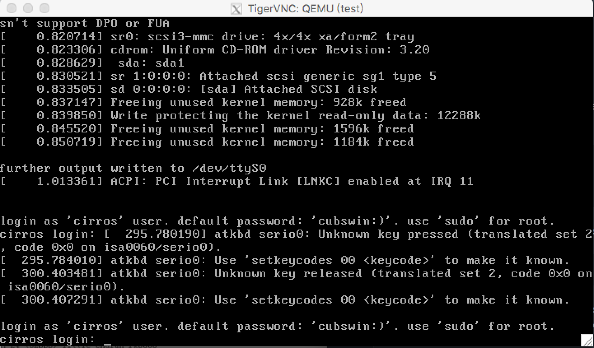

## 使用qemu-kvm管理kvm虚拟机

    第 51 天 【使用qemu-kvm管理kvm虚拟机（02）】

- KVM：hvm
    + kvm, kvn-intel, /dev/kvm

- 管理工具栈：
    + qemu-kvm
    + libvirt

- 管理kvm虚拟的方案：
    + qemu： /usr/libexec/
    + libvirt：
        * 安装工具：
            - virt-install
            - virt-manager
        * 管理工具:
            - virsh
            - vrit-manager
            - virt-viewer
- qemu-kvm 工具：
    + 安装：  
    ```
        # yum instll qemu-kvm
    ```
    + 创建链接：  
    ```
        # ln -sv /usr/libexec/qemu-kvm /usr/bin/
        `/usr/bin/qemu-kvm' -> `/usr/libexec/qemu-kvm'
    ```
    + 命令选项：
        * 标准选项：
        * 显示选项：
        * 块设备选项：
        * 网络选项：
        * i386平台专用选项：
        * 字符设备选项：
        * 蓝牙设备选项：
        * Linux启动专用选项
        * 调试/专家模式选项

- cirros project: 为cloud环境测试vm提供的微缩版Linux；
    + 下载：<http://download.cirros-cloud.net/>
    ```
        # wget http://download.cirros-cloud.net/0.3.4/cirros-0.3.4-x86_64-disk.img

        # qemu-img info cirros-0.3.4-x86_64-disk.img 
        image: cirros-0.3.4-x86_64-disk.img
        file format: qcow2
        virtual size: 39M (41126400 bytes)
        disk size: 13M
        cluster_size: 65536
    ```

    + 启动第一个虚拟：
    ```
        # qemu-kvm -m 128 -smp 2 -name test -hda cirros-0.3.4-x86_64-disk.img 
        VNC server running on `::1:5900'

        已经启动，使用VNC方式。

        安装 tigervnc
            # yum install tigervnc -y 

        使用 vnc 链接 :5900 (需要安装 XServer 服务)
            # vncviewer :5900
    ```

    + vnc 链接界面：
    ```
        # vncviewer :5900
    ```
        

    + 用 `-drive` 指定磁盘映像文件：
    ```
        # qemu-kvm -m 128 -name test -smp 2 -drive file=/images/kvm/cirros-0.3.4-x86_64-disk.img,if=virtio,media=disk,cache=writeback,format=qcow2
    ```

    + 通过cdrom启动winxp的安装：
    ```
        # qemu-kvm -name winxp -smp 4,sockets=1,cores=2,threads=2 -m 512 -drive file=/images/kvm/winxp.img,if=ide,media=disk,cache=writeback,format=qcow2 -drive file=/root/winxp_ghost.iso,media=cdrom
    ```

    + 指定使用桥接网络接口：
    ```
        qemu-kvm -m 128 -name test -smp 2 -drive file=/images/kvm/cirros-0.3.4-i386-disk.img,if=virtio,media=disk,cache=writeback,format=qcow2 -net nic -net tap,script=/etc/if-up,downscript=no -nographic
    ```
    + 指定以网络接口（PXE)方式启动VM：
    ```
        qemu-kvm -m 513 -snmp 2 -name centos -drive file=/images/centos/centos6.img,media=disk,if=virtio -net nic,model=virtio,macaddr=52:54:00:55:32:19 -net tap,ifname=centos6.0,script=/etc/qemu-ifup -boot order=nc,once=n
    ```

- 补充资料：qemu-kum使用文档
```
    2.5.6 使用qemu-kvm管理KVM虚拟机

        Qemu是一个广泛使用的开源计算机仿真器和虚拟机。当作为仿真器时，可以在一种架构(如PC机)下运行另一种架构(如ARM)下的操作系统和程序。而通过动态转化，其可以获得很高的运行效率。当作为一个虚拟机时，qemu可以通过直接使用真机的系统资源，让虚拟系统能够获得接近于物理机的性能表现。qemu支持xen或者kvm模式下的虚拟化。当用kvm时，qemu可以虚拟x86、服务器和嵌入式powerpc，以及s390的系统。

        QEMU 当运行与主机架构相同的目标架构时可以使用 KVM。例如，当在一个x86兼容处理器上运行 qemu-system-x86 时，可以利用 KVM 加速——为宿主机和客户机提供更好的性能。

        Qemu有如下几个部分组成：
        ◇   处理器模拟器(x86、PowerPC和Sparc)；
        ◇   仿真设备(显卡、网卡、硬盘、鼠标等)；
        ◇   用于将仿真设备连接至主机设备(真实设备)的通用设备；
        ◇   模拟机的描述信息；
        ◇   调试器；
        ◇   与模拟器交互的用户接口；

    2.5.6.1 使用qemu-kvm安装Guest

        如2.5.5中所述，基于libvirt的工具如virt-manager和virt-install提供了非常便捷的虚拟机管理接口，但它们事实上上经二次开发后又封装了qemu-kvm的工具。因此，直接使用qemu-kvm命令也能够完成此前的任务。

    2.5.6.1.1 qemu-kvm命令

        在RHEL6上，qemu-kvm位于/usr/libexec目录中。由于此目录不属于PATH环境变量，故无法直接使用，这样也阻止了可以直接使用qemu作为创建并管理虚拟机。如若想使用qemu虚拟机，可以通过将/usr/libexec/qemu-kvm链接为/usr/bin/qemu实现。

        # ln  -sv  /usr/lib/exec/qemu-kvm  /usr/bin/qemu-kvm

        qemu-kvm命令使用格式为“qemu-kvm  [options]  [disk_image]”，其选项非常多，不过，大致可分为如下几类。

        ◇   标准选项；
        ◇   USB选项；
        ◇   显示选项；
        ◇   i386平台专用选项；
        ◇   网络选项；
        ◇   字符设备选项；
        ◇   蓝牙相关选项；
        ◇   Linux系统引导专用选项；
        ◇   调试/专家模式选项；
        ◇   PowerPC专用选项；
        ◇   Sparc32专用选项；

        考虑到篇幅及使用需要，这里介绍的选项主要涉及到标准选项、显示选项、i386平台专用选项及Linux系统引导专用选项等相关的选项。

        2.5.6.1.2 qemu-kvm的标准选项

        qemu-kvm的标准选项主要涉及指定主机类型、CPU模式、NUMA、软驱设备、光驱设备及硬件设备等。
        ◇   -name name：设定虚拟机名称；
        ◇   -M machine：指定要模拟的主机类型，如Standard PC、ISA-only PC或Intel-Mac等，可以使用“qemu-kvm -M ?”获取所支持的所有类型；
        ◇   -m megs：设定虚拟机的RAM大小；
        ◇   -cpu model：设定CPU模型，如coreduo、qemu64等，可以使用“qemu-kvm -cpu ?”获取所支持的所有模型；
        ◇   -smp n[,cores=cores][,threads=threads][,sockets=sockets][,maxcpus=maxcpus]：设定模拟的SMP架构中CPU的个数等、每个CPU的核心数及CPU的socket数目等；PC机上最多可以模拟255颗CPU；maxcpus用于指定热插入的CPU个数上限；
        ◇   -numa opts：指定模拟多节点的numa设备；
        ◇   -fda file
        ◇   -fdb file：使用指定文件(file)作为软盘镜像，file为/dev/fd0表示使用物理软驱；
        ◇   -hda file
        ◇   -hdb file
        ◇   -hdc file
        ◇   -hdd file：使用指定file作为硬盘镜像；
        ◇   -cdrom file：使用指定file作为CD-ROM镜像，需要注意的是-cdrom和-hdc不能同时使用；将file指定为/dev/cdrom可以直接使用物理光驱；
        ◇   -drive option[,option[,option[,...]]]：定义一个硬盘设备；可用子选项有很多。
           file=/path/to/somefile：硬盘映像文件路径；
           if=interface：指定硬盘设备所连接的接口类型，即控制器类型，如ide、scsi、sd、mtd、floppy、pflash及virtio等；
           index=index：设定同一种控制器类型中不同设备的索引号，即标识号；
           media=media：定义介质类型为硬盘(disk)还是光盘(cdrom)；
           snapshot=snapshot：指定当前硬盘设备是否支持快照功能：on或off；
           cache=cache：定义如何使用物理机缓存来访问块数据，其可用值有none、writeback、unsafe和writethrough四个；
           format=format：指定映像文件的格式，具体格式可参见qemu-img命令；
        ◇   -boot [order=drives][,once=drives][,menu=on|off]：定义启动设备的引导次序，每种设备使用一个字符表示；不同的架构所支持的设备及其表示字符不尽相同，在x86 PC架构上，a、b表示软驱、c表示第一块硬盘，d表示第一个光驱设备，n-p表示网络适配器；默认为硬盘设备；
            -boot order=dc,once=d
```

    第 51 天 【使用qemu-kvm管理kvm虚拟机（03）】

### 回顾
---
- kvm：kernel-based vm, module(kernel --> hypervisor), /dev/kvm
- qemu, kvm： qemu-kvm
    + qemu-img
- KVM：
    + qemu-kvm
    + libvirt：
        * virt-install, virsh
        * virt-manager, virt-viever
- qemu-kvm：
    + 标准选项：
    ```
        -m, -cpu, -smp, -name
    ```
    + 块设备选项：
    ```
        -hd{a,b,c,d}, -cdrom, -drive
        - boot order
    ```
    + 显示选项：
    + 网络设备：

### KVM
----
```
显示选项：
    SDL: Simple DirectMedia Layer：C语言开发，跨平台且开源多媒体程序库文件；
        在qemu中使用“-sdl”即可；

    VNC: Virtual Network Computing，使用RFB(Remote FrameBuffer)协议远程控制另外的主机；
        CentOS 6.6
            (1) yum install tigervnc-server
            (2) vncpasswd
            (3) vncserver :N

qemu-kvm
    -vnc display,option,option

    示例：-vnc :N,password

    启动qemu-kvm时，额外使用-monitor stdio选项，并使用
    change vnc password命令设置密码；

    2.5.6.1.3 qemu-kvm的显示选项

    显示选项用于定义虚拟机启动后的显示接口相关类型及属性等。

    ◇   -nographic：默认情况下，qemu使用SDL来显示VGA输出；而此选项用于禁止图形接口，此时,qemu类似一个简单的命令行程序，其仿真串口设备将被重定向到控制台；
    ◇   -curses：禁止图形接口，并使用curses/ncurses作为交互接口；
    ◇   -alt-grab：使用Ctrl+Alt+Shift组合键释放鼠标；
    ◇   -ctrl-grab：使用右Ctrl键释放鼠标；
    ◇   -sdl：启用SDL；
    ◇   -spice option[,option[,...]]：启用spice远程桌面协议；其有许多子选项，具体请参照qemu-kvm的手册；
    ◇   -vga type：指定要仿真的VGA接口类型，常见类型有：
           cirrus：Cirrus Logic GD5446显示卡；
           std：带有Bochs VBI扩展的标准VGA显示卡；
           vmware：VMWare SVGA-II兼容的显示适配器；
           qxl：QXL半虚拟化显示卡；与VGA兼容；在Guest中安装qxl驱动后能以很好的方式工作，在使用spice协议时推荐使用此类型；
           none：禁用VGA卡；
    ◇   -vnc display[,option[,option[,...]]]：默认情况下，qemu使用SDL显示VGA输出；使用-vnc选项，可以让qemu监听在VNC上，并将VGA输出重定向至VNC会话；使用此选项时，必须使用-k选项指定键盘布局类型；其有许多子选项，具体请参照qemu-kvm的手册；

    -vnc display:
        （1）host:N
            172.16.100.7:1, 监听于172.16.100.7主的5900+N的端口上
        (2) unix:/path/to/socket_file
        (3) none

    options:
        password: 连接时需要验正密码；设定密码通过monitor接口使用change
        reverse: “反向”连接至某处于监听状态的vncview上；

    -monitor stdio：表示在标准输出上显示monitor界面
    -nographic
        Ctrl-a, c: 在console和monitor之间切换
        Ctrl-a, h: 显示帮助信息


    2.5.6.1.4 i386平台专用选项

        ◇   -no-acpi：禁用ACPI功能，GuestOS与ACPI出现兼容问题时使用此选项；
        ◇   -balloon none：禁用balloon设备；
        ◇   -balloon virtio[,addr=addr]：启用virtio balloon设备；

    2.5.6.1.5 网络属性相关选项

        网络属性相关选项用于定义网络设备接口类型及其相关的各属性等信息。这里只介绍nic、tap和user三种类型网络接口的属性，其它类型请参照qemu-kvm手册。

        ◇   -net nic[,vlan=n][,macaddr=mac][,model=type][,name=name][,addr=addr][,vectors=v]：创建一个新的网卡设备并连接至vlan n中；PC架构上默认的NIC为e1000，macaddr用于为其指定MAC地址，name用于指定一个在监控时显示的网上设备名称；qemu可以模拟多个类型的网卡设备，如virtio、i82551、i82557b、i82559er、ne2k_isa、pcnet、rtl8139、e1000、smc91c111、lance及mcf_fec等；不过，不同平台架构上，其支持的类型可能只包含前述列表的一部分，可以使用“qemu-kvm -net nic,model=?”来获取当前平台支持的类型；
        注意：默认mac地址均为：52:54:00:12:34:56，使用中需要手动指定。
        ◇   -net tap[,vlan=n][,name=name][,fd=h][,ifname=name][,script=file][,downscript=dfile]：通过物理机的TAP网络接口连接至vlan n中，使用script=file指定的脚本(默认为/etc/qemu-ifup)来配置当前网络接口，并使用downscript=file指定的脚本(默认为/etc/qemu-ifdown)来撤消接口配置；使用script=no和downscript=no可分别用来禁止执行脚本；
        ◇   -net user[,option][,option][,...]：在用户模式配置网络栈，其不依赖于管理权限；有效选项有：
               vlan=n：连接至vlan n，默认n=0；
               name=name：指定接口的显示名称，常用于监控模式中；
               net=addr[/mask]：设定GuestOS可见的IP网络，掩码可选，默认为10.0.2.0/8；
               host=addr：指定GuestOS中看到的物理机的IP地址，默认为指定网络中的第二个，即x.x.x.2；
               dhcpstart=addr：指定DHCP服务地址池中16个地址的起始IP，默认为第16个至第31个，即x.x.x.16-x.x.x.31；
               dns=addr：指定GuestOS可见的dns服务器地址；默认为GuestOS网络中的第三个地址，即x.x.x.3；
               tftp=dir：激活内置的tftp服务器，并使用指定的dir作为tftp服务器的默认根目录；
               bootfile=file：BOOTP文件名称，用于实现网络引导GuestOS；如：qemu -hda linux.img -boot n -net user,tftp=/tftpserver/pub,bootfile=/pxelinux.0

        # cat /etc/qemu-ifup 
        #!/bin/bash
        #
        bridge=br0

        if [ -n "$1" ]; then
            ip link set $1 up
            sleep 1
            brctl addif $bridge $1
            [ $? -eq 0 ] && exit 0 || exit 1
        else
            echo "Error: no interface specified."
            exit 1
        fi


        # cat /etc/qemu-ifdown 
        #!/bin/bash
        #
        bridge=br0

        if [ -n "$1" ];then
            brctl delif $bridge $1
            ip link set $1 down
            exit 0
        else
            echo "Error: no interface specified."
            exit 1
        fi

        # qemu-kvm -m 128 -cpu host -smp 2 -name "test" -drive file=images/kvm/cirros-0.3.4-x86_64-disk.img,if=virtio,media=disk,format=qcow2,cache=writeback -nographic -net nic -net tap,ifname=vif0.0,script=/etc/qemu-ifup

        添加成对的虚拟网卡：
            # ip link add veth1.0 type veth peer veth1.1

        总结：
            KVM 的网络模型：
                1、隔离模型：在 host 创建一个 vswitch (bridge device)；每个虚拟机的tap设备直接添加至 vswitch 上；
                2、路由模型：
                3、NAT模型：
                4、桥接模型：

    2.5.6.1.6 一个使用示例

    下面的命令创建了一个名为rhel5.8的虚拟机，其RAM大小为512MB，有两颗CPU的SMP架构，默认引导设备为硬盘，有一个硬盘设备和一个光驱设备，网络接口类型为virtio，VGA模式为cirrus，并启用了balloon功能。

    # qemu-kvm -name "rhel5.8" -m 512 \
    -smp 2 -boot d \
    -drive file=/VM/images/rhel5.8/hda,if=virtio,index=0,media=disk,format=qcow2 \
    -drive file=/isos/rhel-5.8.iso,index=1,media=cdrom \
    -net nic,model=virtio,macaddr=52:54:00:A5:41:1E \
    -vga cirrus -balloon virtio

    需要注意的是，上述命令中使用的硬盘映像文件/VM/images/rhel5.8/hda需要事先使用qemu-img命令创建，其具体使用格式请见下节介绍。

    在虚拟机创建并安装GuestOS完成之后，可以免去光驱设备直接启动之。命令如下所示。

    # qemu-kvm -name "rhel5.8" -m 512 \
    -smp 2 -boot d \
    -drive file=/VM/images/rhel5.8/hda,if=virtio,index=0,media=disk,format=qcow2 \
    -net nic,model=virtio,macaddr=52:54:00:A5:41:1E \
    -vga cirrus -balloon virtio

    2.5.6.1.7 使用qemu-img管理磁盘映像

    qemu-img是qemu用来实现磁盘映像管理的工具组件，其有许多子命令，分别用于实现不同的管理功能，而每一个子命令也都有一系列不同的选项。其使用语法格式为“qemu-img  subcommand  [options]”，支持的子命令如下。

    ◇   create：创建一个新的磁盘映像文件；
    ◇   check：检查磁盘映像文件中的错误；
    ◇   convert：转换磁盘映像的格式；
    ◇   info：显示指定磁盘映像的信息；
    ◇   snapshot：管理磁盘映像的快照；
    ◇   commit：提交磁盘映像的所有改变；
    ◇   rbase：基于某磁盘映像创建新的映像文件；
    ◇   resize：增大或缩减磁盘映像文件的大小；

    使用create子命令创建磁盘映像的命令格式为“create [-f fmt] [-o options] filename [size]”，例如下面的命令创建了一个格式为qcow2的120G的稀疏磁盘映像文件。

    # qemu-img create -f qcow2  /VM/images/rhel5.8/hda 120G
    Formatting '/VM/images/rhel5.8/hda', fmt=qcow2 size=128849018880 encryption=off cluster_size=65536

    更进一步的使用信息请参照手册页。
```

    第 51 天 【使用qemu-kvm管理kvm虚拟机（04）】

```
回顾：
    kvm，qemu-kvm

    kvm组成部分：
        /dev/kvm
        qemu

    HVM：
        modprobe kvm
        modprobe kvm-intel|kvm-amd

    工具栈：
        qemu-kvm, /usr/libexec
        libvirt:
            GUI: virt-manager
            CLI: virt-install, virsh

    qemu-kvm
        -name 'NAME'
        -m megs
        -cpu ?
        -smp n[,sockets=N][,cores=N][,threads=N][,maxcpus=N]
        -hda|-hdb|-hdc|-hdd
        -cdrom
        -drive 
            file=, media=, if=, cache=, format=, index=, readonly
        -boot [order=drives][,once=drives][,menu=on|off]
            drives: 
        -sdl
        -vnc :0,password
        -nographic
        -monitor stdio
        -usbdevice tablet

KVM(2)

    KVM的网络功能

        qemu-kvm所提供的网络模式：
            基于网桥的虚拟网卡；-net tap
            基于NAT的虚拟网络；
            Qemu内置的用户网络模式；-net user
            直接分配网络设备(VT-d, SR-IOV)

                -net nic：为VM添加虚拟网卡并指明虚拟网卡特性

                -net user, -net tap: 定义虚拟网络，并指定如何将VM的虚拟网卡连入虚拟网络

                -net none: 禁用vm的网络功能

        -net nic -net tap, -net nic -net user

        -net nic[,vlan=n][,macaddr=mac][,model=type][,name=name][,addr=addr][,vectors=v]

            -net nic,model=virtio

            查看本机的qemu-kvm支持网络接口类型：
                # qemu-kvm -net nic,model=?
                    qemu: Supported NIC models: ne2k_pci,i82551,i82557b,i82559er,rtl8139,e1000,pcnet,virtio

            注意：(1) 如果需要为VM添加多块网卡，则要多使用“-net nic”选项；
                  (2) 需要为VM的网卡指定MAC地址，地址范围属于“52:54:00”开头的地址块；

        -net tap[,vlan=n][,name=name][,fd=h][,ifname=name][,script=file][,downscript=dfile]
            ifname=
            script=/path/to/some_script：虚拟机启动时，tap为其创建的Nic的后半段会保留在host上，在host之上通常需要将其添加至某桥上，实现虚拟网络功能；
            downscript=/path/to/some_script: 虚拟机关闭时，如果处理此前的启动脚本为其设置网络；

        kvm常用的虚拟网络模型：
            桥接模型
            NAT模型
            路由模型
            隔离模型

        手动设置接口添加至指定桥的过程：
            brctl addbr $BR
            ip link set $IF up
            ip link set $BR up
            brctl addif $BR $IF

            ip link set $BR promisc on

    virtio半虚拟化：
        HVM：虚拟化CPU

        I/O半虚拟化分成两段：
            前端驱动(virtio前半段)：virtio-blk, virtio-net, virtio-pci, virtio-balloon, virtio-console
                Linux：CentOS 4.8+, 5.3+, 6.0+, 7.0+
                Windows：
            virtio: 虚拟队列，virt-ring
            transport：
            后端处理程序(virt backend drivers)：在QEMU中实现；

        virtio-balloon: 
            ballooning: 让VM中运行的GuestOS中运行调整其内存大小；

            # qemu-kvm  -balloon virtio

            手动查看GuestOS的内存用量：
                info balloon
                balloon N

        virtio-net：
            其依赖于GuestOS中的驱动，及Qemu中的后端驱动
            GuestOS: virtio_net.ko
            Qemu: qemu-kvm -net nic,model=?

            qemu-kvm  -net nic,model=virtio

            Host中的GSO, TSO
                关掉可能会提升性能：
                    ethtool -K $IF gso off
                    ethtool -K $IF tso off
                    ethtool -k $IF

            vhost-net：用于取代工作于用户空间的qemu中为virtio-net实现的后端驱动以实现性能提升的驱动；

                -net tap[,vnet_hdr=on|off][,vhost=on|off]

                qemu-kvm -net tap,vnet_hdr=on,vhost=on

        virtio-blk：
            其依赖于GuestOS中的驱动，及Qemu中的后端驱动

            -drive file=/path/to/some_image_file,if=virtio

        kvm_clock: 半虚拟化的时钟
            # grep -i "paravirt" /boot/config-2.6.32-504.el6.x86_64 
            CONFIG_PARAVIRT_GUEST=y
            CONFIG_PARAVIRT=y
            CONFIG_PARAVIRT_CLOCK=y

    VM Migration：
        static migration
        live migration 
            整体迁移时间
            服务器停机时间
            对服务的性能的影响

        在待迁入主机使用
            # qemu-kvm    -vnc :N -incoming tcp:0:7777
            # vncviewer :590N

        在源主机使用：
            monitor接口：
                migrate tcp:DEST_IP:DEST:PORT


补充资料：nat模型网络脚本示例：

    /etc/qemu-natup
        #!/bin/bash
        #
        bridge="isbr"
        net="10.0.0.0/8"
        ifaddr=10.0.10.1

        checkbr() {
            if brctl show | grep -i "^$1"; then
                return 0
            else
                return 1
            fi
        }

        initbr() {
            brctl addbr $bridge
            ip link set $bridge up
            ip addr add $ifaddr dev $bridge
        }

        enable_ip_forward() {
            sysctl -w net.ipv4.ip_forward=1
        }

        setup_nat() {
            checkbr $bridge
            if [ $? -eq 1 ]; then
                initbr
                enable_ip_forward
                iptables -t nat -A POSTROUTING -s $net ! -d $net -j MASQUERADE
            fi
        }

        if [ -n "$1" ]; then
            setup_nat
            ip link set $1 up
            brctl addif $bridge $1
            exit 0
        else
            echo "Error: no interface specified."
            exit 1
        fi
        
    /etc/qemu-natdown
        #!/bin/bash
        #
        bridge="isbr"

        remove_rule() {
        iptables -t nat -F
        }

        isalone_bridge() {
        if ! brctl show | awk "/^$bridge/{print \$4}" | grep "[^[:space:]]" &> /dev/null; then
            ip link set $bridge down
            brctl delbr $bridge
            remove_rule
        fi
        }

        if [ -n "$1" ];then
            ip link set $1 down
            brctl delif $bridge $1
            isalone_bridge
        exit 0
        else
            echo "Error: no interface specified."
            exit 1
        fi
        

    
补充资料：Qemu监视器
    图形窗口：ctrl+alt+2, ctrl+alt+1
    文本（-nographic）: Ctrl+a, c
    
    算定义minitor接口的输出位置：-monitor /dev/XXX
        -monitor  stdio
        
    常用命令：
        help: 显示帮助
            help info
        info: 显示系统状态
            info cpus 
            info tlb
        commit：
        change：
            change vnc password
        device_add和device_del:
        usb_add和usb_del 
        savevm, loadvm, delvm
            创建、装载及删除虚拟机快照；
        migrate, migrate_cancel
        cpu CPU_index
        log和logfile：
        sendkey 
        system_powerdown, system_reset, system_wakeup
        q或quit: 退出qemu模拟器，qemu进程会终止            
```

（完）


