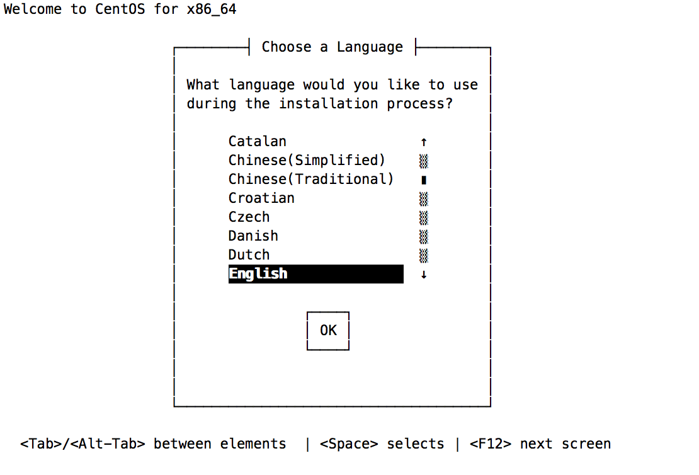

## xen 虚拟化技术

    第50天 【xen虚拟化技术基础(01)】

### 回顾:
---
- 虚拟化技术的分类：
    + 模拟：Emulation，模拟出的硬件架构体系与物理机底层架构体系不同。
        * Qemu, PearPC, Bochs
    + 完全虚拟化：Full Virtualization，Native Virtualization，提供的硬件架构与宿主机相同，或者兼容。
        * HVM
        * VMware Workstation, VirtualBox, VMWare Server, Parallels Desktop, KVM, XEN
    + 半虚拟化：ParaVirtualization
        * GuestOS：知晓自己是运行在 Virtualization 环境。
        * Hypercall
        * Xen, UML(User-Mode Linux)
    + OS级别的虚拟化：
        * Guest直接运行在用户空间
        * 容器级虚拟化
        * 将用户空间分隔为多个，彼此间互相隔离
        * OpenVZ, LXC(Linux Container), libcontainer, Virtuozzo, Linux V Server
    + 库级别虚拟化
        * WINE
    + 程序级虚拟化
        * jvm

    + Type-I：hypervisor 直接运行在硬件上。xen，VM ESXi
    + Type-II
    + IaaS：Infrastructure as a Service
    + PaaS：Platfrom as a Service

### Xen:
---
剑桥大学研发，开源 VMM；

- Xen 组成部分：
    + Xen Hypervisor
        * 分配 CPU、Memory、Interrupt
    + Dom0
        * 特权域，I/O 分配
            - 网络设备
                + net-front(GuestOS), net-backend
            - 块设备
                + block-front(GuestOS), block-backend
        * Linux Kernel：
            - 2.6.37：开始支持运行 Dom0
            - 3.0：对关键特性进行优化
        * 提供管理 DomU 工具栈
            - 用于实现对虚拟机进行添加、启动、快照、停止、删除等操作；
    + DomU
        * 非特权域，根据其虚拟化方式实现，有多种类型
            - PV
            - HVM
            - PV on HVM

        * Xen 的 PV 技术：
            - 不依赖于 CPU 的 HVM 特性，但要求 GuestOS 的内核作出修改以知晓自己运行于 PV 环境；
            - 运行于 DomU 中的 OS：Linux(2.6.24+), NetBSD, FreeBSD, OpenSolaris

        * Xen 的 HVM 技术：
            - 依赖于 Intel VT 或 AMD AMD-V，还要依赖于 Qemu 来模拟 IO 设备；
            - 运行于 DomU 中的 OS：几乎所有支持此 X86 平台的；

        * PV on HVM：
            - CPU 为 HVM 模式运行
            - IO 设备为 PV 模式运行
            - 运行于 DomU 中的 OS：只要 OS 能驱动 PV 接口类型的 IO 设备；
                + net-front, blk-front


- Xen 的工具栈  
    + xm/xend：在 Xen Hypervisor 的 Dom0 中要启动 xend 服务   
        * xm：命令行管理工具，有诸多子命令：
            - create
            - destroy
            - stop
            - pause
    + xl：基于 libxenlight 提供的轻量级的命令行工具栈；
    + xe/xapi：提供了对 xen 管理的 api， 因此多用于 cloud 环境；Xen Server, XCP
    + virsh/libvirt：Libvirt 是一组软件的汇集，提供了管理虚拟机和其它虚拟化功能（如：存储和网络接口等）的便利途径。这些软件包括：一个长期稳定的 C 语言 API、一个守护进程（libvirtd）和一个命令行工具（virsh）。Libvirt 的主要目标是提供一个单一途径以管理多种不同虚拟化方案以及虚拟化主机，包括：KVM/QEMU，Xen，LXC，OpenVZ 或 VirtualBox hypervisors.

- XenStore：
    + 为各 Domain 提供的共享信息存储空间；有着层级机构的名称空间；位于 Dom0。

- CentOS 对 Xen 的支持：
    + RHEL 5.7-：默认的虚拟化技术为 Xen；
        * kernel version：2.6.18
            - kernel-
            - kernel-xen
    + RHEL 6+：仅支持kvm
        * Dom0：不支持
        * DomU：支持

- 如何在 CentOS 6.6 上使用 Xen；
    1. 编译 3.0 以上版本的内核，启动对 Dom0 的支持；
    2. 编译 Xen 程序；
    3. 制作好的相关程序包的项目：
        + xen4centos
        + xen made easy

- 在 CentOS 6.9 上使用 yum 源安装 Xen
    + 查看当前 CPU 是否支持虚拟化：
    ```
        # grep -E '(vmx|svm)' /proc/cpuinfo
    ```
    + 当前系统内核版本：
    ```
        # uname -r
        2.6.32-696.el6.x86_64
    ```
    + 设置 yum 源，只用阿里云的镜像
    ```
        # vim xen.repo
        [xenCentos]
        name=Xen for CentOS 6
        baseurl=https://mirrors.aliyun.com/centos/6.9/virt/x86_64/xen/
        gpgcheck=0
    ```
    + 使用 yum 安装
    ```
        # yum install xen -y
        主要安装了一下软件包：
        Dependencies Resolved

        =================================================================================================================================
         Package                               Arch                Version                                  Repository              Size
        =================================================================================================================================
        Installing:
         linux-firmware                        noarch              20170828-77.gitb78acc9.el6               xenCentos               55 M
             replacing  ivtv-firmware.noarch 2:20080701-20.2
             replacing  kernel-firmware.noarch 2.6.32-573.3.1.el6
             replacing  ql2100-firmware.noarch 1.19.38-3.1.el6
             replacing  ql2200-firmware.noarch 2.02.08-3.1.el6
             replacing  ql23xx-firmware.noarch 3.03.27-3.1.el6
             replacing  ql2400-firmware.noarch 7.03.00-1.el6_5
             replacing  ql2500-firmware.noarch 7.03.00-1.el6_5
             replacing  rt61pci-firmware.noarch 1.2-7.el6
             replacing  rt73usb-firmware.noarch 1.8-7.el6
             replacing  xorg-x11-drv-ati-firmware.noarch 7.5.99-3.el6
         xen                                   x86_64              4.4.4-34.el6                             xenCentos              1.0 M
        Installing for dependencies:
         SDL                                   x86_64              1.2.14-7.el6_7.1                         base                   193 k
         bridge-utils                          x86_64              1.2-10.el6                               base                    30 k
         glusterfs                             x86_64              3.7.9-12.el6                             base                   422 k
         glusterfs-api                         x86_64              3.7.9-12.el6                             base                    58 k
         glusterfs-client-xlators              x86_64              3.7.9-12.el6                             base                   1.1 M
         glusterfs-libs                        x86_64              3.7.9-12.el6                             base                   313 k
         kernel                                x86_64              4.9.75-30.el6                            xenCentos               42 M
         kpartx                                x86_64              0.4.9-100.el6_9.1                        updates                 70 k
         libusb1                               x86_64              1.0.9-0.7.rc1.el6                        base                    80 k
         python-lxml                           x86_64              2.2.3-1.1.el6                            base                   2.0 M
         qemu-img                              x86_64              2:0.12.1.2-2.503.el6_9.4                 updates                846 k
         usbredir                              x86_64              0.5.1-3.el6                              base                    41 k
         xen-hypervisor                        x86_64              4.4.4-34.el6                             xenCentos              4.7 M
         xen-libs                              x86_64              4.4.4-34.el6                             xenCentos              432 k
         xen-licenses                          x86_64              4.4.4-34.el6                             xenCentos               88 k
         xen-runtime                           x86_64              4.4.4-34.el6                             xenCentos              9.9 M
         yajl                                  x86_64              1.0.7-3.el6                              base                    27 k

    ```
    + 此时查看 /etc/grub.conf 文件，会看到新安装了一个内核（kernel-4.9.75-30.el6.x86_64)，此内核是运行在 Xen 的 Dom0 中，所以这里不能设置从这里启动。
    ```
        ]# cat /etc/grub.conf
        # grub.conf generated by anaconda
        #
        # Note that you do not have to rerun grub after making changes to this file
        # NOTICE:  You have a /boot partition.  This means that
        #          all kernel and initrd paths are relative to /boot/, eg.
        #          root (hd0,0)
        #          kernel /vmlinuz-version ro root=/dev/mapper/vg_node1-lv_root
        #          initrd /initrd-[generic-]version.img
        #boot=/dev/sda
        default=0
        timeout=5
        splashimage=(hd0,0)/grub/splash.xpm.gz
        hiddenmenu
        title CentOS (4.9.75-30.el6.x86_64)
                root (hd0,0)
                kernel /vmlinuz-4.9.75-30.el6.x86_64 ro root=/dev/mapper/vg_node1-lv_root rd_NO_LUKS LANG=en_US.UTF-8 rd_LVM_LV=vg_node1/lv_swap rd_NO_MD SYSFONT=latarcyrheb-sun16 crashkernel=auto rd_LVM_LV=vg_node1/lv_root  KEYBOARDTYPE=pc KEYTABLE=us rd_NO_DM rhgb quiet
                initrd /initramfs-4.9.75-30.el6.x86_64.img
        title CentOS 6 (2.6.32-696.el6.x86_64)
                root (hd0,0)
                kernel /vmlinuz-2.6.32-696.el6.x86_64 ro root=/dev/mapper/vg_node1-lv_root rd_NO_LUKS LANG=en_US.UTF-8 rd_LVM_LV=vg_node1/lv_swap rd_NO_MD SYSFONT=latarcyrheb-sun16 crashkernel=auto rd_LVM_LV=vg_node1/lv_root  KEYBOARDTYPE=pc KEYTABLE=us rd_NO_DM rhgb quiet
                initrd /initramfs-2.6.32-696.el6.x86_64.img
    ```
    + 查看 /boot 目录下的文件，会发现其有 xen.gz、xen-4.4.gz和xen-4.4.4-34.el6.gz 3个文件，xen.gz、xen-4.4.gz 文件是 xen-4.4.4-34.el6.gz 文件的软连接，而 xen-4.4.4-34.el6.gz 文件即是 Xen 的内核，其需要直接运行在硬件环境上，故需修改 /etc/grub.conf 文件，如下：
    ```
        grub 配置：

        #boot=/dev/sda
        default=0
        timeout=5
        splashimage=(hd0,0)/grub/splash.xpm.gz
        hiddenmenu
        title CentOS (4.9.75-30.el6.x86_64)
                root (hd0,0)
                kernel /xen.gz dom0_mem=1024M cpufreq=xen dom0_max_vcpus=2 dom0_vcpus_pin
                module /vmlinuz-4.9.75-30.el6.x86_64 ro root=/dev/mapper/vg_node1-lv_root rd_NO_LUKS LANG=en_US.UTF-8 rd_LVM_LV=vg_node1/lv_swap rd_NO_MD SYSFONT=latarcyrheb-sun16 crashkernel=auto rd_LVM_LV=vg_node1/lv_root  KEYBOARDTYPE=pc KEYTABLE=us rd_NO_DM rhgb quiet
                module /initramfs-4.9.75-30.el6.x86_64.img
        title CentOS 6 (2.6.32-696.el6.x86_64)
                root (hd0,0)
                kernel /vmlinuz-2.6.32-696.el6.x86_64 ro root=/dev/mapper/vg_node1-lv_root rd_NO_LUKS LANG=en_US.UTF-8 rd_LVM_LV=vg_node1/lv_swap rd_NO_MD SYSFONT=latarcyrheb-sun16 crashkernel=auto rd_LVM_LV=vg_node1/lv_root  KEYBOARDTYPE=pc KEYTABLE=us rd_NO_DM rhgb quiet
                initrd /initramfs-2.6.32-696.el6.x86_64.img

        配置说明：
            kernel /xen.gz：配置 kernel 从 xen-4.4.4-34.el6.gz 内核启动。
            dom0_mem=1024：设置 dom0 使用的内存大小。
            cpufreq=xen：cpu 使用频率由 xen 控制。
            dom0_max_vcpus=1：dom0 使用的 vcpu 个数为 1。
            dom0_vcpus_pin：将 dom0 的 vcpu 固定在物理核心上。

            grub.conf boot options: http://xenbits.xen.org/docs/unstable/misc/xen-command-line.html
    ```
    + 官方 Man 手册：<https://wiki.xenproject.org/wiki/Xen_Man_Pages>
    + 重启服务器，查看其内核与虚拟化环境：
    ```
        # shutdown -r now 

        # uname -r
        4.9.75-30.el6.x86_64

        # xl list
        Name                                        ID   Mem VCPUs      State   Time(s)
        Domain-0                                     0  1024     2     r-----      37.2
    ```

```
    第50天 【xen虚拟化技术基础(02)】
```

- Xen 工具栈
    + xm/xend
        * 默认 xend 服务没有启动，如果使用 xm 管理，则需先启动 xend 服务（service xend start)
        * xm 命令已经被废弃了，虽然有提供，但不建议使用。
    + xl
        * `xl list` 显示 Domain 的相关信息
            - Xen 虚拟机状态：
                + r: running
                + b: 阻塞
                + p: 暂停
                + s: 停止
                + c: 崩溃
                + d: dying, 正在关闭的过程中

- 如何创建 Xen pv 模式：
    + 定义 DomU 的配置文件
        * kernel
        * initrd 或 initramfs
        * DomU 内核模块
        * 根文件系统
        * swap 设备
        * 将上述内容定义在 DoumU 的配置文件中
        * 注意：xm 与 xl 启动 DomU 使用的配置文件略有不同；
        * 对于 xl 而言，其创建 DomU 使用的配置指令可通过 `man xl.cfg` 获取
        ```
            - 常用指令：
                + name：域唯一名称
                + builder：指明虚拟机的类型，generic 表示 pv，hvm 表示 HVM
                + vcpus：虚拟 cpu 个数
                + maxcpus：最大虚拟 cpu 个数
                + cpus：vcpu 可运行于其上的物理 cpu 列表
                + memory=MBYTES：表示内存大小
                + maxmem=MBYTES：可以使用的最大内存空间
                + on_poweroff：指明关机时采取的 action：
                    * destroy, restart, preserve
                + on_reboot="ACTION"：指明“重启” DomU 时采取的 action
                + on_crash="ACTION"：虚拟机意外崩溃时采取的 action
                + uuid：DomU 的唯一标识
                + disk=[ "DISK_SPEC_STRING", "DISK_SPEC_STRING", ...]：指明磁盘设备，列表。
                + vif=[ "NET_SPEC_STRING", "NET_SPEC_STRING", ...]：指明网络接口，列表。
                + vfb=[ "VFB_SPEC_STRING", "VFB_SPEC_STRING", ...]：指明 virtual frame buffer，列表。
                + pci=[ "PCI_SPEC_STRING", "PCI_SPEC_STRING", ... ]：pci 设备列表。
            - PV 模式专用指令：
                + kernel="PATHNAME": 内核文件路径，此为 Dom0 中的路径；
                + ramdisk="PATHNAME"：为 kernel 指定内核提供的 ramdisk 文件路径；
                + bootloader="PROGRAM"：如果 DomU 使用自己的 kernel 及 ramdisk, 此时需要一个 Dom0 中的应用程序来实现其 bootloader 功能；
                + root="STRING"：指明根文件系统；
                + extra="STRING"：额外传递给内核引导时使用的参数；
            - 磁盘参数制定方式：
                + 官方文档：http://xenbits.xen.org/docs/unstable/man/xl-disk-configuration.5.html
                + [<target>, [<format>, [<vdev>, [<access>]]]]
                    - <target> 表示磁盘映像文件或设备文件路径：/images/xen/linux.img, /dev/myvg/linux
                    - <format> 表示磁盘格式，如果是映像文件，有多种格式，例如：raw, qcow, qcow2 ...
                    - <vdev> 此设备在 DomU 被识别为硬件设备类型，支持hd[x], xvd[x], sd[x] etc.
                    - <access> 访问权限，
                        ro, r：只读
                        rw, w：读写

                        disk = [ "/images/xen/linux.img,raw,xvda,rw","...","..." ]
                + 使用 qemu-img 管理磁盘映像文件
                    - create [-f fmt] [-o options] filename [size]
                        + 可创建 sparse(稀疏) 格式的磁盘映像文件，是默认格式
                            # mkdir -pv /images/xen
                            mkdir: created directory `/images'
                            mkdir: created directory `/images/xen'
                            两种创建方式：
                            1、
                            # qemu-img create -f raw -o size=2G /images/xen/busybox.img
                            Formatting '/images/xen/busybox.img', fmt=raw size=2147483648
                            2、
                            # qemu-img create -f raw  /images/xen/busybox.img 2G 
                            Formatting '/images/xen/busybox.img', fmt=raw size=2147483648 

                            使用 ll 看是 2G，实则为 0
                            # ll -h /images/xen/busybox.img 
                            -rw-r--r--. 1 root root 2.0G Feb  4 17:03 /images/xen/busybox.img
                            # du -sh /images/xen/busybox.img
                            0       /images/xen/busybox.img

                            格式化：
                            # mke2fs -t ext2 busybox.img 
                            mke2fs 1.41.12 (17-May-2010)
                            busybox.img is not a block special device.
                            Proceed anyway? (y,n) y
                            Filesystem label=
                            OS type: Linux
                            Block size=4096 (log=2)
                            Fragment size=4096 (log=2)
                            Stride=0 blocks, Stripe width=0 blocks
                            131072 inodes, 524288 blocks
                            26214 blocks (5.00%) reserved for the super user
                            First data block=0
                            Maximum filesystem blocks=536870912
                            16 block groups
                            32768 blocks per group, 32768 fragments per group
                            8192 inodes per group
                            Superblock backups stored on blocks: 
                                    32768, 98304, 163840, 229376, 294912

                            Writing inode tables: done                            
                            Writing superblocks and filesystem accounting information: done

                            This filesystem will be automatically checked every 36 mounts or
                            180 days, whichever comes first.  Use tune2fs -c or -i to override.
                            # du -sh busybox.img 
                            33M     busybox.img

                            挂载：
                            # mount -o loop busybox.img /mnt // mount -o loop 挂载本地回环设备
                            ~]# cd /mnt/
                            mnt]# ls
                            lost+found

        ```

    + 示例：
        * 创建一个pv格式的vm:
            - 准备磁盘映像文件：
            ```
                qemu-img create -f raw -o size=2G /images/xen/busybox.img
                make2fs -t ext2 /images/xen/busybox.img
                mount -o loop /images/xen/busybox.img /mnt
            ```
            - 提供根文件系统：
                + [编译busybox](https://github.com/hellowangjian/MageEdu-Linux/blob/master/Mini%20Linux%20制作过程.md)，并复制到busybox.img映像中
                ```
                    busybox 编译方法见 《Mini Linux 制作过程.md》文件。

                    复制到 busybox.img
                        cp -a /usr/local/src/busybox-1.28.1/_install/* /mnt/

                    # mkdir /mnt/{proc,sys,boot,dev,usr,var,root,home}
                ```
            - 内核及 ramdisk
            ```
                前面 CentOS 6.9 为了安装支持 xen，升级了内核，但是旧的内核依然在 /boot/ 目录下，我们就以此内核作为 DomU 的内核：
                    为了简便，为其创建连接文件：
                    # cd /boot
                    # ln -sv vmlinuz-2.6.32-696.el6.x86_64 vmlinuz 
                    # ln -sv initramfs-2.6.32-696.el6.x86_64.img initramfs.img
            ```
            - 提供配置DomU配置文件
            ```
                # cd /etc/xen/
                # cp xlexample.pvlinux busybox
                name = "busybox-001"
                kernel = "/boot/vmlinuz"
                ramdisk = "/boot/initramfs.img"
                extra = "root=/dev/xvda ro selinux=0 init=/bin/sh"
                memory = 256
                vcpus = 2
                disk = [ '/images/xen/busybox.img,raw,xvda,rw' ]
            ```
            - 启动实例：
            ```
                xl [-v] create <DomU_Config_file> -n  // Dry run - prints the resulting configuration
                xl create <DomU_Config_file> -c   

                登录虚拟机控制台：
                    xl console busybox-001 

                退出虚拟机控制台：
                    Control + ]
            ```

        *  如何配置网络接口：
            -  官方文档：<http://xenbits.xen.org/docs/unstable/man/xl-network-configuration.5.html>
            ```
            格式：
                vif = [ '<vifspec>', '<vifspec>', ... ]

                vifspec：[<key>=<value>|<flag>,]

                常用的 key：
                    mac=：指定mac地址，要以“00:16:3e”开头；
                    bridge=<bridge>：指定此网络接口在 Dom0 被关联至哪个桥设备上；
                    model=<MODEL>：网卡类型，rtl8139 (default) ；
                    vifname=：接口名称，在 Doum0 中显示的名称；
                    script=：执行的脚本；
                    ip=：指定ip地址，会注入到 DomU 中；
                    rate=：指明设备传输速率，通常为“#UNIT/s"格式；
                        UNIT：GB, MB, KB, B for bytes.
                              Gb, Mb, Kb, b for bits.

            示例：
                vif = [ 'bridge=xenbr0']
            ```

```
    第50天 【xen虚拟化技术进阶(03)】
```

### 回顾：
    
- xen基本组件：
    + xen hypervisor, Dom0(Privileged Domain), DomU(Unprivileged Domain)    
    + netdev-frontend, netdev-backend;
    + blkdev-frontend, blkdev-backend;

- Xen的DomU虚拟化类型：
    + PV
    + hvm(fv)
    + pv on hvm

- Dom0: kernel, ramdisk
- RootFS：busybox
    + qemu-img

Xen(2)

    注意：内核版本降级至3.7.4，Sources/6.x86_64/xen-4.1；

- 网络接口的启用：
```
    vif = [ 'bridge=xenbr0',...]
```

- xl 的其它常用命令：
    ```
    shutdown：关机指令
    reboot：重启

    pause：暂停
    unpause：解除暂停
    console：连接至控制台

    save：将 DomU 的内存中的数据转存至指定的磁盘文件中；
        Usage: xl [-vf] save [options] <Domain> <CheckpointFile> [<ConfigFile>]

            # xl save busybox-001 /tmp/busybox-001.img
            Saving to /tmp/busybox-001.img new xl format (info 0x3/0x0/1017)
            xc: info: Saving domain 9, type x86 PV
            xc: Frames: 32768/32768  100%
            xc: End of stream: 0/0    0%

            # ls -l /tmp/busybox-001.img  
            -rw-r--r--. 1 root root 134496785 Mar 10 07:21 /tmp/busybox-001.img

    restore：从指定的磁盘文件中恢复 DomU 内存数据；
        Usage: xl [-vf] restore [options] [<ConfigFile>] <CheckpointFile>

            # xl restore /tmp/busybox-001.img 
            Loading new save file /tmp/busybox-001.img (new xl fmt info 0x3/0x0/1017)
             Savefile contains xl domain config in JSON format
            Parsing config from <saved>
            xc: info: Found x86 PV domain from Xen 4.6
            xc: info: Restoring domain
            xc: info: Restore successful
            xc: info: XenStore: mfn 0x3a873, dom 0, evt 1
            xc: info: Console: mfn 0x3a872, dom 0, evt 2

            # xl list
            Name                                        ID   Mem VCPUs      State   Time(s)
            Domain-0                                     0  1024     2     r-----     927.7
            busybox-001                                 10   128     2     -b----       0.2

    vcpu-list：查看 vcpu 个数；
        # xl vcpu-list busybox-001
        Name                                ID  VCPU   CPU State   Time(s) Affinity (Hard / Soft)
        busybox-001                         10     0    0   -b-       0.8  all / all
        busybox-001                         10     1    1   -b-       0.3  all / all

    vcpu-pin
    vcpu-set

    info：当前 xen hypervisor 的摘要信息；

    domid
    domname

    dmesg：DomU 的 dmesg 信息；

    top：查看domain资源占用排序状态的命令；

    network-list：查看指定域使用网络及接口；
        # xl network-list busybox-001
        Idx BE Mac Addr.         handle state evt-ch   tx-/rx-ring-ref BE-path                       
        0   0  00:16:3e:12:ab:37     0     4     14   768/769         /local/domain/0/backend/vif/10/0
    network-attach：添加网卡；
        # xl network-attach busybox-001 bridge=br0

        # xl network-list busybox-001
        Idx BE Mac Addr.         handle state evt-ch   tx-/rx-ring-ref BE-path                       
        0   0  00:16:3e:12:ab:37     0     4     14   768/769         /local/domain/0/backend/vif/10/0
        1   0  00:16:3e:47:7a:dd     1     4     15  1280/1281        /local/domain/0/backend/vif/10/1
    network-detach：移除网卡；
        # xl network-detach busybox-001 1

        # xl network-list busybox-001
        Idx BE Mac Addr.         handle state evt-ch   tx-/rx-ring-ref BE-path                       
        0   0  00:16:3e:12:ab:37     0     4     14   768/769         /local/domain/0/backend/vif/10/0

    block-list：查看指定域磁盘设备；
        # xl block-list busybox-001
        Vdev  BE  handle state evt-ch ring-ref BE-path                       
        51712 0   10     4     13     8        /local/domain/0/backend/vbd/10/51712
    block-attach：向指定域添加一个磁盘设备；
        # xl block-attach busybox-001 '/images/xen/busybox1.2.img,qcow2,xvdb,w'

        # xl block-list busybox-001
        Vdev  BE  handle state evt-ch ring-ref BE-path                       
        51712 0   10     4     13     8        /local/domain/0/backend/vbd/10/51712
        51728 0   10     3     15     1281     /local/domain/0/backend/qdisk/10/51728
    block-detach：指定域中移除指定磁盘设备；
        # xl block-detach busybox-001 51728

        # xl block-list busybox-001
        Vdev  BE  handle state evt-ch ring-ref BE-path                       
        51712 0   11     4     13     8        /local/domain/0/backend/vbd/11/51712

    uptime：指定域的运行时长；
        # xl uptime busybox-001
        Name                                ID Uptime
        busybox-001                         11  0:03:48
    ```

- qcow2 格式磁盘创建：xen 支持的一种高级格式的磁盘格式，支持虚拟机快照；
```
    [root@node1 ~]# qemu-img create -f qcow2 -o ? /images/xen/busybox1.2.img
    Supported options:
    size             Virtual disk size
    backing_file     File name of a base image
    backing_fmt      Image format of the base image
    encryption       Encrypt the image
    cluster_size     qcow2 cluster size
    preallocation    Preallocation mode (allowed values: off, metadata, falloc, full)
    [root@node1 ~]# qemu-img create -f qcow2 -o size=5G,preallocation=metadata /images/xen/busybox1.2.img
    Formatting '/images/xen/busybox1.2.img', fmt=qcow2 size=5368709120 encryption=off cluster_size=65536 preallocation='metadata' 
    [root@node1 ~]# ll -h /images/xen/
    total 39M
    -rw-r--r--. 1 root root 5.1G Mar 10 08:22 busybox1.2.img
    -rw-r--r--. 1 root root 2.0G Mar 10 06:41 busybox.img
    [root@node1 ~]# du -sh /images/xen/busybox1.2.img 
    972K    /images/xen/busybox1.2.img
```


- 使用DomU自有的kernel来启动运行DomU：
    + 制作磁盘映像文件：
    ```
        # qemu-img create -f raw -o size=5G /images/xen/busybox3.img
        Formatting '/images/xen/busybox3.img', fmt=raw size=5368709120  
    ```

    + 挂载磁盘映像文件：
    ```
        losetup - set up and control loop devices
            losetup -a：显示所有已用的loop设备相关信息
            losetup -f：显示第一个空闲可用的loop设备文件

        挂载：
            # losetup /dev/loop1 /images/xen/busybox3.img 
            # losetup -a
            /dev/loop0: [fd00]:523272 (/images/xen/busybox.img)
            /dev/loop1: [fd00]:541710 (/images/xen/busybox3.img)
    ```
    + 分区：
    ```
        # fdisk /dev/loop1
        Device contains neither a valid DOS partition table, nor Sun, SGI or OSF disklabel
        Building a new DOS disklabel with disk identifier 0x1ce50137.
        Changes will remain in memory only, until you decide to write them.
        After that, of course, the previous content won't be recoverable.

        Warning: invalid flag 0x0000 of partition table 4 will be corrected by w(rite)

        WARNING: DOS-compatible mode is deprecated. It's strongly recommended to
                 switch off the mode (command 'c') and change display units to
                 sectors (command 'u').

        Command (m for help): p

        Disk /dev/loop1: 5369 MB, 5369757696 bytes
        255 heads, 63 sectors/track, 652 cylinders
        Units = cylinders of 16065 * 512 = 8225280 bytes
        Sector size (logical/physical): 512 bytes / 512 bytes
        I/O size (minimum/optimal): 512 bytes / 512 bytes
        Disk identifier: 0x1ce50137

              Device Boot      Start         End      Blocks   Id  System

        Command (m for help): n
        Command action
           e   extended
           p   primary partition (1-4)
        p
        Partition number (1-4): 1
        First cylinder (1-652, default 1): 
        Using default value 1
        Last cylinder, +cylinders or +size{K,M,G} (1-652, default 652): +100M

        Command (m for help): n
        Command action
           e   extended
           p   primary partition (1-4)
        p
        Partition number (1-4): 2
        First cylinder (15-652, default 15): 
        Using default value 15
        Last cylinder, +cylinders or +size{K,M,G} (15-652, default 652): +1G

        Command (m for help): w
        The partition table has been altered!

        Calling ioctl() to re-read partition table.

        WARNING: Re-reading the partition table failed with error 22: Invalid argument.
        The kernel still uses the old table. The new table will be used at
        the next reboot or after you run partprobe(8) or kpartx(8)
        Syncing disks.

        显示分区信息：
            # kpartx -av /dev/loop1
            add map loop1p1 (253:2): 0 224847 linear /dev/loop1 63
            add map loop1p2 (253:3): 0 2120580 linear /dev/loop1 224910
            # ls /dev/mapper/
            control  loop1p1  loop1p2  vg_node1-lv_root  vg_node1-lv_swap
    ```
    + 格式化分区：
    ```
        # mke2fs -t ext2 /dev/mapper/loop1p1
        mke2fs 1.41.12 (17-May-2010)
        Discarding device blocks: done                            
        Filesystem label=
        OS type: Linux
        Block size=1024 (log=0)
        Fragment size=1024 (log=0)
        Stride=0 blocks, Stripe width=0 blocks
        28112 inodes, 112420 blocks
        5621 blocks (5.00%) reserved for the super user
        First data block=1
        Maximum filesystem blocks=67371008
        14 block groups
        8192 blocks per group, 8192 fragments per group
        2008 inodes per group
        Superblock backups stored on blocks: 
                8193, 24577, 40961, 57345, 73729

        Writing inode tables: done                            
        Writing superblocks and filesystem accounting information: done

        This filesystem will be automatically checked every 33 mounts or
        180 days, whichever comes first.  Use tune2fs -c or -i to override.

        # mke2fs -t ext2 /dev/mapper/loop1p2
        mke2fs 1.41.12 (17-May-2010)
        Discarding device blocks: done                            
        Filesystem label=
        OS type: Linux
        Block size=4096 (log=2)
        Fragment size=4096 (log=2)
        Stride=0 blocks, Stripe width=0 blocks
        66384 inodes, 265072 blocks
        13253 blocks (5.00%) reserved for the super user
        First data block=0
        Maximum filesystem blocks=272629760
        9 block groups
        32768 blocks per group, 32768 fragments per group
        7376 inodes per group
        Superblock backups stored on blocks: 
                32768, 98304, 163840, 229376

        Writing inode tables: done                            
        Writing superblocks and filesystem accounting information: done

        This filesystem will be automatically checked every 25 mounts or
        180 days, whichever comes first.  Use tune2fs -c or -i to override.
    ```
    + 挂载分区：
    ```
        # mkdir /mnt/{boot,sysroot}
        # mount /dev/mapper/loop1p1 /mnt/boot/
        # mount /dev/mapper/loop1p2 /mnt/sysroot
    ```

    + 复制内核及 initrd：
    ```
        # cp /boot/vmlinuz-2.6.32-358.el6.x86_64 /mnt/boot/vmlinuz
        # cp /boot/initramfs-2.6.32-358.el6.x86_64.img /mnt/boot/initramfs.img
    ```
    + 复制 busybox 及 网卡 modules
    ```
        # cd /mnt/sysroot/
        # mkdir lib/modules lib64 sys proc var dev root home tmp -pv
        # cp -a /usr/local/src/busybox-1.26.1/_install/* /mnt/sysroot/

        # cp /lib/modules/2.6.32-358.el6.x86_64/kernel/drivers/net/xen-netfront.ko /mnt/sysroot/lib/modules/
    ```
    + 安装 `grub`
    ```
        # grub-install --root-directory=/mnt /dev/loop1
        Probing devices to guess BIOS drives. This may take a long time.
        /dev/loop1 does not have any corresponding BIOS drive.

        # ls /mnt/boot/
        grub  initramfs.img  lost+found  vmlinuz

        # vim /mnt/boot/grub/grub.conf
        default=0
        timeout=5
        title BusyBox(kernel-2.6.32)
                root (hd0,0)
                kernel /vmlinuz root=/dev/xvda2 ro seliux=0 init=/bin/sh
                initrd /initramfs.img
    ```
    + 虚拟机配置文件：
    ```
        # grep -Ev '^#|^$' /etc/xen/busybox3
        name = "busybox-003"
        extra = "root=/dev/xvda2 ro init=/bin/sh selinux=0"
        memory = 128
        vcpus = 2
        vif = [ 'bridge=br0' ]
        disk = [ '/images/xen/busybox3.img,raw,xvda,rw' ]
        bootloader = '/usr/bin/pygrub'

        pygrub：使用 python 研发的复制虚拟机启动的grub。
    ```
    + 卸载分区，及回环映像文件：
    ```
        # umount /mnt/boot/
        # umount /mnt/sysroot/

        # kpartx -d /dev/loop1
        # losetup -a
        /dev/loop0: [fd00]:523272 (/images/xen/busybox.img)
    ```
    + 启动虚拟机：
    ```
        # xl create /etc/xen/busybox3 -c
    ```

```
    第50天 【xen虚拟化技术进阶(04)】
```

- 使用 xl 命令进行创建虚拟机并完成 CentOS 6.9 的系统安装：
    + 获取安装指定版本的系统所需要 kernel 和 initrd 文件及创建磁盘映像文件
    ```
        获取安装指定版本的系统所需要 kernel 和 initrd：
            [root@node1 ~]# mkdir /images/kernel
            [root@node1 ~]# cd /images/kernel
            [root@node1 kernel]# wget https://mirrors.aliyun.com/centos/6.9/os/x86_64/isolinux/vmlinuz
            --2018-03-10 16:29:54--  https://mirrors.aliyun.com/centos/6.9/os/x86_64/isolinux/vmlinuz
            Resolving mirrors.aliyun.com... 114.80.174.21, 180.163.155.9, 180.163.155.10, ...
            Connecting to mirrors.aliyun.com|114.80.174.21|:443... connected.
            HTTP request sent, awaiting response... 200 OK
            Length: 4274992 (4.1M) [application/octet-stream]
            Saving to: “vmlinuz”

            100%[=======================================================================================>] 4,274,992   4.49M/s   in 0.9s    

            2018-03-10 16:29:55 (4.49 MB/s) - “vmlinuz” saved [4274992/4274992]

            [root@node1 kernel]# wget https://mirrors.aliyun.com/centos/6.9/os/x86_64/isolinux/initrd.img
            --2018-03-10 16:30:13--  https://mirrors.aliyun.com/centos/6.9/os/x86_64/isolinux/initrd.img
            Resolving mirrors.aliyun.com... 114.80.174.21, 180.163.155.9, 180.163.155.10, ...
            Connecting to mirrors.aliyun.com|114.80.174.21|:443... connected.
            HTTP request sent, awaiting response... 200 OK
            Length: 41587792 (40M) [application/octet-stream]
            Saving to: “initrd.img”

            100%[=======================================================================================>] 41,587,792  4.78M/s   in 8.6s    

            2018-03-10 16:30:22 (4.61 MB/s) - “initrd.img” saved [41587792/41587792]

        创建磁盘映像文件：
            [root@node1 xen]# qemu-img create -f qcow2 -o size=10G,preallocation=metadata /images/xen/centos6.9.img
            Formatting '/images/xen/centos6.9.img', fmt=qcow2 size=10737418240 encryption=off cluster_size=65536 preallocation='metadata' 
    ```
    + 创建DomU配置文件：
    ```
        [root@node1 kernel]# cd /etc/xen/
        [root@node1 xen]# cp busybox centos
        [root@node1 xen]# vim centos
        # grep -Ev '^#|^$' centos 
        name = "centos-001"
        kernel = "/images/kernel/vmlinuz"
        ramdisk = "/images/kernel/initrd.img"
        memory = 512
        vcpus = 2
        vif = [ 'bridge=br0' ]
        disk = [ '/images/xen/centos6.9.img,qcow2,xvda,rw' ]
        on_reboot = "shutdown"
    ```

    + 启动：
    ```
        # xl create /etc/xen/centos -c
    ```
    

    + 安装完成后，创建虚拟机的配置文件需要做出修改：
    ```
        # grep -Ev '^#|^$' centos 
        name = "centos-001"
        bootloader = "pygrub"
        ramdisk = "/images/kernel/initrd.img"
        memory = 512
        vcpus = 2
        vif = [ 'bridge=br0' ]
        disk = [ '/images/xen/centos6.9.img,qcow2,xvda,rw' ]
    ```

    + 启动图形窗口：
        * 在创建虚拟机的配置文件中定义 vfb
            ```
            sdl：
                vfb = [ 'sdl=1' ]

            vnc：
                # yum install tigervnc
                vfb = [ 'vnc=1' ]
                    vnc监听的端口为5900，相应的 DISPLAYNUM 为 0
            ```

- 使用 Dom0 中物理磁盘分区为 DomU 提供存储空间：
    + 创建一个分区，提供文件系统及配置文件...

- 使用libvirt实现xen虚拟机管理

```
    # yum install libvirt libvirt-daemon-xen virt-manager python-virtinst libvirt-client -y

    # service libvirtd start
    Starting libvirtd daemon:                                  [  OK  ]

    virt-manager：图形化管理
    virt-install：命令行安装系统
    virsh：统一的命令行管理系统，支持 xen, kvm, qemu
```

