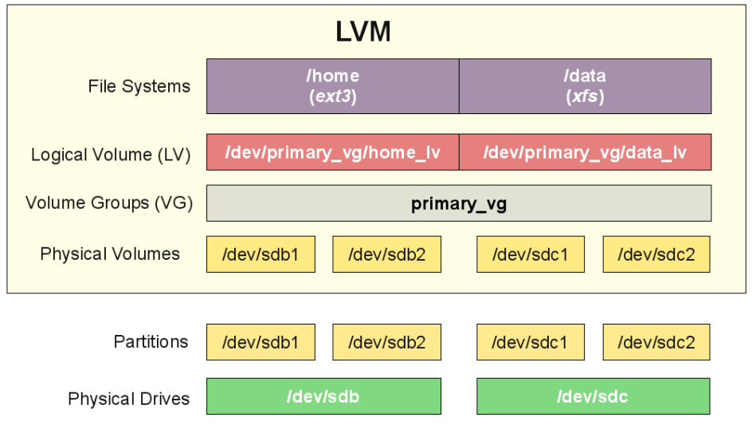

## Ubuntu 17.04 上创建新的 LVM 磁盘



本教程将会为你展示如何在 Ubuntu 17.04 系统上创建和管理 LVM 磁盘。LVM（Logical Volume Management）是一个强大的磁盘管理系统，它提供了一个健壮的、易于扩展的磁盘。在使用 LVM 方案时，我们可以很容易的收缩或扩展现有的卷（volume)。但是，默认 Ubuntu 17.04 不支持 LVM，所以我们需要安装一个名为 lvm2 的包。如果我们在安装 Ubuntu 17.04 时已经使用了 LVM 方案，那么 lvm2软件包默认已经安装了。

你将在本教程中学到：

- **Create new Physical Volume (PV)**
- **Create new Volume Group (VG)**
- **Create new Logical Volume (LV)**

### 在 Ubuntu 17.04 上创建新的 LVM 磁盘步骤：

在我们使用 LVM 之前，需要先安装 lvm2 软件包。如果你已经安装了，可以跳过此步骤。

#### 步骤 1、安装 LVM2 软件包
```
root@dhani-VirtualBox:~# apt install lvm2
Reading package lists... Done
Building dependency tree       
Reading state information... Done
The following additional packages will be installed:
  dmeventd libdevmapper-event1.02.1 liblvm2app2.2 liblvm2cmd2.02 libreadline5
Suggested packages:
  thin-provisioning-tools
```

### 步骤 2、准备磁盘

在这个示例中，我已经向现有的Ubuntu系统添加了2个磁盘。我将使用这两个磁盘创建新的卷组。首先，我们需要检查当前的磁盘布局。
```
root@ubuntu-server:~# lsblk
NAME                          MAJ:MIN RM  SIZE RO TYPE MOUNTPOINT
sr0                            11:0    1  685M  0 rom  
vda                           252:0    0   10G  0 disk 
`-vda1                        252:1    0   10G  0 part 
  |-ubuntu--server--vg-root   253:0    0    9G  0 lvm  /
  `-ubuntu--server--vg-swap_1 253:1    0 1020M  0 lvm  [SWAP]
vdb                           252:16   0   20G  0 disk 
vdc                           252:32   0   25G  0 disk 
```

如你所见，当前系统已经有一个 LVM 卷组（vda），同时我们也看到有两个空闲的磁盘（vdb 和 vdc）。

**创建新的物理卷组（PV）**

首先，我们在磁盘或者分区上创建物理卷组。由于我想使用全部的磁盘空间，所以我没有事先在磁盘上创建新的分区。我们可以直接在这两块磁盘上创建新的物理卷组。
```
root@ubuntu-server:~# pvcreate /dev/vdb
  Physical volume "/dev/vdb" successfully created.
root@ubuntu-server:~# pvcreate /dev/vdc
  Physical volume "/dev/vdc" successfully created.
```

使用`pvdisplay`命令可以在我们的系统上查看创建的物理卷组信息
```
root@ubuntu-server:~# pvdisplay
  --- Physical volume ---
  PV Name               /dev/vda1
  VG Name               ubuntu-server-vg
  PV Size               10.00 GiB / not usable 2.00 MiB
  Allocatable           yes 
  PE Size               4.00 MiB
  Total PE              2559
  Free PE               9
  Allocated PE          2550
  PV UUID               po49qK-xdN8-2PH4-AHTK-Oy9A-b700-FuStPW
   
  "/dev/vdb" is a new physical volume of "20.00 GiB"
  --- NEW Physical volume ---
  PV Name               /dev/vdb
  VG Name               
  PV Size               20.00 GiB
  Allocatable           NO
  PE Size               0   
  Total PE              0
  Free PE               0
  Allocated PE          0
  PV UUID               iQlgZB-LlYQ-N01P-D56H-Dmci-UIzX-0F8pSP
   
  "/dev/vdc" is a new physical volume of "25.00 GiB"
  --- NEW Physical volume ---
  PV Name               /dev/vdc
  VG Name               
  PV Size               25.00 GiB
  Allocatable           NO
  PE Size               0   
  Total PE              0
  Free PE               0
  Allocated PE          0
  PV UUID               CVACIX-mdUH-mzUb-WBeo-2Ij8-s4jI-Mrvlrx
```

**创建新的卷组（VG）**

现在让我们首先使用`/dev/sdb`磁盘创建一个新的卷组。
```
root@ubuntu-server:~# vgcreate manjaro_lvm /dev/vdb
  Volume group "manjaro_lvm" successfully created
```

上面的命令使用`/dev/sdb`创建了一个名为`manjaro_lvm`的卷组。当然你可以根据自己的设置修改它。现在我们可以使用`vgdisplay`命令查看新的卷组(VG)信息。
```
root@ubuntu-server:~# vgdisplay
  --- Volume group ---
  VG Name               ubuntu-server-vg
  System ID             
  Format                lvm2
  Metadata Areas        1
  Metadata Sequence No  3
  VG Access             read/write
  VG Status             resizable
  MAX LV                0
  Cur LV                2
  Open LV               2
  Max PV                0
  Cur PV                1
  Act PV                1
  VG Size               10.00 GiB
  PE Size               4.00 MiB
  Total PE              2559
  Alloc PE / Size       2550 / 9.96 GiB
  Free  PE / Size       9 / 36.00 MiB
  VG UUID               EIUd8I-enfK-5aAz-CWhN-nBaw-vy5U-S3wX8p
   
  --- Volume group ---
  VG Name               manjaro_lvm
  System ID             
  Format                lvm2
  Metadata Areas        1
  Metadata Sequence No  1
  VG Access             read/write
  VG Status             resizable
  MAX LV                0
  Cur LV                0
  Open LV               0
  Max PV                0
  Cur PV                1
  Act PV                1
  VG Size               20.00 GiB
  PE Size               4.00 MiB
  Total PE              5119
  Alloc PE / Size       0 / 0   
  Free  PE / Size       5119 / 20.00 GiB
  VG UUID               2RTcyM-yHcM-qgrc-NZjs-ydf9-ZIRF-tZ5wJy
```

**创建新的逻辑卷（LV）**

现在我们可以创建新的逻辑卷组了。例如，该命令将在之前创建的卷组`manjaro_lvm`中创建名为`manjaro_lv01`的新逻辑卷（LV）。
```
root@ubuntu-server:~# lvcreate -L 5G -n manjaro_lv01 manjaro_lvm
  Logical volume "manjaro_lv01" created.
```

**格式化逻辑卷**

在我们使用新的逻辑卷存储数据之前，我们需要先将其格式化。例如，我将`manjaro_lv01`格式化为 ext4 文件系统。
```
mkfs.ext4 /dev/mapper/manjaro_lvm-manjaro_lv01
```
示例：
```
root@ubuntu-server:~# mkfs.ext4 /dev/mapper/manjaro_lvm-manjaro_lv01 
mke2fs 1.43.4 (31-Jan-2017)
Creating filesystem with 1310720 4k blocks and 327680 inodes
Filesystem UUID: a152ff83-f2f2-4037-9050-4e7144fced1e
Superblock backups stored on blocks: 
        32768, 98304, 163840, 229376, 294912, 819200, 884736

Allocating group tables: done                            
Writing inode tables: done                            
Creating journal (16384 blocks): done
Writing superblocks and filesystem accounting information: done
```

### 挂载这个新的卷组
```
mount /dev/mapper/manjaro_lvm-manjaro_lv01 /mnt
```

至此，我们已经学习了如何创建新的物理卷、卷组、逻辑卷。请继续关注这个博客。接下来，我将介绍如何扩展卷组和逻辑卷的大小。

（完）

翻译自：<https://manjaro.site/create-new-lvm-disk-ubuntu-17-04/>

2018年6月26日晚 
