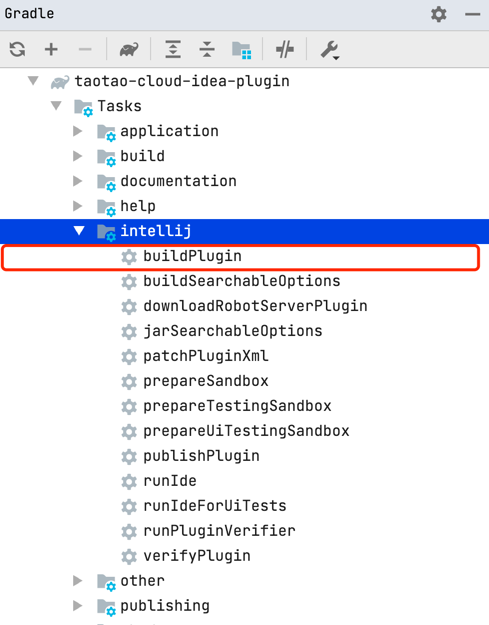
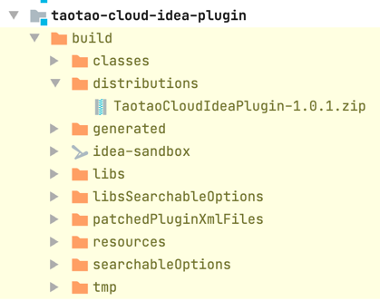
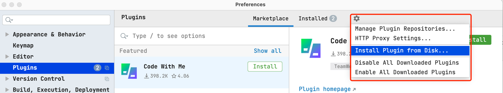
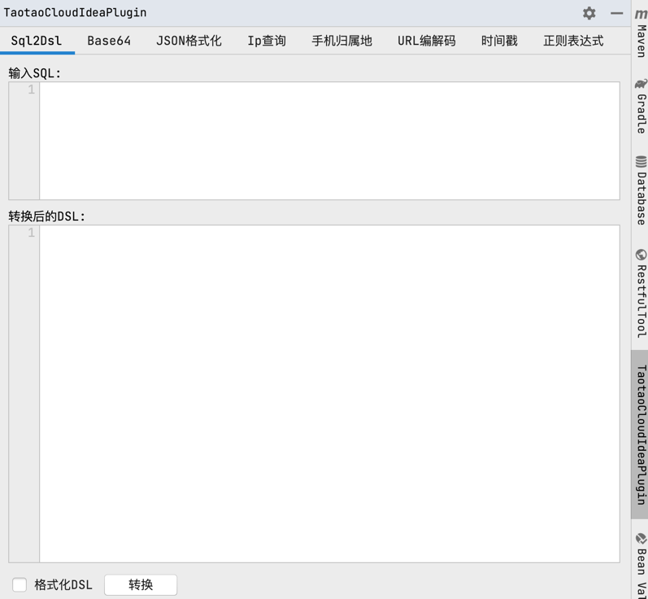

### idea plugin模块

**借鉴 https://gitee.com/silently9527/ToolsetIdeaPlugin**

### 插件安装

开发环境: IU-2020.3

1. buildPlugin 在项目的build/distributions目录下生成zip包





3. 安装plugin 选中zip包安装即可

**有可能会存在版本不兼容的问题 自行解决**



4. 展示



5. 上传

```
1.先要在https://plugins.jetbrains.com/author/me上传一个jar或者zip包 需要先选择license

2.在https://plugins.jetbrains.com/author/me生成一个token

3.然后再使用publishPlugin
```
